##   1. 产品介绍

### 1.1 产品介绍

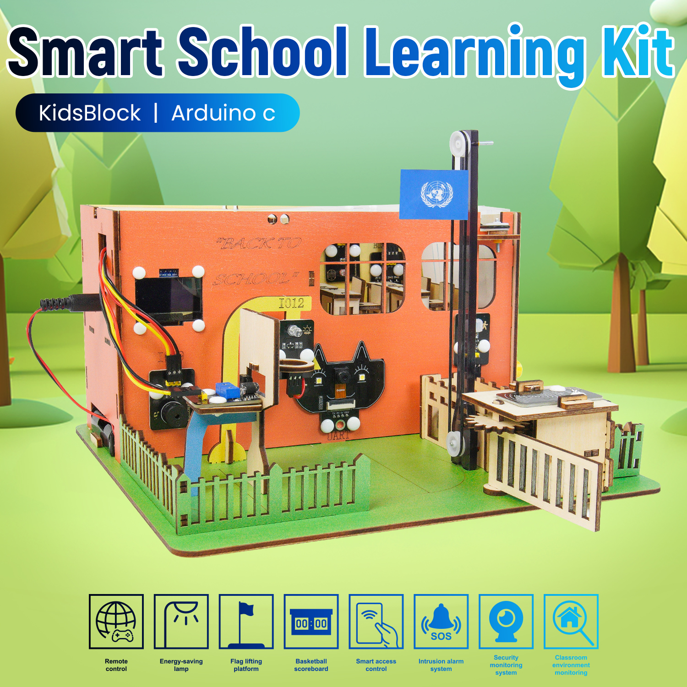

智慧校园创意学习套件是一款专为中小学生设计的STEAM教育学习套件，将传统木艺与现代电子技术完美融合。学生通过亲手搭建椴木质感的校园微缩模型，学习传感器应用、物联网原理和智能控制技术，在创造中感受科技的魅力。

### 1.2 产品清单

| 序号 |              名称              | 数量 |                 图片                  |
| :--: | :----------------------------: | :--: | :-----------------------------------: |
|  1   |             开发板             |  1   |      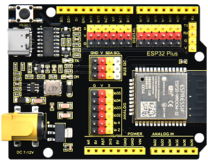      |
|  2   |          6812 RGB模块          |  1   |      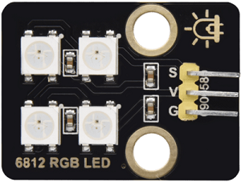      |
|  3   |         无源蜂鸣器模块         |  1   |      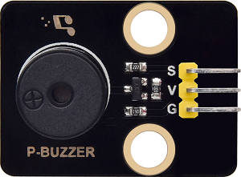      |
|  4   |       AHT20 温湿度传感器       |  1   |            |
|  5   |          白色LED模块           |  1   |            |
|  6   |          单路按键模块          |  1   |      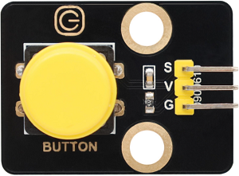      |
|  7   |         光敏电阻传感器         |  1   |            |
|  8   |          RFID刷卡模块          |  1   |      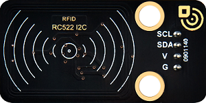      |
|  9   |           180度 舵机           |  1   |       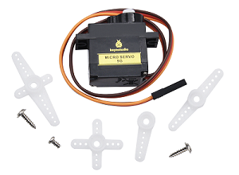       |
|  10  |           避障传感器           |  1   |            |
|  11  |     ENS160 空气质量传感器      |  1   |      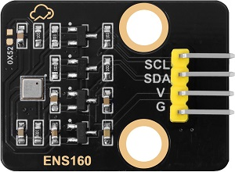      |
|  12  |            OLED模块            |  1   |              |
|  13  |       人体红外热释传感器       |  1   |      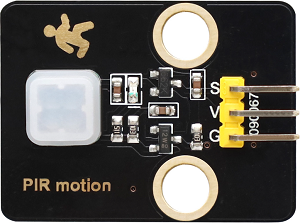      |
|  14  |       28BYJ-48 步进电机        |  1   |    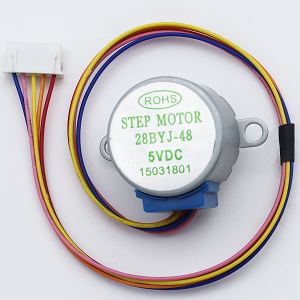    |
|  15  |         步进电机驱动板         |  1   |      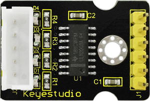      |
|  16  |              电机              |  1   |      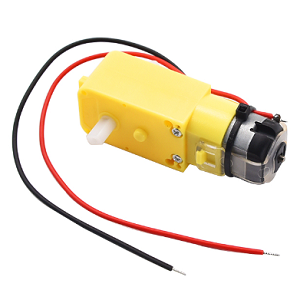      |
|  17  |           电机驱动板           |  1   |      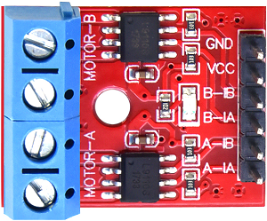      |
|  18  |          舵机控制模块          |  1   |       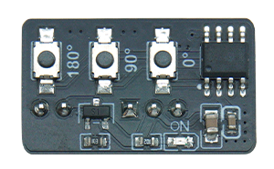       |
|  19  |             摄像头             |  1   |            |
|  20  |             电池盒             |  1   |      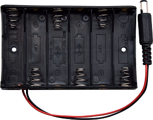      |
|  21  |              IC卡              |  1   |        |
|  22  |     3P 母对母连拼线 200mm      |  5   |        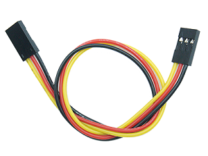        |
|  23  |     3P 母对母连拼线 250mm      |  2   |        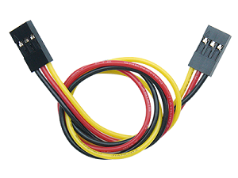        |
|  24  |   4P 母连拼转公单拼线 150mm    |  1   |        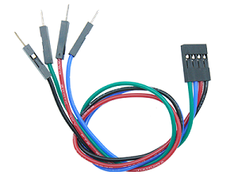        |
|  25  |     4P 母对母连拼线 200mm      |  2   |        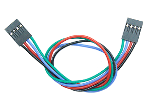        |
|  26  |   4P 母连拼转母单拼线 350mm    |  1   |        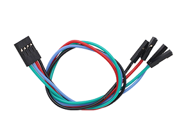        |
|  27  |     4P 母对母连拼线 400mm      |  1   |        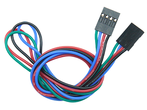        |
|  28  |  4P HX-2.54转杜邦母单线 150mm  |  1   |       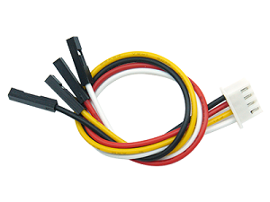       |
|  29  | 2P 公对母杜邦线 200mm 颜色随机 |  1   |        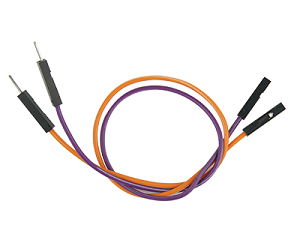        |
|  30  | 6P 母对母杜邦线 150mm 颜色随机 |  1   |        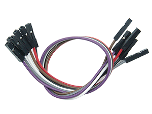        |
|  31  |           十字螺丝刀           |  1   | 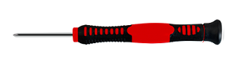 |
|  32  |          一字型螺丝刀          |  1   | 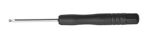 |
|  33  |            橡胶皮带            |  2   |       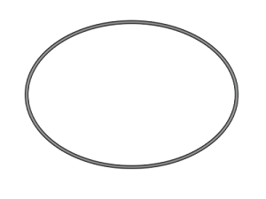       |
|  34  |             贴纸1              |  1   |                  |
|  35  |             贴纸2              |  1   |                  |
|  36  |              镊子              |  1   |     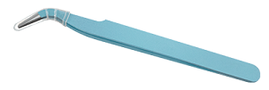     |
|  37  |              卡纸              |  1   |            |
|  38  |             椴木板             |  1   |         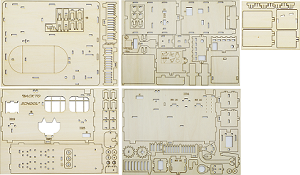         |
|  39  |            亚克力1             |  1   |     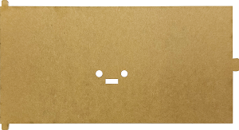     |
|  40  |            亚克力2             |  1   |          |
|  41  |        M1.2*4 自攻螺钉         |  4   |       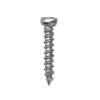       |
|  42  |          M2*8MM 螺钉           |  3   |         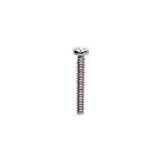         |
|  43  |          M3*6MM 螺钉           |  8   |         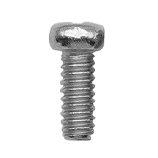         |
|  44  |            M2 螺母             |  2   |          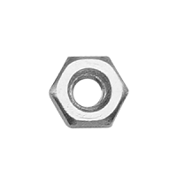          |
|  45  |        M3*10MM 六角铜柱        |  4   |        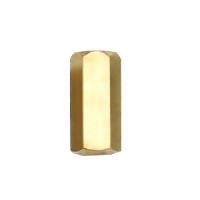        |
|  46  |             皮带轮             |  3   |         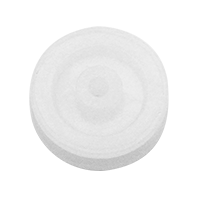         |
|  47  |              光轴              |  3   |        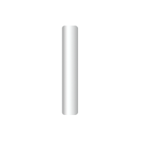        |
|  48  |             硬轴套             |  2   |          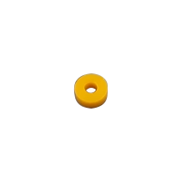          |
|  49  |           R4060 铆钉           |  22  |       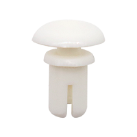       |
|  50  |           R3550 铆钉           |  2   |        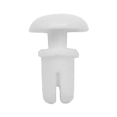        |
|  51  |           R3075 铆钉           |  4   |        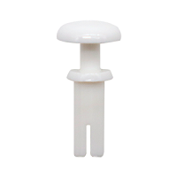        |
|  52  |           R3065 铆钉           |  2   |       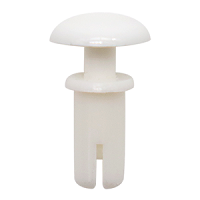       |
|  53  |            迷你篮球            |  1   |  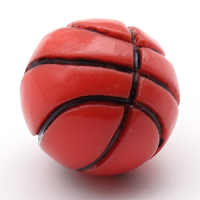  |
|  54  |            装配工具            |  1   |     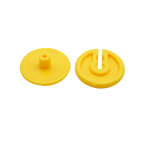     |

注意：需要自备：AA电池 * 6

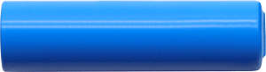

### 1.3 产品参数

#### 介绍

这是一款基于ESP32开发板，集成了ESP32-WROOM-32模组，是一款通用型的WIFI加蓝牙开发板，引脚兼容Arduino。有丰富的外设，包括霍尔传感器，高速SDIO/SPI、UART、I2S和I2C等，并且可以搭载freeRTOS操作系统，非常适用于物联网、智能家居方案。

#### 参数

| 参数         | 规格             |
| ------------ | ---------------- |
| 输出电压     | 3.3V-5V          |
| 输出电流     | MAX：1.2A        |
| 最大功率     | 最大输出10W      |
| 工作温度范围 | -10~50摄氏度     |
| 尺寸         | 70 * 53 * 14.5mm |
| 重量         | 25.5g            |
| 环保属性     | ROHS             |

* 介绍开发板、扩展板接口
* 如果是套件教程，可以把各类模块传感器参数放到各自的教程里面
* 必要情况下需要写明注意事项，防止产品意外损坏

#### 引脚图

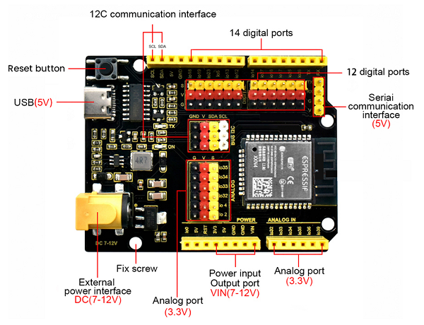

#### 原理图

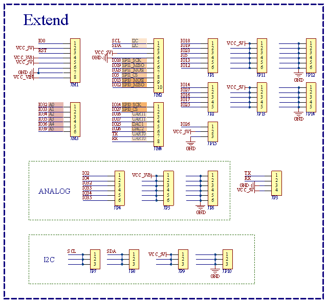

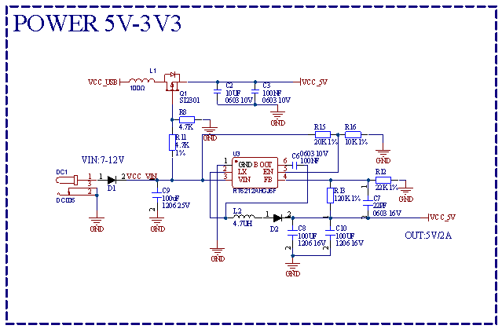

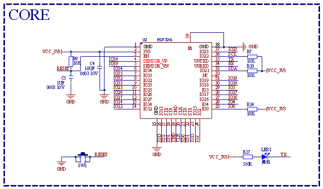

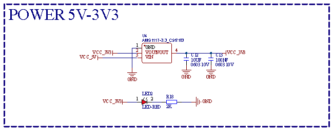

