# 1. 产品介绍

首先感谢选择keyes产品，我们将继续为你提供好的产品和服务!

**关于keyes**

Keyes是KEYES Corporation旗下最畅销的品牌，我们的产品包括Arduino开发板、扩展板、传感器模块；树莓派、micro：bit扩展板和智能小车；以及为各阶段客户设计的完整入门套件。这些入门套件旨在为任何水平的客户学习Arduino、树莓派、micro：bit相关知识。

我们所有产品，均符合国际质量标准，在世界各地不同市场中，得到了极大的赞赏。

欢迎从我们的官方网站查看更多内容：[http://www.keyes-robot.com](http://www.keyes-robot.com)

**获取售后服务**

1. 如果发现某些东西丢失或损坏，或者学习套件时遇到一些困难，keyes会提供免费和快速的支持。如果您有任何疑问，请联系我们客服或工作人员。

2. 欢迎提出建议和反馈，我们会根据您的反馈不断更新套件和教程，以使其更好。谢谢！

**产品安全**    

1. 本产品内含细小的元器件（电阻，LED等），请放在儿童接触不到的地方，防止划伤或误食。8岁及以下儿童使用，请在大人监督下使用。

2. 本产品包含导电部件(控制板和电子模块），请按照本教程的要求进行操作，不当的操作可能导致过热并且损害零件，请勿触摸并立即断开电路电源（请按照正确的方式安装电池）。

**版权**

keyes商标和徽标是KEYES DIY ROBOT co.,LTD的版权，任何人和公司在没有授权的情况下，不得复制，售卖，转卖，keyes品牌的产品。如果您有兴趣在当地售卖我们的产品，请联系我们专业的批发销售人员。

## 1.1 套件介绍

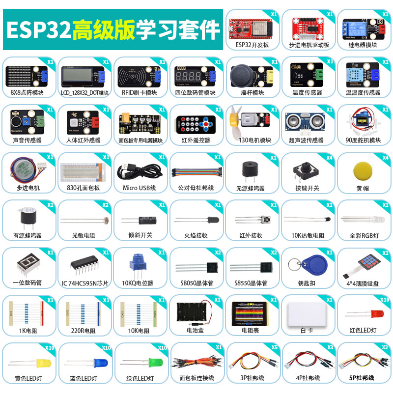

你想学习编程知识吗?

只要你对科学充满热情，敢于探索新事物，这个Keyes ESP32高级版学习套件主要包含了我们常用的一些电子元件/传感器/模块，同时还包含ESP32主板和面包线等。该工具包的每个教程都有详细的接线图、元件知识和项目代码等，完全适合初学者。

每一个项目教程中的代码都是通过MicroPython(Thonny软件)编程、Arduino IDE编程、Mixly图形化编程，入门非常简单。用一个控制器（ESP32主控板），许多传感器/模块和电子元件，你可以做许多精彩的DIY项目。通过这些课程，可以让你们对编程方法、逻辑以及电子电路有了更深刻的理解。

## 1.2 套件清单

当收到这个Keyes ESP32 高级版学习套件工具包的时候，首先看到是一个包装精美的外盒，每个配件被安全且有序的装在外盒里面的小袋子里，先来清点一下：

| 序号 | 名称 | 数量 | 图片 |
| :--: | :--: | :--: | :--: |
| 1 | 蓝色LED | 10 |  |
| 2 | 红色LED | 10 |  |
| 3 | 黄色LED | 10 |  |
| 4 | 绿色LED | 10 |  |
| 5 | RGB | 1 |  |
| 6 | 220Ω电阻 | 10 | 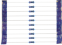 |
| 7 | 10KΩ电阻 | 10 |  |
| 8 | 1KΩ电阻 | 10 | |
| 9 | 10KΩ电位器 | 1 | 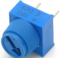 |
| 10 | 有源蜂鸣器 | 1 | 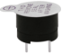 |
| 11 | 无源蜂鸣器 | 1 | 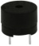 |
| 12 | 按键开关 | 4 | 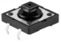 |
| 13 | 倾斜开关 | 1 | 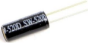 |
| 14 | 光敏电阻 | 2 | 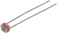 |
| 15 | 火焰传感器 | 1 | 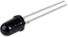 |
| 16 | 黄帽 | 4 |  |
| 17 | IC 74HC595N芯片 | 1 | 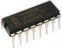 |
| 18 | 一位数码管 | 1 | 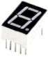 |
| 19 | 四位数码管 | 1 | 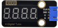 |
| 20 | 8*8点阵屏 | 1 | 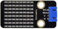 |
| 21 | 温湿度传感器 | 1 | 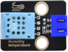 |
| 22 | LCD_128X32_DOT | 1 | 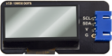 |
| 23 | 红外接收器 | 1 |  |
| 24 | 红外遥控器 | 1 |  |
| 25 | 舵机 | 1 | 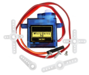 |
| 26 | 4*4薄膜键盘 | 1 |  |
| 27 | 130直流电机模块 | 1 | 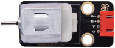 |
| 28 | 步进电机驱动板 | 1 | 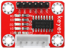 |
| 29 | 步进电机 | 1 | 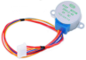 |
| 30 | 摇杆模块 | 1 | 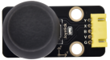 |
| 31 | 声音传感器 | 1 | 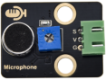 |
| 32 | 人体红外传感器 | 1| 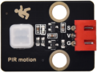 |
| 33 | RFID刷卡模块 | 1 | 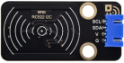 |
| 34 | 超声波传感器 | 1 | 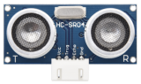 |
| 35 | LM35温度传感器 | 1| 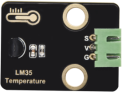 |
| 36 | 5V继电器模块 | 1 |  |
| 37 | 热敏电阻 | 1 |  |
| 38 | NPN型晶体管(S8050) | 2 |  |
| 39 | PNP型晶体管(S8550) | 2 |  |
| 40 | 白卡 | 1 |  |
| 41 | ABS蓝色钥匙扣 | 1 |  |
| 42 | 三叶软桨 | 1 |  |
| 43 | 面包板连接线 | 1 | 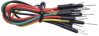 |
| 44 | 公对母杜邦线 | 1 |  |
| 45 | 830孔面包板 | 1 | 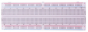 |
| 46 | USB线 | 1 | 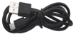 |
| 47 | 电阻卡 | 1 | 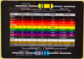 |
| 48 | Keyes ESP32开发板 | 1 | 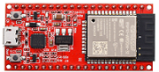 |
| 49 | 面包板专用电源模块 | 1 |  |
| 50 | 6节5号电池盒 | 1 | 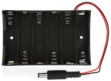 |
| 51 | 3P转杜邦线公单 | 5 |  |
| 52 | 4P转杜邦线公单 | 3 |  |
| 53 | 5P转杜邦线公单 | 2 |  |

注：这套件使用到的电池是6个5号电池，需要自己准备。

## 1.3 主板介绍

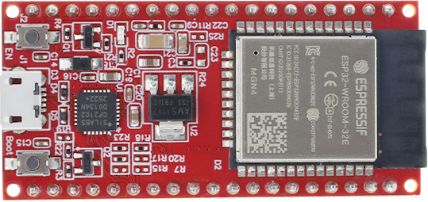

**1\. 说明：**

keyes ESP32 主控板是基于ESP-WROOM-32E模块所设计的的迷你开发板。该开发板引出大部分I/O至两侧的2.54mm间距的排针，开发者可以根据自己的需求连接外设。使用开发板进行开发和调试时，两侧的标准排针可以让你的操作更加简洁方便。

ESP-WROOM-32E模块是业内集成度领先的 WiFi + 蓝牙 解决方案，外部元器件少于 10 个，它集成了天线开关、射频 balun、功率放大器、低噪放大器、过滤器和电源管理模块。同时，它也集成了天采用 TSMC 低功耗 40nm 技术，功耗性能和射频性能，安全可靠，易于扩展至各种应用。

**2\. 规格参数：**

- 微控制器: ESP-WROOM-32E模块
- USB转串口芯片: CP2102-GMR
- 工作电压:	DC 5V
- 工作电流：80mA（平均）
- 供电电流：500mA（最小）
- 工作温度范围: -40°C ~ +85°C 
- WiFi模式：Station / SoftAP / SoftAP+Station / P2P
- WiFi协议：802.11 b/g/n/e/i（802.11n，速度高达 150 Mbps
- WiFi频率范围：2.4 GHz ~ 2.5 GHz
- 蓝牙协议：符合蓝牙 v4.2 BR/EDR 和 BLE 标准
- 尺寸：55mm x 26mm x 13mm
- 重量：9.8g

**3\. 各个接口和主要元件说明：**

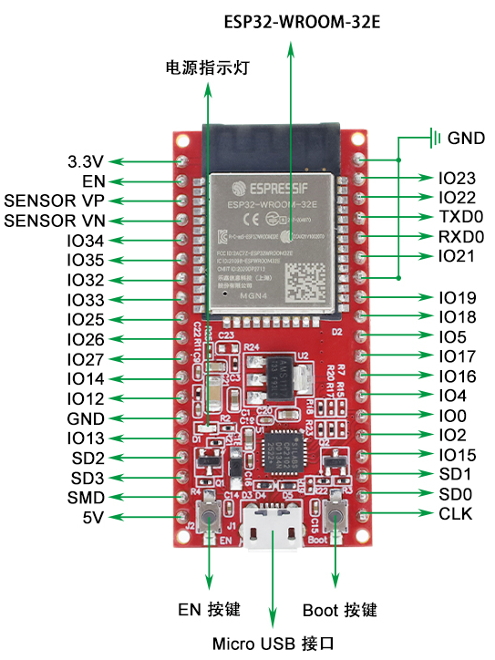

**4\. 各个接口详细说明：**

- IO23: VSPI MOSI/SPI MOSI
- IO22: Wire SCL
- TXD0: IO1/Serial TX
- RXD0: IO3/Serial RX
- IO21: Wire SDA
- IO19: VSPI MISO/SPI MISO
- IO18: VSPI SCK/SPI SCK
- IO5: VSPI SS/SPI SS
- IO4: ADC10/TOUCH0
- IO0: ADC11/TOUCH1
- IO2: ADC12/TOUCH2
- IO15: HSPI SS/ADC13/TOUCH3/TDO
- SD1: IO8/FLASH D1
- SD0: IO7/FLASH D0
- CLK: IO6/FLASH SCK
- CMD: IO11/FLASH CMD
- SD3: IO10/FLASH D3
- SD2: IO9/FLASH D2
- IO13: HSPI MOSI/ADC14/TOUCH4/TCK
- IO12: HSPI MISO/ADC15/TOUCH5/TDI
- IO14: HSPI SCK/ADC16/TOUCH6/TMS
- IO27: ADC17/TOUCH7
- IO26: ADC19/DAC2
- IO25: ADC18/DAC1
- IO33: ADC5/TOUCH8
- IO32: ADC4/TOUCH9
- IO35: ADC7
- IO34: ADC6
- SENSOR VN: IO39/ADC3
- SENSOR VP: IO36/ADC0
- EN 按钮: 复位键

## 1.4 常见问题解答

1\. 问：esp32 主板烧录程序出错?

答：请检查 esp32 主板的型号是否选对。

请检查USB串口端口号是否选对。

2\. 问：esp32 主板使用USB线连接到计算机，串口端口未显示?

答：请检查 esp32 是否与计算机连接完好，再点击 “**设备管理器**”，查看是否显示对应的串口端口。如果显示正确，说明连接完好，如果还是没有显示，那有可能是 esp32 主控板上的USB芯片出问题了。

3\. 问：烧录了代码，传感器/模块不工作或串口监视器窗口不能显示正确的信息？

答：请确认代码中的引脚和实际接线是否一致，如有错误，请正确按照代码中的引脚进行接线即可。

4\. 问：舵机为什么工作不正常？

答：可能电压不够，最好外接电源供电。

5\. 问：超声波传感器检测时，为什么检测距离不准？

答：应从超声波传感器的发射头处开始测量，此模块非高精度超声波距离检测模块，会有误差。

6\. 问：风扇（电机）工作不正常，主板很容易被烧坏？

答：由于风扇在转动时，所需的电流比其他传感器要大，会引起电路中电压电流波动，特别是风扇进行正反转时，电压电流波动过大，导致 esp32 主板的电压电流过低，会导致复位。需要外接电源给 esp32 主板供电，这样保证风扇能正常工作。

7\. 问：无源蜂鸣器的音调与实际音调不准？

答：普通无源蜂鸣器模拟的音调，达不到专业音调的要求，如需非常准确音调，需要更专业的无源蜂鸣器。

8\. 问：人体红外热释电传感器误报？

答：人体红外热释电传感器避免误报警要求如下：

探测范围内避开被风吹而引起飘动的物体，如：窗帘、衣物、花草等。

探测范围内避免强光照射干扰，如：阳光照射、汽车灯光照射、射灯照射及照明等光源。

9\. 问：温湿度传感器防水吗？

答：温湿度传感器检测的是空气中的温度和湿度，不防水，请勿将模块放入水中。

10\. 按红外遥控，红外接收器有反应，但无法控制产品运行?

答：红外遥控器按键都有自己对应的键码，按下与代码不匹配的键码无法对产品进行操作；其次，按键按一下就松开，不要一直按，否则输出键码与原键码不同。

11\. RFID模块读卡没反应？

答：关于产品RFID的实验，注意是否代码中输入了所读卡的编码，基本每张卡的编码都会有所不同，需要通过代码确定编码。

卡编码的读取方法：上传RFID的代码，打开串口监视器即可看见卡号编码。

12\. 安装软件后无法使用？

答：为确保产品各部分的正常运行，建议选择与资料一致的软件及版本进行安装，使用最新版本可能存在与库文件等不兼容的情况导致产品无法正常使用。

13\. 能否把所有代码一起烧录进去？

答：不能；开发板一次只支持烧录一个代码，当烧录进一个代码时之前所有的代码都会覆盖掉，没办法将所有代码烧录进去再选择代码使用；如果需要多种传感器同时工作，可以将相关传感器写在一个代码里面。

14\. 问：WiFi一直连接不上？

答：请将 esp32 主板移动到路由器周边，按下主板上的复位键重启 esp32 主板，耐心等待连接即可。若还是一直连接不上，请查看WiFi名称和密码是否填写正确。

