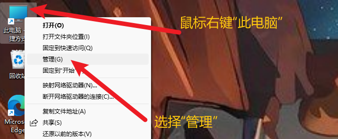
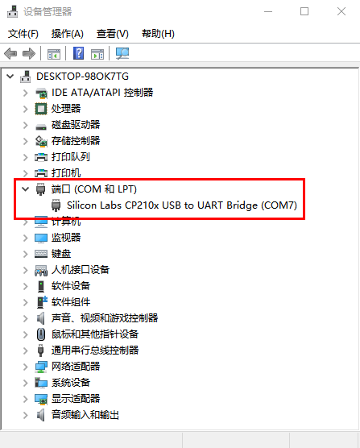
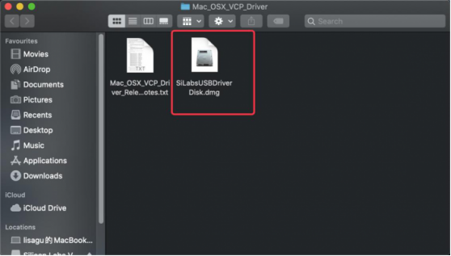
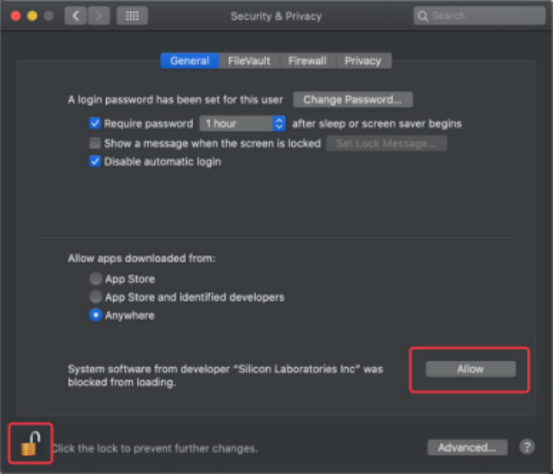

# 2. 驱动安装（选读）

本部分非必读部分，仅在ESP32主控板无法被电脑识别时使用，如果已经识别可直接跳过！！！

（注意：如果ESP32主控板在 Arduino教程、Mixly教程 或者 KidsBlock(Scratch)教程中无法被识别，请先检查ESP32主控板是否连接到位并且连接电脑其他USB端口重新测试，如果依旧不行再开始以下驱动安装步骤：）

## 2.1 在Windows系统上安装驱动

Windows系统驱动下载：[CP2102驱动](https://xiazai.keyesrobot.cn/software/cp2102/CP2102_Driver.zip)

1\. 将ESP32主控板接到电脑：

2\. 打开 “**设备管理器**”

3\. 检查驱动是否安装。

情况一：驱动安装完成，请跳过驱动安装教程，进行下一步学习。

情况二：驱动没有安装，请进行以下安装教程进行手动安装驱动。

（1）右键点击 “**USB Serial**”，选择 “**更新驱动程序(P)**” 并点击。

（2）跳转到以下页面，选择 “**浏览我的电脑以查找驱动程序(R)**” 并点击。

（3）回到开头下载windows的CP2102驱动，将驱动文件复制到 电脑桌面 上，然后解压下载的驱动压缩包，然后点击 “**浏览(R)...**”，选中CP210X系列芯片的驱动（即解压后得到的文件夹），最后点击 “**下一页**”。位置如下:

（4）界面显示如下图类似的话语，证明驱动安装成功，点击 “**关闭**”。

（5）驱动安装完成后，选择 “**端口**” 选项，USB的黄色感叹号消失，证明驱动安装完成。

## 2.2 在MacOS系统上安装驱动

（**注意：** 如果已经安装了驱动程序，则不需要再安装驱动；如果没有，则需要进行以下操作。）

（1）用USB线将ESP32主板连接到你的MacOS系统电脑上。

（2）CP2102驱动下载链接：[CP2102驱动](https://xiazai.keyesrobot.cn/software/cp2102/Mac_OSX_VCP_Driver.zip)

（3）解压下载好的压缩包。

（4）打开文件夹，双击 “**SiLabsUSBDriverDisk.dmg**” 文件。

可以看到以下文件：

（5）双击 “**Install CP210x VCP Driver**”，勾选 “**Don’t warn me when opening application on this disk image**” 并单击 “**Open**”。

（6）单击 “**Continue**”。

（7）先点击 “**Agree**”，然后点击 “**Continue**”。

（8）继续点击 “**Continue**”，然后输入你的用户密码。

（9）选择 “**Open Security Preferences**”。

（10）点击安全锁，输入你的用户密码来授权（电脑开机时进入桌面的解锁密码）。

（11）看到锁被打开了，点击 “**Allow**”。

（12）回到安装界面，根据提示等待安装。

（13）安装成功

