# 3. 安装驱动（选读部分）

*本部分非必读部分，仅在主板无法被电脑识别时使用，如果已经识别可直接跳过！！！*

（注意：如果主板在Arduiino或kidsblock课程无法被识别，请先检查主板是否连接到位并且连接电脑其他USB端口重新测试，如果依旧不行再开始以下驱动安装课程）

## 3.1 Windows系统驱动安装

将主板连接到电脑（如图）；

打开 “ 设备管理器 ” 。

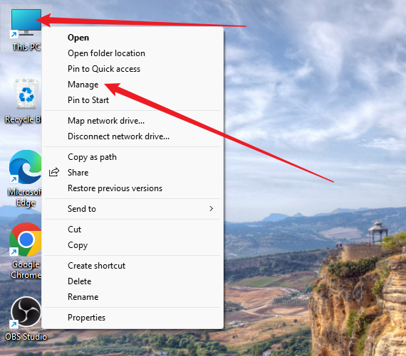

如下图所示，电脑自动安装了驱动就可以跳过此教程。

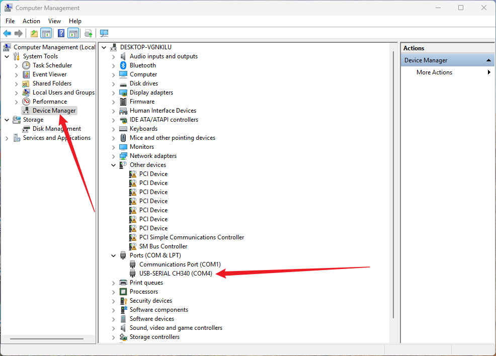

如下图所示，电脑没有自动安装驱动，需要手动安装。

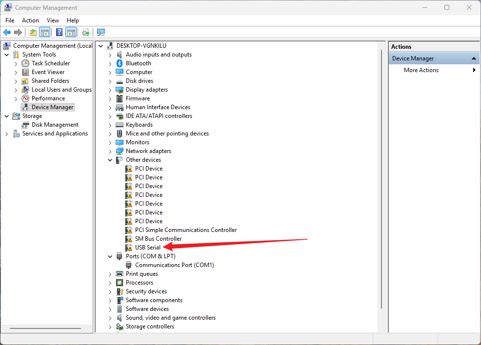

1、下载驱动后解压。

Windows系统驱动下载：[Windows驱动](./Windows.7z)

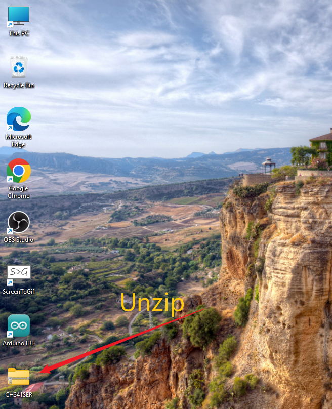

2、打开解压后的文件夹，点击 “ SETUP ” 。

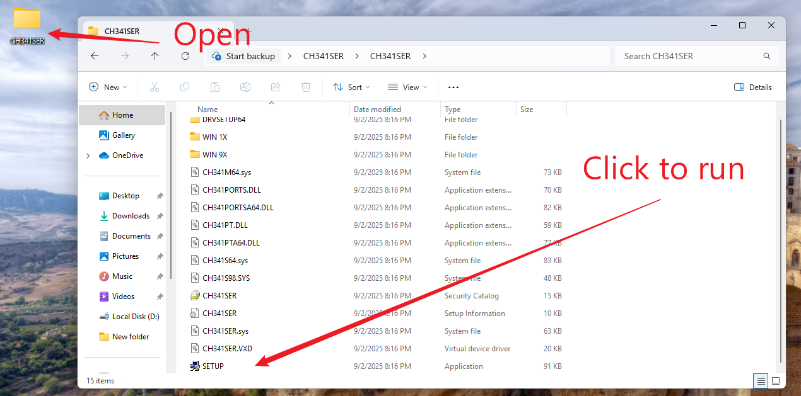

3、点击 “ YES ” 。

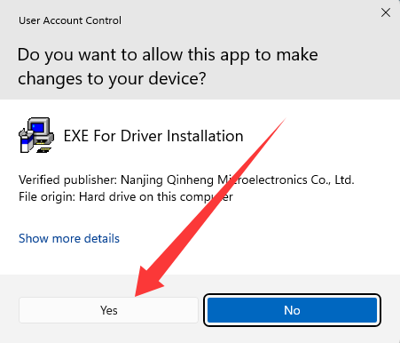

4、点击 “ INSTALL ” 。

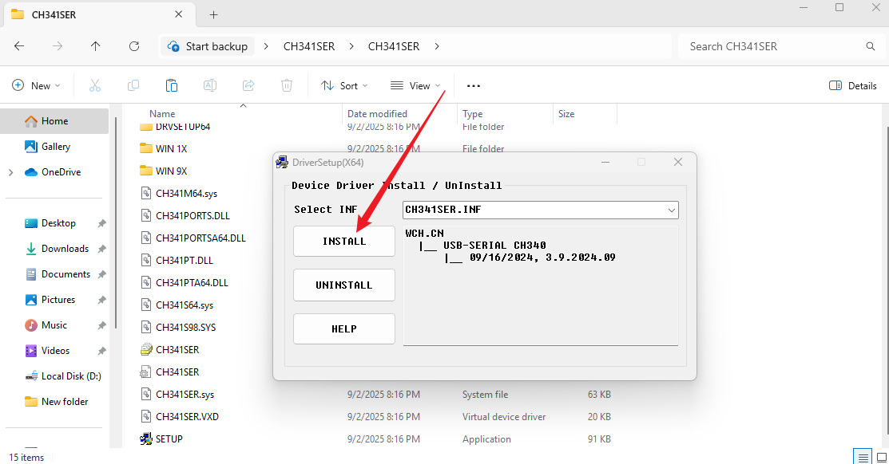

5、安装将成功。

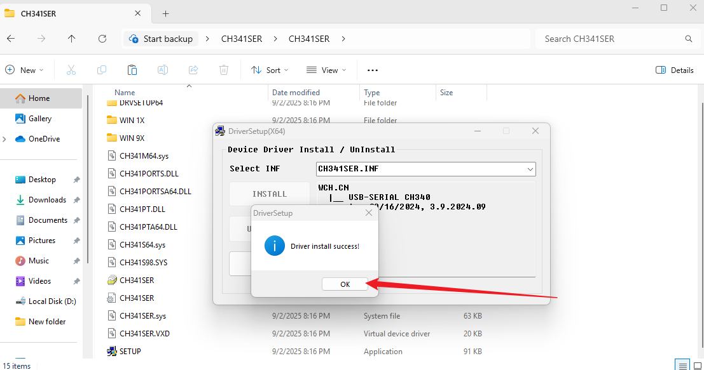

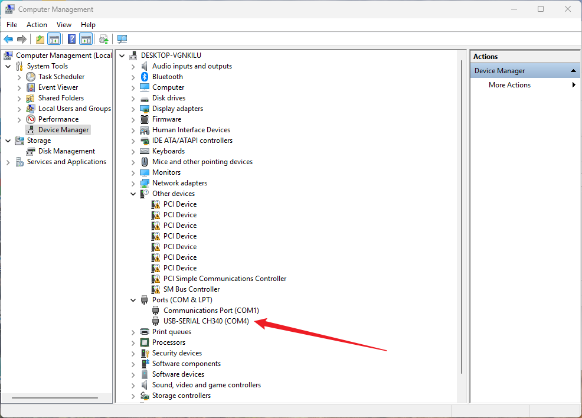

## 3.2 Mac系统驱动安装

Mac系统驱动下载：[Mac驱动](./Mac.7z)

1、下载驱动后解压，点击 “**.pkg**” 文件。

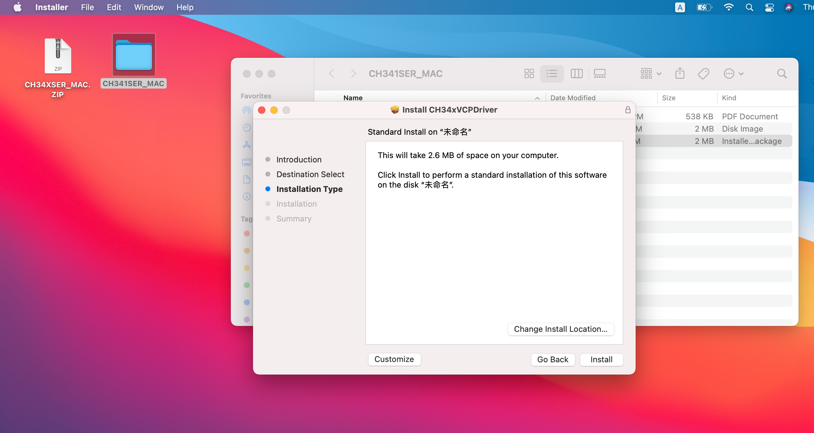

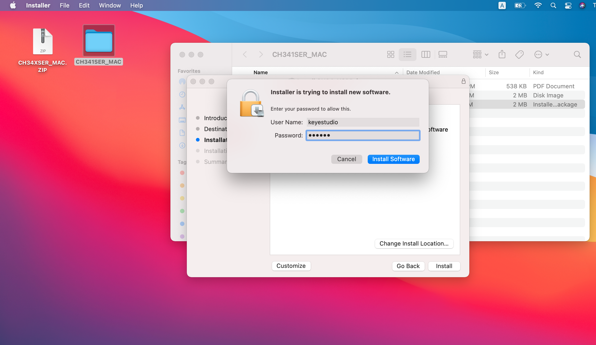

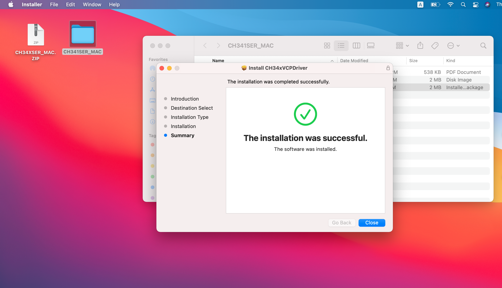

2、点击 “**Continue**”。

3、点击 “**Install**”。

4、输入你的电脑锁屏密码，然后点击 “**Install Software**”，等待安装。

5、安装完成。

