## Arduino 开发环境

### **1. Arduino IDE 下载**

首先，进入Arduino官方网站：[Software | Arduino](https://www.arduino.cc/en/software) ，下载Arduino IDE。

Arduino 软件有很多版本，有Windows，Mac，Linux系统的（如下图），而且还有过去老的版本，你只需要下载一个适合自己计算机系统的版本即可。这里是以下载 **Windows Win 10 or newer(64-bit)** 为例，你也可以根据自己所需，选择下载 **Windows ZIP file**。选择如下图：

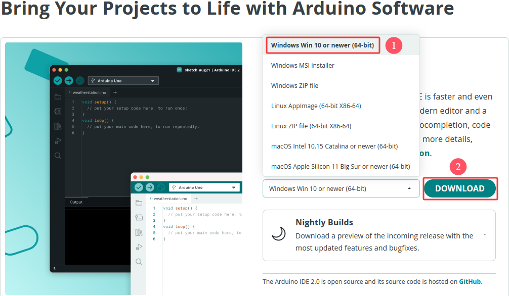

这里我们以Windows系统的为例给大家介绍下载和安装的步骤。Windows系统的也有两个版本，一个版本是安装版：**Windows Win 10 or newer(64-bit)** ；另一个版本是下载版：**Windows ZIP file**，是不用安装，直接下载文件到电脑，解压就可以用了。

### **2. Arduino IDE 安装** 

1\. 保存从软件页面下载的 "**.exe文件**" 到硬盘驱动器，然后简单地运行该文件，

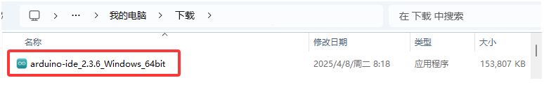

2\. 当你收到操作系统的警告时，请点击 “**Allow access**” 允许驱动程序安装。

3\. 点击 “**I Agree**” 阅读许可协议并同意。

4\. 选择安装选项为 “**Anyone who uses this computer(all users)**” 后再点击 "**Next**"。

5\. 如果又出现下面页面，请点击 “**I Agree**”。

6\. 选择安装目录(我们建议保持默认目录)，然后点击 “**Install**”。

7\. 如果出现以下界面，则应选择 “**Install**”。

该过程将提取并安装所有必需的文件，以正确执行Arduino软件(IDE)。

8\. 安装完成后，会在桌面上生成一个Arduino IDE软件快捷方式，单击 “**Finish**” 并运行 Arduino IDE。

### **3. Arduino IDE工具栏介绍**

点击电脑桌面上的图标 ，打开 Arduino IDE。

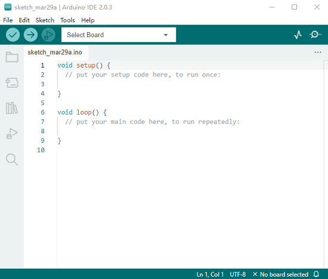

 -- 用于 检查是否存在任何编译错误。

 -- 用于 将程序上传到Arduino板。

 -- 用于 编写程序时的单步调试。

 -- 用于 从板接收串行数据并将串行数据发送到板的串行监视器。

 -- 用于 串口接收的数据转换成动态曲线图。

 -- 用于 打开最近保存的示例草图。

 -- 用于 手动安装开发板。

**语言切换功能：**

（1）单击 “**File**” → “**Preferences**”，在 Preferences 页面中将语言 “**English**” 切换成 “**简体中文**”，点击 “**OK**” 就可以了。

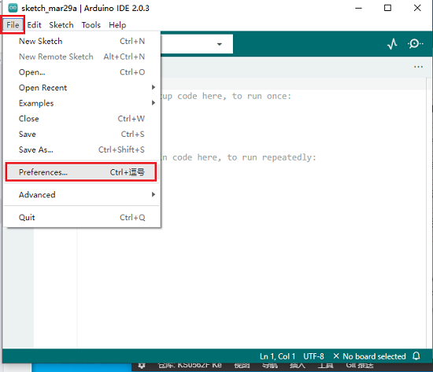

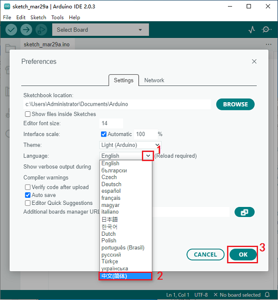

### **4. 在Arduino IDE上安装ESP32**

上面已经学习了怎么下载ArduinoIDE和怎么安装驱动，那下面就要在Arduino IDE上安装ESP32，请执行以下步骤：

特别注意：请选择1.8.5及以上版本的Arduino IDE进行安装，以确保ESP32环境可以安装成功。

(1) 点击电脑桌面上的图标 ，打开Arduino IDE。

(2) 点击 “**文件**” → “**首选项**”，如下图：

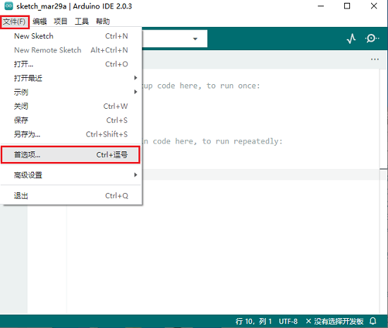

(3) 打开下图标出的按钮。

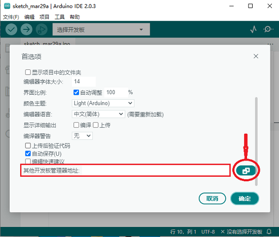

(4) 将这个地址：`https://espressif.github.io/arduino-esp32/package_esp32_index.json` 复制粘贴到里面去，再点击 “**确定**” 保存这个地址，如下图：

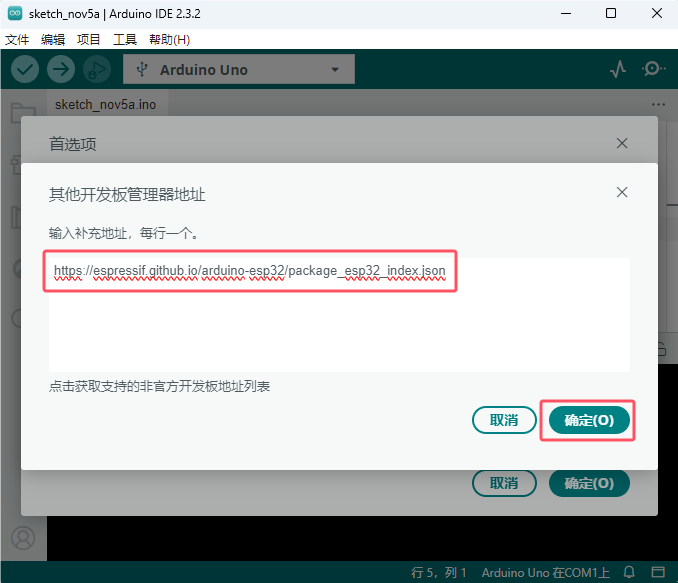

(5) 再点击 “**确定**”。

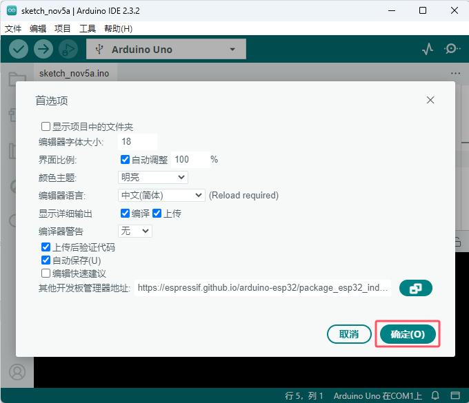

（6）先点击 “**工具**” → “**开发板:**”，再点击 “**开发板管理器...**” 按钮进入 “**开发板管理器**” 页面，在文本框中输入 “**esp32**”，选择 1.0.6 版本进行安装，安装包不大，点击 “**安装**” 按钮开始安装相关安装包。如下图：**（特别提醒：如果选择更高版本或最新版本，在后续课程上传代码中可能会报错。）**

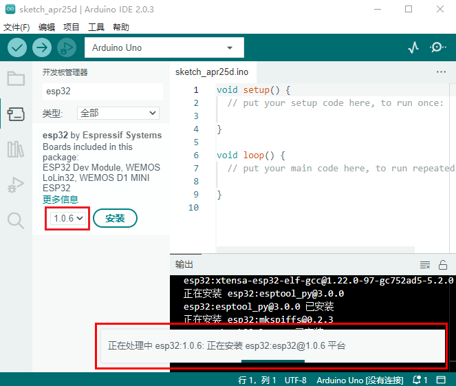

（7）点击 “**工具**” → “**开发板:**”，就可以看到安装好的 **ESP32 Arduino**，你可以在里面查看到各种不同型号ESP32开发板，选择对应的ESP32开发板型号。

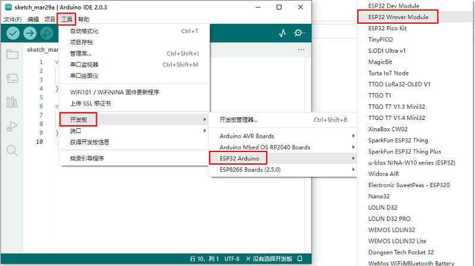

### **5. 添加arduino库文件（以Windows系统为例）**

特别提醒：库文件在上面 **资料下载** 处提供有，请下载并且安装好库文件。

找到前面下载的资料，如下图：

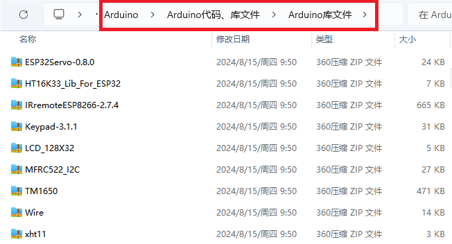

（1）打开Arduino IDE，在Arduino IDE界面点击 “**项目**” → “**包含库**” → “**添加.ZIP库...**”。

（2）找到库文件存放的位置，选中对应的库文件，点击 “**打开**” 添加即可。库文件只能一个一个的添加。（注意：库文件需要压缩为 **.ZIP** 格式，我们在文件夹中是以 **.ZIP** 格式提供有；这里以 “**ESP32Servo-0.8.0.ZIP**” 为演示，其他库文件的添加方法是一样的。）。

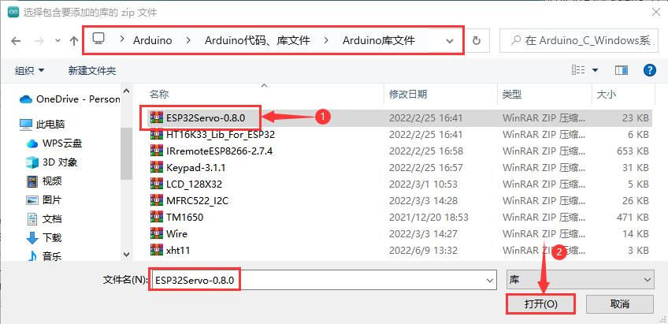

到这，正常是安装成功的了。

