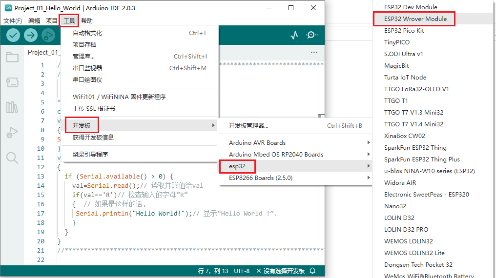
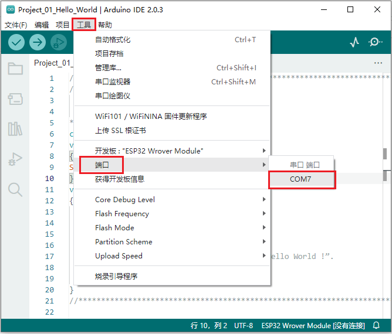
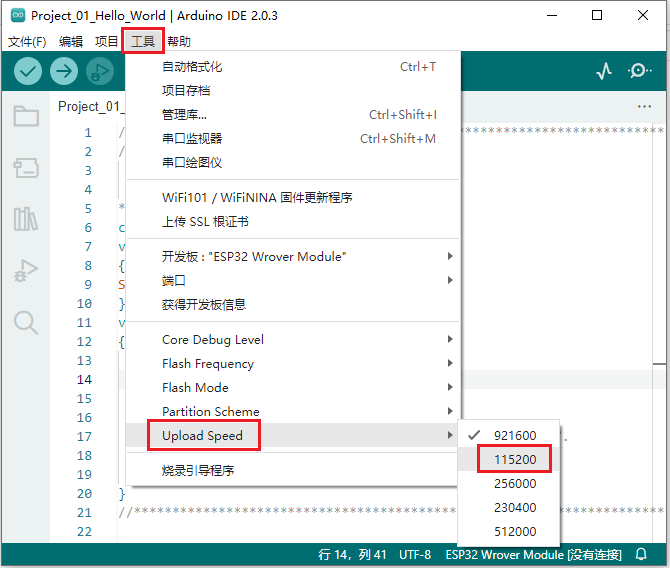
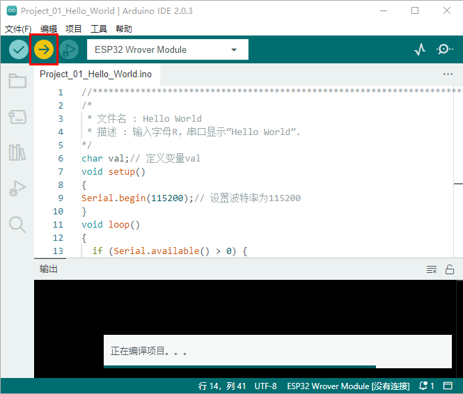
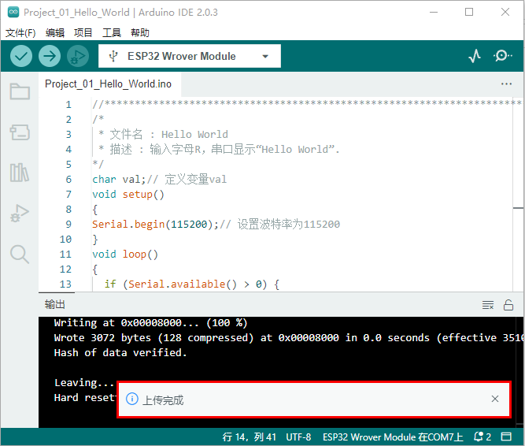
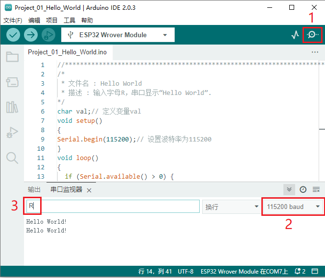

## 项目01 Hello World

**1. 项目介绍：**

对于ESP32的初学者，我们将从一些简单的东西开始。在这个项目中，你只需要一个ESP32主板，USB线和电脑就可以完成 “Hello World!” 项目。它不仅是ESP32主板和电脑的通信测试，也是ESP32的初级项目。

**2. 项目元件：**

|||
| :--: | :--: |
| ESP32*1 | USB 线*1 |

**3. 项目接线：**

在本项目中，我们通过USB线将ESP32和电脑连接起来。


**4. 项目代码：**

代码也可以从前面 “**资料下载**” 中找到，建议直接使用下载的资料里面的代码。

```C
//*************************************************************************************
/*
 * 文件名 : Hello World
 * 描述 : 输入字母R，串口显示“Hello World”.
*/
char val;// 定义变量val
void setup()
{
Serial.begin(115200);// 设置波特率为115200
}
void loop()
{
  if (Serial.available() > 0) {
    val=Serial.read();// 读取并赋值给val
    if(val=='R')// 检查输入的字母“R”
    {  // 如果是这样的话,    
     Serial.println("Hello World!");// 显示“Hello World !”.
    }
  }
}
//*************************************************************************************

```
在上传项目代码到ESP32之前，点击 “**工具**” → “**开发板**”，选择 “**ESP32 Wrover Module**”。（**<span style="color: rgb(255, 76, 65);">后面上传项目代码的步骤也一样，即：同下</span>。**）



选择正确的端口（COM）。(<span style="color: rgb(255, 76, 65);">注意：</span>将ESP32主板通过USB线连接到计算机后才能看到对应的端口。)



<span style="color: rgb(255, 76, 65);">注意：</span>对于macOS用户，如果上传失败，在单击之前，请设置波特率为 **115200**。



单击  将项目代码上传到ESP32主板上。



<span style="color: rgb(255, 76, 65);">注意：</span> 如果上传代码不成功，可以再次点击  后用手按住ESP32主板上的Boot键 ，出现上传进度百分比数后再松开Boot键，如下图所示：


项目代码上传成功！



**5. 项目结果：** 

项目代码上传成功后，单击图标  进入串行监视器，设置波特率为 **115200**，在文本框输入字母 “**R**”，按一下回车键(Enter 键)，这样串口监视器打印 “Hello World!”。




