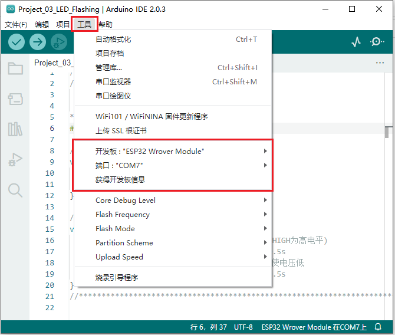
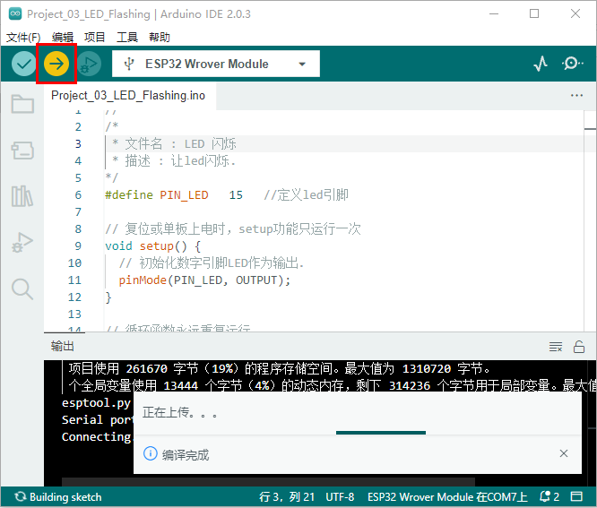
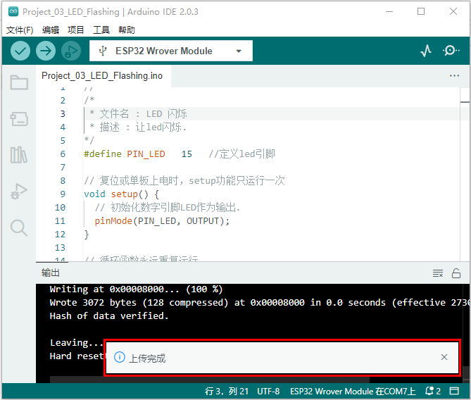
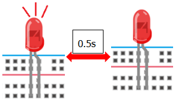

## 项目03 LED闪烁

**1. 项目介绍：**

在这个项目中，我们将向你展示LED闪烁效果。我们使用ESP32的数字引脚打开LED，让它闪烁。

**2. 项目元件：**

||||
| :--: | :--: | :--: |
|ESP32*1|面包板*1|红色LED*1|
|| ||
|220Ω电阻*1|跳线*2|USB 线*1|

**3. 项目接线图：**

首先，切断ESP32的所有电源。然后根据电路图和接线图搭建电路。电路搭建好并验证无误后，用USB线将ESP32连接到电脑上。

<span style="color: rgb(255, 76, 65);">注意：</span>避免任何可能的短路(特别是连接3.3V和GND)!

<span style="color: rgb(255, 76, 65);">警告：短路可能导致电路中产生大电流，造成元件过热，并对硬件造成永久性损坏。 </span>


<span style="color: rgb(255, 76, 65);">注意: </span>

怎样连接LED 


怎样识别五色环220Ω电阻


**4. 项目代码：**

代码也可以从前面 “**资料下载**” 中找到，建议直接使用下载的资料里面的代码。（注意：从本课程开始后续课程不再进行此提示）

```C
//**********************************************************************
/*
 * 文件名 : LED 闪烁
 * 描述 : 让led闪烁.
*/
#define PIN_LED   15   //定义led引脚

// 复位或单板上电时，setup功能只运行一次
void setup() {
  // 初始化数字引脚LED作为输出.
  pinMode(PIN_LED, OUTPUT);
}

// 循环函数永远重复运行
void loop() {
  digitalWrite(PIN_LED, HIGH);   // 打开LED (HIGH为高电平)
  delay(500);                       // 延时 0.5s
  digitalWrite(PIN_LED, LOW);    // 关闭LED，使电压低
  delay(500);                       // 延时 0.5s
}
//*************************************************************************************

```
在上传项目代码到ESP32之前，请检查Arduino IDE的配置。（**<span style="color: rgb(255, 76, 65);">后面上传项目代码的步骤也一样，即：同下</span>。**）

单击 “**工具**”，确认 “**开发板**” 板型和 “**端口(COM)**”，如下所示：(<span style="color: rgb(255, 76, 65);">注意：</span>将ESP32主板通过USB线连接到计算机后才能看到对应的端口。)



单击  将项目代码上传到ESP32主板上。



<span style="color: rgb(255, 76, 65);">注意：</span> 如果上传代码不成功，可以再次点击  后用手按住ESP32主板上的Boot键 ，出现上传进度百分比数后再松开Boot键，如下图所示：


项目代码上传成功！



**5. 项目现象：**

项目代码上传成功后，利用USB线上电，可以看到的现象是：可以看到电路中的LED会反复闪烁。




