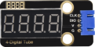
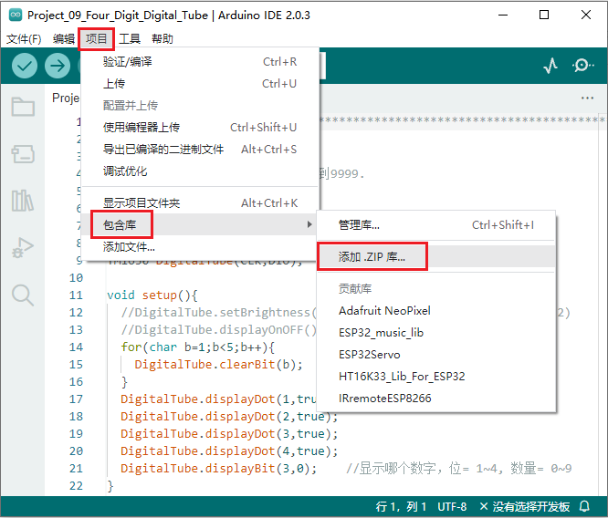
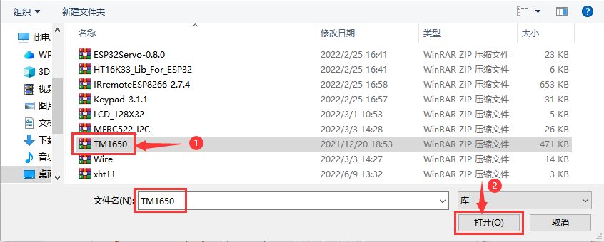
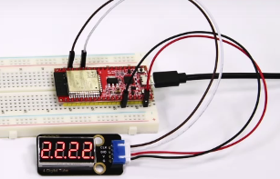

## 项目09 四位数码管

**1. 项目介绍：**

四位数码管是一种非常实用的显示器件，电子时钟的显示，球场上的记分员，公园里的人数都是需要的。由于价格低廉，使用方便，越来越多的项目将使用4位数码管。

在这个项目中，我们使用ESP32控制四位数码管来显示四位数字。

**2. 项目元件：**

||||
| :--: | :--: | :--: |
|ESP32*1|面包板*1|四位数码管*1|
||| |
|4P转杜邦线公单*1|USB 线*1| |

**3. 元件知识：**

**TM1650四位数码管：** 是一个12脚的带时钟点的四位共阴数码管（0.36英寸）的显示模块，驱动芯片为TM1650，只需2根信号线即可使单片机控制四位数码管。控制接口电平可为5V或3.3V。

G：电源负极

V：电源正极，+5V

DIO：数据IO模块，可以接任意的数字引脚

CLK：时钟引脚，可以接任意的数字引脚

**4位数码管模块规格参数：**

工作电压：DC 3.3V-5V

工作电流：≤100MA

最大功率：0.5W

数码管显示颜色：红色

**4位数码管模块原理图：**


**4. 项目接线图：**


**5. 添加TM1650库：**

本项目代码使用了一个名为 “<span style="color: rgb(255, 76, 65);">TM1650</span>” 库。如果你已经添加好了 “<span style="color: rgb(255, 76, 65);">TM1650</span>” 库，则跳过此步骤。如果你还没有添加，请在学习之前安装它。添加第三方库的步骤如下:

**如何安装库？**

打开Arduino IDE，单击 “**项目**” → “**包含库**” → “**添加.ZIP库...**”。在弹出窗口中找到该目录下名为 **..\Arduino代码、库文件\Arduino库文件\TM1650.ZIP**的文件，先选中 **TM1650.ZIP** 文件，再单击 “**打开**”。





**6. 项目代码：**

```C
//**********************************************************************
/* 
 * 文件名  : 四位数码管
 * 描述 : 四位数管显示数字从1111到9999.
*/
#include "TM1650.h"
#define CLK 22    //TM1650的引脚定义，可以更改为其他端口 
#define DIO 21
TM1650 DigitalTube(CLK,DIO);

void setup(){
  //DigitalTube.setBrightness();  //stes brightness 从0到7(默认为2)
  //DigitalTube.displayOnOFF();   // 0= off,1= on(默认 is 1)
  for(char b=1;b<5;b++){
    DigitalTube.clearBit(b);      //要清除哪位?
  }
  DigitalTube.displayDot(1,true); // 显示第一个数字
  DigitalTube.displayDot(2,true);
  DigitalTube.displayDot(3,true);
  DigitalTube.displayDot(4,true);
  DigitalTube.displayBit(3,0);    //显示哪个数字，位= 1~4, 数量= 0~9
}

void loop(){
  for(int num=0; num<10; num++){
    DigitalTube.displayBit(1,num);
    DigitalTube.displayBit(2,num);
    DigitalTube.displayBit(3,num);
    DigitalTube.displayBit(4,num);
    delay(1000);
  }  
 }
//**********************************************************************************
```
**7. 项目现象：**

代码上传成功后，利用USB线上电后，你会看到的现象是：四位数码管显示四位数字0000-9999，并在一个无限循环中重复这些动作。




