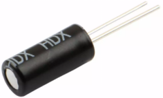
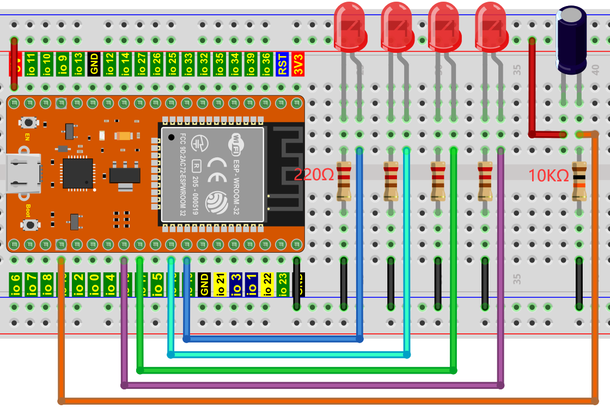

## 项目15 模拟沙漏

**1. 项目介绍：**

古代人没有电子时钟，就发明了沙漏来测时间，沙漏两边的容量比较大，在一边装了细沙，中间有个很小的通道，将沙漏直立，有细沙的一边在上方，由于重力的作用，细沙就会往下流通过通道到沙漏的另一边，当细沙都流到下边了，就倒过来，把一天反复的次数记录下来，第二天就可以通过沙漏反复流动的次数而知道这一天大概的时间了。

这一课我们将利用ESP32控制倾斜开关和LED灯来模拟沙漏，制作一个电子沙漏。

**2. 项目元件：**

|  |  |  |  |
| :------------------------------------------------------------: | :------------------------------------------------------------: | :------------------------------------------------------------: | :------------------------------------------------------------: |
|                            ESP32*1                             |                             面包板*1                              |                             倾斜开关*1                             |                            10KΩ电阻*1                            |
|  |  |  |  |
|                            红色 LED*4                            |                            220Ω电阻*4                            |                              跳线若干                              |                            USB 线*1                             |

**3. 元件知识：**



倾斜开关也叫数字开关或球形开关，里面有一个金属球。它用于检测小角度的倾斜。

原理很简单：当开关倾斜一定角度时，里面的球会向下滚动，接触到连接到外面引脚的两个触点，从而触发电路。否则，球将远离触点，从而断开电路。

这里用倾斜开关的内部结构来说明它是如何工作的，显示如下图：


**4. 项目接线图：**



<span style="color: rgb(255, 76, 65);">注意: </span>

怎样连接LED 


怎样识别五色环220Ω电阻和五色环10KΩ电阻


**5. 项目代码：**

```C
//**********************************************************************
/* 
 * 文件名  : 倾斜和LED
 * 描述 : 倾斜开关和四个led模拟沙漏.
*/
#define SWITCH_PIN  15  // 倾斜开关连接Pin15
byte switch_state = 0;
void setup()
{
  for(int i=16;i<20;i++)
  {
    pinMode(i, OUTPUT);
  } 
  pinMode(SWITCH_PIN, INPUT);
  for(int i=16;i<20;i++)
  {
    digitalWrite(i,0);
  } 
  Serial.begin(9600);
}
void loop()
{
switch_state = digitalRead(SWITCH_PIN); 
Serial.println(switch_state);
  if (switch_state == 0) 
  {
    for(int i=16;i<20;i++)
    {
      digitalWrite(i,1);
      delay(500);
    } 
}
 if (switch_state == 1) 
 {
   for(int i=19;i>15;i--)
   {
    digitalWrite(i,0);
    delay(500);
   }
  }
}
//**********************************************************************************
```

**6. 项目现象：**

代码上传成功后，利用USB线上电，你会看到的现象是：将面包板倾斜到一定角度，led就会一个一个地亮起来。当回到上一个角度时，led会一个一个关闭。就像沙漏一样，随着时间的推移，沙子漏了出来。


