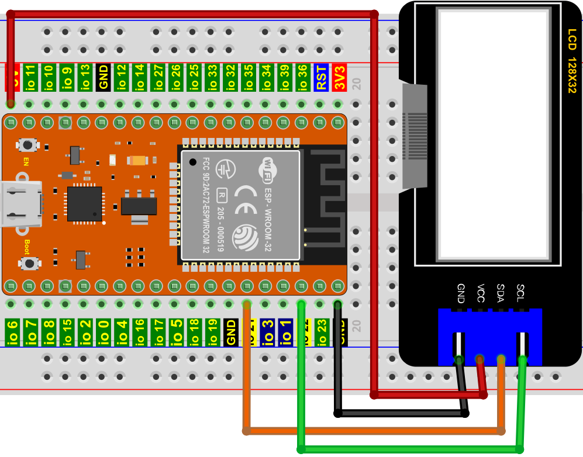
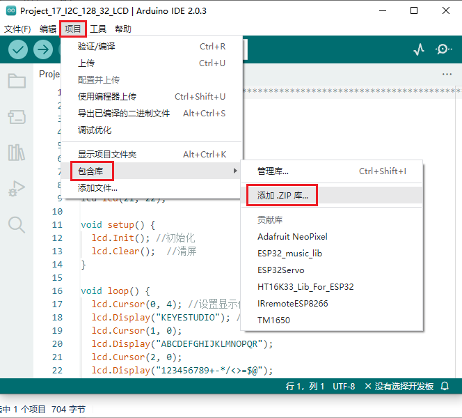
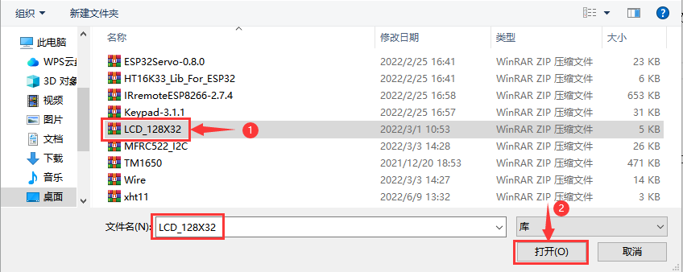

## 项目17 I2C 128×32 LCD

**1. 项目介绍：**

在生活中，我们可以利用显示器等模块来做各种实验。你也可以DIY各种各样的小物件。例如，用一个温度传感器和显示器做一个温度测试仪，或者用一个超声波模块和显示器做一个距离测试仪。下面，我们将使用LCD_128X32_DOT模块作为显示器，将其连接到ESP32控制板上。将使用ESP32主板控制LCD_128X32_DOT显示屏显示各种英文文字、常用符号和数字。

**2. 项目元件：**

||||
| :--: | :--: | :--: |
|ESP32*1|面包板*1|LCD_128X32_DOT*1|
||| |
|4P转杜邦线公单*1|USB 线*1| |

**3. 元件知识：**


**LCD_128X32_DOT：** 一个像素为128X32的液晶屏模块，它的驱动芯片为ST7567A。模块使用IIC通信方式，它不仅可以显示英文字母、符号，还可以显示中文文字和图案。使用时，还可以在代码中设置，让英文字母和符号等显示不同大小。

**LCD_128X32_DOT原理图：**


**LCD_128X32_DOT技术参数：**

显示像素：128 * 32 字符

工作电压：DC 5V

工作电流：100mA (5V)

模块最佳工作电压：5V

亮度、对比度可通过程序指令控制

**4. 项目接线图：**



**5. 添加LCD_128×32库：**

本项目代码使用了一个名为 “<span style="color: rgb(255, 76, 65);">LCD_128×32</span>” 库。如果你已经添加好了 “<span style="color: rgb(255, 76, 65);">LCD_128×32</span>” 库，则跳过此步骤。如果你还没有添加，请在学习之前安装它。添加第三方库的步骤如下:

打开Arduino IDE，单击 “**项目**” → “**包含库**” → “**添加.ZIP库...**”。在弹出窗口中找到该目录下名为 **..\Arduino代码、库文件\Arduino库文件\LCD_128X32.ZIP** 的文件，先选中 **LCD_128X32.ZIP** 文件，再单击 “**打开**”。





**6. 项目代码：**

```C
//**********************************************************************************
/*
 * 文件名  : LCD 128*32
 * 描述 : LCD 128*32显示字符串
*/
#include "lcd128_32_io.h"

//创建lCD128 *32引脚，sda--->21， scl--->22
lcd lcd(21, 22);

void setup() {
  lcd.Init(); //初始化
  lcd.Clear();  //清屏
}

void loop() {
  lcd.Cursor(0, 4); //设置显示位置
  lcd.Display("KEYESTUDIO"); //设置显示
  lcd.Cursor(1, 0);
  lcd.Display("ABCDEFGHIJKLMNOPQR");
  lcd.Cursor(2, 0);
  lcd.Display("123456789+-*/<>=$@");
  lcd.Cursor(3, 0);
  lcd.Display("%^&(){}:;'|?,.~\\[]");
}
//**********************************************************************************
```

**7. 项目现象：**

代码上传成功后，利用USB线上电，你会看到的现象是：128X32LCD模块显示屏第一行显示“KEYESTUDIO”、第二行显示“ABCDEFGHIJKLMNOPQR”、第三行显示“123456789+-*/<>=$@”、第四行显示“%^&(){}:;'|?,.~\\[]”。


