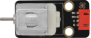
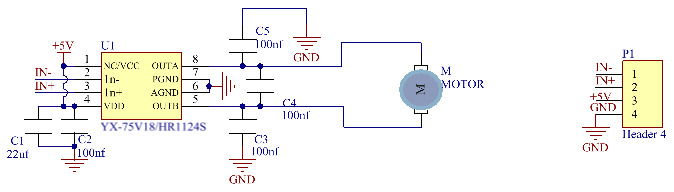
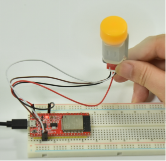

## 项目18 小风扇

**1. 项目介绍：** 

在炎热的夏季，需要电扇来给我们降温，那么在这个项目中，我们将使用ESP32控制130电机模块和小扇叶来制作一个小电扇。

**2. 项目元件：**

||||
| :--: | :--: | :--: |
|ESP32*1|面包板*1|130电机模块*1|
||||
|面包板专用电源模块*1|6节5号电池盒*1|风扇叶*1|
|  |||
|4P转杜邦线公单*1|5号电池(<span style="color: rgb(255, 76, 65);">自备</span>)*6|USB 线*1|

**3. 元件知识:**


**130电机模块：** 该电机控制模块采用HR1124S电机控制芯片，HR1124S是应用于直流电机方案的单通道H桥驱动器芯片。HR1124S的H桥驱动部分采用低导通电阻的PMOS和NMOS功率管，低导通电阻保证芯片低的功率损耗，使得芯片安全工作更长时间。此外HR1124S拥有低待机电流，低静态工作电流，这些性能使130电机模块易用于玩具方案。

**130电机模块参数：**

工作电压：5V

工作电流：≤200MA

工作功率：2W

工作温度：-10℃~+50℃

**130电机模块原理：**

HR1124S芯片的作用是助于驱动电机，而电机所需电流较大，无法用三极管驱动更无法直接用IO口驱动。让电机转动起来的方法很简单，给电机两端添加电压即可。不同电压方向电机转向也不相同，在额度电压内，电压越大，电机转动得越快；反之电压越低，电机转动得越慢，甚至无法转动。控制方式有两种：一种是高低电平控制（控制转动和停止），一种是PWM控制（控制转速）。



**面包板专用电源模块：**


**说明：**

此模块，能方便的给面包板提供3.3V和5V的电源，具有DC2.1输入（DC7－12V），另外，具备USB Type C接口的电源输入。

**规格：** 

 输入电压：DC座：7-12V；Type C USB：5V 

 电流：3.3V：最大500mA；5V：最大500mA；

 最大功率: 2.5W

 尺寸: 53mmx26.3mm

 环保属性: ROHS

**接口说明：**


**原理图：**


**4. 项目接线图：**


(<span style="color: rgb(255, 76, 65);">注: 先接好线，然后在直流电机上安装一个小风扇叶片。</span>)

**5. 项目代码：**

```C
//**********************************************************************************
/*
 * 文件名  : 小风扇
 * 描述 : 风扇顺时针旋转，停止，逆时针旋转，停止，循环.
*/
#define Motorla    15  // 电机的Motor_IN+引脚
#define Motorlb     2  // 电机的Motor_IN引脚

void setup(){
  pinMode(Motorla, OUTPUT);//设置Motorla为OUTPUT
  pinMode(Motorlb, OUTPUT);//设置Motorlb为OUTPUT
}
void loop(){
//设置为逆时针旋转5s
  digitalWrite(Motorla,HIGH);
  digitalWrite(Motorlb,LOW);
  delay(5000);
//设置停止旋转2s 
  digitalWrite(Motorla,LOW);
  digitalWrite(Motorlb,LOW);
  delay(2000);
//设置为顺时针旋转5s
  digitalWrite(Motorla,LOW);
  digitalWrite(Motorlb,HIGH);
  delay(5000);
//设置停止旋转2s 
  digitalWrite(Motorla,LOW);
  digitalWrite(Motorlb,LOW);
  delay(2000);
}
//********************************************************************************
```

**6. 项目现象：**

代码上传成功后，外接电源，上电后，你会看到的现象是：小风扇先逆时针转5秒，停止2秒，再顺时针转5秒，停止2秒，以此规律重复执行。




