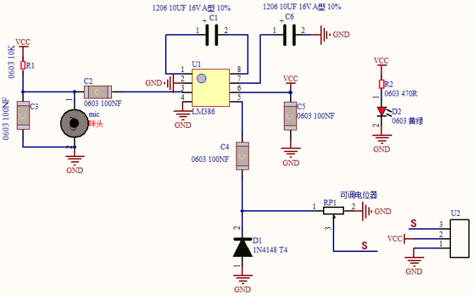
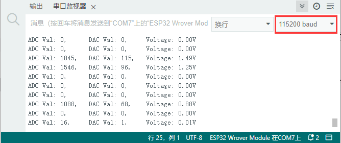

## 项目26 声控风扇

**1. 项目介绍：**

声音传感器有一个内置的电容驻极体麦克风和功率放大器。它可以用来检测环境的声音强度。

在这个项目中，我们利用ESP32控制声音传感器和电机模块模拟一个声控风扇。

**2. 项目元件：**

|||||
| :--: | :--: | :--: | :--: |
|ESP32*1|面包板*1|130电机模块*1|声音传感器*1 |
||||  |
|面包板专用电源模块*1|6节5号电池盒*1|风扇叶*1|3P转杜邦线公单*1 |
|||| |
|4P转杜邦线公单*1|5号电池(<span style="color: rgb(255, 76, 65);">自备</span>)*6|USB 线*1| |

**3. 元件知识：**


**声音传感器:** 通常用于检测周围环境中的声音响度。微型控制板可以通过模拟输入接口采集其输出信号。传感器的S引脚是模拟输出，是麦克风电压信号的实时输出。传感器附带一个电位器，这样你就可以调整信号强度。你可以使用它来制作一些交互式作品，如语音操作的开关等。

**声音传感器参数：**

- 工作电压：3.3V-5V（DC）
- 工作电流：≤100mA
- 最大功率：0.5W
- 输出信号：模拟信号

**声音传感器原理图：**

它主要采用一个高感度麦克风元件和LM386芯片。高感度麦克风元件用于检测外界的声音。利用LM386芯片搭建合适的电路，我们对高感度麦克风检测到的声音进行放大，最大倍数为200倍。使用时我们可以通过旋转传感器上电位器，调节声音的放大倍数。调节时，顺时针调节电位器到尽头，放大倍数最大。



**4. 读取声音传感器的ADC值，DAC值和电压值：**

我们首先使用一个简单的代码来读取声音传感器的ADC值，DAC值和电压值并将其打印出来，接线请参照以下接线图：


```C
//**********************************************************************************
/*  
 * 文件名 : 读取声音传感器模拟值
 * 描述 : ADC的基本用法
*/
#define PIN_ANALOG_IN  36  //声音传感器的引脚

void setup() {
  Serial.begin(115200);
}

//在loop()中，使用analogRead()函数获取ADC值，
//然后使用map()函数将值转换为8位精度的DAC值。
//输入输出电压按下式计算，
//信息最终被打印出来.

void loop() {
  int adcVal = analogRead(PIN_ANALOG_IN);
  int dacVal = map(adcVal, 0, 4095, 0, 255);
  double voltage = adcVal / 4095.0 * 3.3;
  Serial.printf("ADC Val: %d, \t DAC Val: %d, \t Voltage: %.2fV\n", adcVal, dacVal, voltage);
  delay(200);
}
//**********************************************************************************
```

编译并上传代码到ESP32，代码上传成功后，利用USB线上电，打开串口监视器，设置波特率为<span style="color: rgb(255, 76, 65);">115200</span>。可以看到的现象是：串口监视器窗口将打印声音传感器读取的模拟值，当对着传感器拍拍手，声音传感器的模拟值发生了显著的变化。



**5. 智能风扇的接线图：**

接下来，我们正式进入这个项目。我们用声音传感器、130电机模块和风叶片来模拟一个声控风扇。接线图如下：


(<span style="color: rgb(255, 76, 65);">注: 先接好线，然后在直流电机上安装一个小风扇叶片。</span>)

**6. 项目代码：**

（<span style="color: rgb(255, 76, 65);">注意：</span>代码中的阀值600可以根据实际情况自己重新设置）

```C
//**********************************************************************************
/*  
 * 文件名 : 声控风扇
 * 描述 : 通过声音传感器控制风扇.
*/
#define PIN_ADC0   36  //声音传感器的引脚
#define PIN_Motorla    15  // 电机的Motor_IN+引脚
#define PIN_Motorlb    2 // 电机的Motor_IN引脚

void setup() {
  pinMode(PIN_Motorla, OUTPUT);//设置Motorla为输出
  pinMode(PIN_Motorlb, OUTPUT);//设置Motorlb为输出
  pinMode(PIN_ADC0, INPUT);//设置PIN_ADC2为INPUT
}

void loop() {
  int adcVal = analogRead(PIN_ADC0); //读取声音传感器的ADC值
  if (adcVal > 600) {
    digitalWrite(PIN_Motorla,HIGH); //旋转
    digitalWrite(PIN_Motorlb,LOW);
    delay(5000); //延时 5S
  }
  else
  {
    digitalWrite(PIN_Motorla,LOW); //停止旋转
    digitalWrite(PIN_Motorlb,LOW); 
  }
}
//**********************************************************************************
```
**7. 项目现象：**

编译并上传代码到ESP32，代码上传成功后，外接电源，上电后，你会看到的现象是：对着声音传感器拍拍手，当声音强度超过阈值时，小风扇旋转起来；反之，小风扇不旋转。


