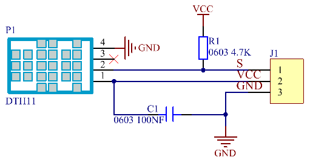
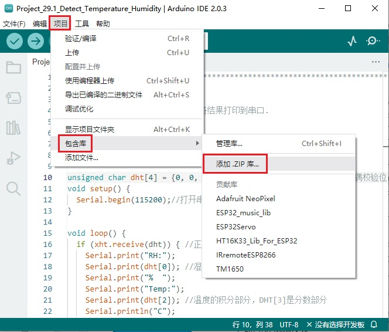
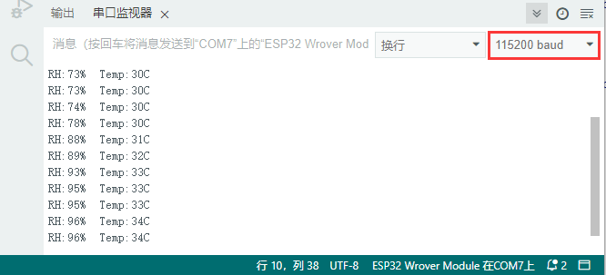

## 项目29 温湿度表

**1. 项目介绍：**

在冬季时，空气中的湿度很低，就是空气很干燥，再加上寒冷，人体的皮肤就容易过于干燥而裂，所以需要在用加湿器给家里的空气增加湿度，但是怎么知道空气过于干燥了呢？那就需要检测空气湿度的设备。

这节课就来学习温湿度传感器的使用。我们使用温湿度传感器制作一个温湿度计，并且还结合LCD 128X32 DOT来显示温度和湿度值。

**2. 项目元件：**

|||||
| :--: | :--: | :--: | :--: |
|ESP32*1|面包板*1|LCD_128X32_DOT*1|温湿度传感器*1|
| ||| |
|3P转杜邦线公单*1|4P转杜邦线公单*1|USB 线*1| |

**3. 元件知识：**


**温湿度传感器：** 是一款含有已校准数字信号输出的温湿度复合传感器，其精度湿度±5%RH，温度±2℃，量程湿度20-90%RH， 温度0~50℃。温湿度传感器应用专用的数字模块采集技术和温湿度传感技术，确保产品具有极高的可靠性和卓越的长期稳定性。温湿度传感器包括一个电阻式感湿元件和一个NTC测温元件，非常适用于对精度和实时性要求不高的温湿度测量场合。
工作电压在3.3V-5.5V范围内。

温湿度传感器有三个引脚，分别为VCC，GND和S。S为数据输出的引脚。使用的是串行通讯。

**温湿度传感器的单总线格式定义：**

| 名称 |单总线格式定义 |
| :--: | :--: |
| 起始信号| 微处理器把数据总线(SDA)拉低一段时间至少 18ms(最大不得超过 30ms)，通知传感器准备数据。 | 
| 响应信号 | 传感器把数据总线（SDA）拉低 83µs，再接高 87µs 以响应主机的起始信号。 |
| 湿度 | 湿度高位为湿度整数部分数据，湿度低位为湿度小数部分数据  |
| 温度 |温度高位为温度整数部分数据，温度低位为温度小数部分数据，且温度低位 Bit8 为 1 则表示负温度，否则为正温度 |
| 校验位 | 校验位＝湿度高位+湿度低位+温度高位+温度低位 |

**温湿度传感器数据时序图：** 

用户主机（MCU）发送一次开始信号后，温湿度传感器从低功耗模式转换到高速模式，待主机开始信号结束后，温湿度传感器发送响应信号，送出 40bit 的数据，并触发一次信采集。信号发送如图所示。 


温湿度传感器可以很容易地将温湿度数据添加到您的DIY电子项目中。它是完美的远程气象站，家庭环境控制系统，和农场或花园监测系统。

**温湿度传感器的参数：**

- 工作电压：+5 V
- 温度范围：0-50 °C ，误差：± 2 °C
- 湿度范围：20-90% RH ，误差：± 5% RH
- 数字接口

**温湿度传感器的原理图：**



**4. 读取温湿度值：**


**如何添加xht11库：**

本项目代码使用了一个名为 “<span style="color: rgb(255, 76, 65);">xht11</span>” 库。如果你已经添加好了 “<span style="color: rgb(255, 76, 65);">xht11</span>” 库，则跳过此步骤。如果你还没有添加，请在学习之前添加它。添加第三方库的步骤如下:

打开Arduino IDE，单击“**项目**” → “**包含库**” → “**添加.ZIP库...**”。在弹出窗口中找到该目录下名为 **..\Arduino代码、库文件\Arduino库文件\xht11.ZIP** 的文件，先选中 **xht11.ZIP** 文件，再单击 “**打开**”。




```C
//**********************************************************************************
/*
 * 文件名  : 温湿度传感器
 * 描述 : 使用XHT11测量温湿度。将结果打印到串口.
*/
#include "xht11.h"
//gpio13
xht11 xht(13);

unsigned char dht[4] = {0, 0, 0, 0};//只接收数据的前32位，不接收奇偶校验位
void setup() {
  Serial.begin(115200);//打开串口监视器，将波特率设置为115200
}

void loop() {
  if (xht.receive(dht)) { //正确选中时返回true
    Serial.print("RH:");
    Serial.print(dht[0]); //湿度的积分部分，DHT[0]为小数部分
    Serial.print("%  ");
    Serial.print("Temp:");
    Serial.print(dht[2]); //温度的积分部分，DHT[3]是分数部分
    Serial.println("C");
  } else {    //读取错误
    Serial.println("sensor error");
  }
  delay(1000);  //设备读取等待时间为1000ms
}
//**********************************************************************************
```
编译并上传代码到ESP32，代码上传成功后，利用USB线上电，打开串口监视器，设置波特率为<span style="color: rgb(255, 76, 65);">115200</span>。你会看到的现象是：串口监视器窗口将打印当前显示当前环境中的温湿度数据，如下图。



**5. 温湿度仪表的接线图：**

现在我们开始用LCD_128X32_DOT打印温湿度传感器的值，我们会在LCD_128X32_DOT的屏幕上看到相应的值。让我们开始这个项目吧。请按照下面的接线图进行接线：


**6. 项目代码：**

前面已经添加过 <span style="color: rgb(255, 76, 65);">xht11</span> 和 <span style="color: rgb(255, 76, 65);">LCD_128×32</span> 库，可以不用重复添加。如果没有添加，就需要添加 <span style="color: rgb(255, 76, 65);">xht11</span> 和 <span style="color: rgb(255, 76, 65);">LCD_128×32</span> 库，添加 <span style="color: rgb(255, 76, 65);">xht11</span> 库的方法请参照本项目的上面方法，添加 <span style="color: rgb(255, 76, 65);">LCD_128×32</span> 库的方法请参照 **项目17 I2C 128×32 LCD** 中的方法。

```C
//**********************************************************************************
/*
 * 文件名  : 温湿度计
 * 描述 : LCD显示温度和湿度的数值.
*/
#include "xht11.h"
#include "lcd128_32_io.h"

//gpio13
xht11 xht(13);
unsigned char dht[4] = {0, 0, 0, 0};//只接收数据的前32位，不接收奇偶校验位

lcd lcd(21, 22); //创建lCD128 *32引脚，sda->21， scl->22

void setup() {
  lcd.Init(); //初始化
  lcd.Clear();  //清屏
}
char string[10];

//LCD显示湿度和温度值
void loop() {
  if (xht.receive(dht)) { //正确选中时返回true
    }
  lcd.Cursor(0,0); //设置显示位置
  lcd.Display("Temper:"); //设置显示
  lcd.Cursor(0,8);
  lcd.DisplayNum(dht[2]);
  lcd.Cursor(0,11);
  lcd.Display("C");
  lcd.Cursor(2,0); 
  lcd.Display("humid:");
  lcd.Cursor(2,8);
  lcd.DisplayNum(dht[0]);
  lcd.Cursor(2,11);
  lcd.Display("%");
  delay(200);
}
//**********************************************************************************
```
**7. 项目现象：**

编译并上传代码到ESP32，代码上传成功后，利用USB线上电，你会看到的现象是：LCD 128X32 DOT的屏幕上显示温湿度传感器检测环境中相应的温度值和湿度值。


