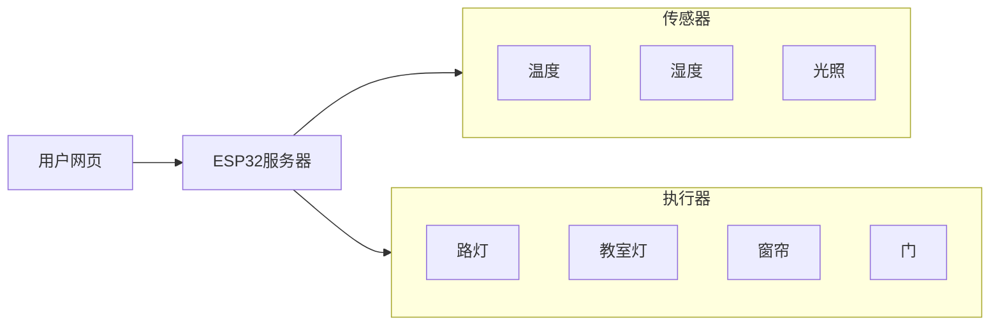
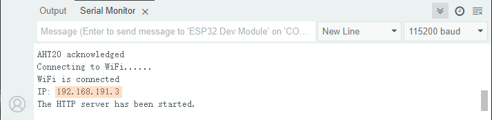
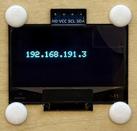
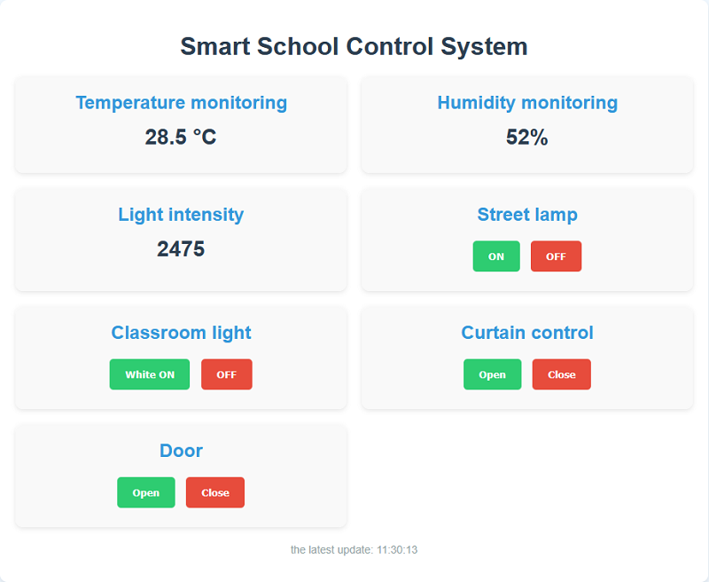
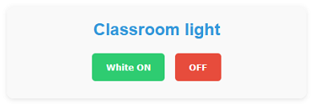
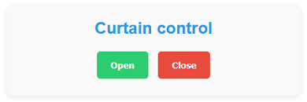
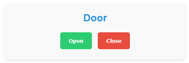

## 16. 智慧教室

本智慧校园课程将指导您开发一个集环境监测与设备控制于一体的物联网应用系统。通过网页端实时监控教室内的温湿度、光照强度等环境数据，并支持远程控制窗帘开关、教室灯与路灯的明灭以及校门启闭状态。一起来助力绿色智慧校园建设吧！


#### 流程图




#### 实验代码

```c++
#include <WiFi.h>
#include <WebServer.h>
#include <Wire.h>
#include <AHT20.h>
#include <Stepper.h>
#include <ESP32Servo.h>
#include <Adafruit_GFX.h>
#include <Adafruit_SH110X.h>
#include <Adafruit_NeoPixel.h>

// Replac with your WiFi name and passwords
const char* ssid = "YourWiFiSSID";
const char* password = "YourWiFiPassword";

// OLED configuration
#define SCREEN_WIDTH 128
#define SCREEN_HEIGHT 64
#define OLED_RESET -1  // Share I2C reset
#define I2C_ADDRESS 0x3C  // Default address of SH1106

// Define pins
#define LIGHT_SENSOR_PIN 34
#define LED_PIN 12
#define RGB_LED_PIN 4
#define SERVO_PIN 32

// Configure RGB
#define RGB_LED_COUNT 4
Adafruit_NeoPixel rgbLeds(RGB_LED_COUNT, RGB_LED_PIN, NEO_GRB + NEO_KHZ800);

// Create a display object
Adafruit_SH1106G display(SCREEN_WIDTH, SCREEN_HEIGHT, &Wire, OLED_RESET);

// Set stepper motor
const int STEPS_PER_REV = 2038;  // Actual steps per turn
const int MOTOR_PIN1 = 14;       // IN1
const int MOTOR_PIN2 = 27;       // IN2  
const int MOTOR_PIN3 = 16;       // IN3
const int MOTOR_PIN4 = 17;       // IN4

// Initialize the stepper motor (note the pin sequence: IN1-IN3-IN2-IN4)
Stepper myStepper(STEPS_PER_REV, MOTOR_PIN1, MOTOR_PIN3, MOTOR_PIN2, MOTOR_PIN4);

// Servo
Servo myservo;
int servoAngle = 180;

// Sensor instance
AHT20 aht20;

// Web server instance
WebServer server(80);

// Set the RGB to white
void setRGBWhite() {
  for (int i = 0; i < RGB_LED_COUNT; i++) {
    rgbLeds.setPixelColor(i, rgbLeds.Color(255, 255, 255));
  }
  rgbLeds.show();
}

// Turn off RGB
void setRGBOff() {
  for (int i = 0; i < RGB_LED_COUNT; i++) {
    rgbLeds.setPixelColor(i, rgbLeds.Color(0, 0, 0));
  }
  rgbLeds.show();
}

void setup() {
  Serial.begin(115200);

  // Initialize the pin
  pinMode(LED_PIN, OUTPUT);
  digitalWrite(LED_PIN, LOW);
  
  // Initialize the RGB strips
  rgbLeds.begin();
  rgbLeds.setBrightness(100);
  setRGBOff(); // The initial state is off
  
  // Initialize the speed of the stepper motor
  myStepper.setSpeed(10);
  
  // Initialize the servo
  myservo.attach(SERVO_PIN);
  myservo.write(servoAngle);

  Wire.begin(); // 初始化I2C总线
  
  // Check whether the AHT20 is connected properly
  if (aht20.begin() == false) {
    Serial.println("AHT20 not detected. Please check wiring.");
    while (1);
  }
  Serial.println("AHT20 acknowledged");

  // Initialize OLED
  if(!display.begin(I2C_ADDRESS, true)) {  // true is 128x64 resolution
    Serial.println("SH1106 initialization failed");
    while(1);  // Stuck and not continuing
  }

  // Clear the screen and set the text properties
  display.clearDisplay();
  display.setTextSize(1);      // text size
  display.setTextColor(SH110X_WHITE);  // Monochrome display
  display.setCursor(10, 25);   // Set the starting position (center)

  // Connect to WiFi
  WiFi.begin(ssid, password);
  Serial.print("Connecting to WiFi...");
  while (WiFi.status() != WL_CONNECTED) {
    delay(500);
    Serial.print(".");
  }
  Serial.println("");
  Serial.println("WiFi is connected");
  Serial.print("IP: ");
  Serial.println(WiFi.localIP());
  display.println(WiFi.localIP());
  display.display();

  // Set server routing
  server.on("/", handleRoot);       // Root path
  server.on("/data", handleData);   // Data API path
  server.on("/control", handleControl); // Control path

  // Start the server
  server.begin();
  Serial.println("The HTTP server has been started.");
}

void loop() {
  server.handleClient();  // Handle client requests
}

// Handle root path requests
void handleRoot() {
  String html = R"=====(
<!DOCTYPE html>
<html>
<head>
  <meta charset="UTF-8">
  <meta name="viewport" content="width=device-width, initial-scale=1">
  <title>Smart School Control System</title>
  <style>
    body { 
      font-family: Arial, sans-serif; 
      text-align: center; 
      margin: 0; 
      padding: 20px; 
      background: #f0f8ff;
    }
    .container { 
      max-width: 1000px; 
      margin: 0 auto; 
      background: white; 
      padding: 20px; 
      border-radius: 10px; 
      box-shadow: 0 4px 8px rgba(0,0,0,0.1);
    }
    h1 { 
      color: #2c3e50; 
      margin-bottom: 20px;
    }
    .dashboard {
      display: grid;
      grid-template-columns: repeat(auto-fit, minmax(300px, 1fr));
      gap: 20px;
      margin: 20px 0;
    }
    .card {
      background: #f9f9f9;
      padding: 20px;
      border-radius: 10px;
      box-shadow: 0 2px 5px rgba(0,0,0,0.1);
    }
    .card h2 {
      color: #3498db;
      margin-top: 0;
      margin-bottom: 15px;
    }
    .value {
      font-size: 28px;
      font-weight: bold;
      color: #2c3e50;
      margin: 10px 0;
    }
    .btn {
      padding: 12px 20px;
      margin: 5px;
      border: none;
      border-radius: 5px;
      cursor: pointer;
      font-weight: bold;
    }
    .btn-on {
      background: #2ecc71;
      color: white;
    }
    .btn-off {
      background: #e74c3c;
      color: white;
    }
    .update-time {
      color: #95a5a6;
      margin-top: 20px;
      font-size: 14px;
    }
  </style>
</head>
<body>
  <div class="container">
    <h1>Smart School Control System</h1>
    
    <div class="dashboard">
      <div class="card">
        <h2>Temperature monitoring</h2>
        <div class="value" id="temperature">--</div>
      </div>
      
      <div class="card">
        <h2>Humidity monitoring</h2>
        <div class="value" id="humidity">--</div>
      </div>
      
      <div class="card">
        <h2>Light intensity</h2>
        <div class="value" id="light-value">--</div>
      </div>
      
      <div class="card">
        <h2>Street lamp</h2>
        <div>
          <button class="btn btn-on" onclick="controlDevice('led', 'on')">ON</button>
          <button class="btn btn-off" onclick="controlDevice('led', 'off')">OFF</button>
        </div>
      </div>
      
      <div class="card">
        <h2>Classroom light</h2>
        <div>
          <button class="btn btn-on" onclick="controlDevice('rgb', 'on')">White ON</button>
          <button class="btn btn-off" onclick="controlDevice('rgb', 'off')">OFF</button>
        </div>
      </div>
      
      <div class="card">
        <h2>Curtain control</h2>
        <div>
          <button class="btn btn-on" onclick="controlDevice('stepper', 'forward')">Open</button>
          <button class="btn btn-off" onclick="controlDevice('stepper', 'reverse')">Close</button>
        </div>
      </div>
      
      <div class="card">
        <h2>Door</h2>
        <div>
          <button class="btn btn-on" onclick="controlDevice('servo', '90')">Open</button>
          <button class="btn btn-off" onclick="controlDevice('servo', '180')">Close</button>
        </div>
      </div>
    </div>
    
    <p class="update-time">the latest update:  <span id="update-time">--</span></p>
  </div>

  <script>
    function controlDevice(device, state) {
      fetch('/control?device=' + device + '&state=' + state)
        .then(response => response.text())
        .then(data => console.log(data))
        .catch(error => console.error('Control error:', error));
    }

    function refreshData() {
      fetch('/data')
        .then(response => response.json())
        .then(data => {
          document.getElementById('temperature').innerHTML = data.temperature.toFixed(1) + ' &deg;C';
          document.getElementById('humidity').textContent = data.humidity.toFixed(0) + '%';
          document.getElementById('light-value').textContent = data.light;
          
          const now = new Date();
          document.getElementById('update-time').textContent = now.toLocaleTimeString();
        })
        .catch(error => console.error('Obtain dara failed:', error));
    }
    
    // Obtain data when the page is loading
    window.onload = refreshData;
    
    // Refresh the data every 2 seconds
    setInterval(refreshData, 2000);
  </script>
</body>
</html>
)=====";

  server.send(200, "text/html", html);
}

// Handle data API requests
void handleData() {
  // Obtain sensor data
  float temperature = 0;
  float humidity = 0;
  int lightValue = 0;
  
  // Directly read the data from the AHT20 sensor
  temperature = aht20.getTemperature();
  humidity = aht20.getHumidity();
  
  lightValue = analogRead(LIGHT_SENSOR_PIN);
  
  // Create a JSON response
  String json = "{";
  json += "\"temperature\":" + String(temperature) + ",";
  json += "\"humidity\":" + String(humidity) + ",";
  json += "\"light\":" + String(lightValue);
  json += "}";
  
  server.send(200, "application/json", json);
}

// Handle control requests
void handleControl() {
  if (server.hasArg("device") && server.hasArg("state")) {
    String device = server.arg("device");
    String state = server.arg("state");
    
    if (device == "led") {
      if (state == "on") {
        digitalWrite(LED_PIN, HIGH);
        server.send(200, "text/plain", "OK");
      } else if (state == "off") {
        digitalWrite(LED_PIN, LOW);
        server.send(200, "text/plain", "OK");
      }
    }
    else if (device == "rgb") {
      if (state == "on") {
        setRGBWhite();
        server.send(200, "text/plain", "OK");
      } else if (state == "off") {
        setRGBOff();
        server.send(200, "text/plain", "OK");
      }
    }
    else if (device == "stepper") {
      if (state == "forward") {
        // forward 2 turns
        myStepper.step(STEPS_PER_REV * 2);
        server.send(200, "text/plain", "OK");
      } else if (state == "reverse") {
        // reverse 2 turns
        myStepper.step(STEPS_PER_REV * -2);
        server.send(200, "text/plain", "OK");
      }
    }
    else if (device == "servo") {
      servoAngle = state.toInt();
      myservo.write(servoAngle);
      server.send(200, "text/plain", "OK");
    }
  }
}
```


#### 代码说明

**注意：此课程涉及HTML、CSS、JS等课外知识， 且代码都有详细的注释，这里只做简单介绍。**

**网络功能**

- WiFi连接
- Web服务器 (端口80)

**传感器数据监测**

- 温度监测: AHT20传感器实时监测环境温度
- 湿度监测: AHT20传感器实时监测环境湿度
- 光照监测: 光敏电阻检测环境光照强度

**设备控制功能**

- 路灯控制: 通过GPIO 12控制LED开关
- 教室灯控制: 通过RGB LED灯带实现白光开关
- 窗帘控制: 步进电机正反转控制窗帘开合
- 门控制: 舵机控制校门的开关角度(90°开门, 180°关门)

**用户界面**

- 网页界面: 响应式设计，支持电脑和手机访问
- OLED显示: 本地显示IP地址


#### 实验结果

代码上传成功后，打开串口监视器，设置波特率为115200，可以看到打印的IP信息：



OLED屏上同步打印IP信息：



将**你的IP地址**输入到手机/电脑浏览器并打开，即可访问智慧校园页面。

<span style="color: rgb(200, 70, 100);">注意：确保手机/电脑与ESP32连接到同一个 WiFi 。</span>



可以看到实时显示温度值、湿度值和室内光照值，方便我们监测教室内的情况。


- 按下 **ON** ，打开校园路灯；按下 **OFF** ，关闭校园路灯。



- 按下 **White ON** ，打开教室灯；按下 **OFF** ，关闭教室灯。



- 按下 **Open** ，拉开窗帘；按下 **Close** ，关闭窗帘。



- 按下 **Open** ，打开校园大门；按下 **Close** ，关闭校园大门。


#### 常见问题解决

1. 若代码上传不成功，确保库文件都已成功添加。


2. 若串口监视器无任何信息打印，请按下主板的复位键：

   

3. 若ESP32 一直没有获取到 IP 地址，通常是因为 WiFi 连接失败，解决办法：

   - 确保代码里的 WiFi 名称和密码已经替换为你的。
   - 确保你的 WiFi 网络是 2.4GHz 的，ESP32不支持 5GHz WiFi。

4. 若输入IP地址无页面，解决办法：

   - 确保IP地址输入正确。
   - 检查手机/电脑是否与ESP32在同一网络。
