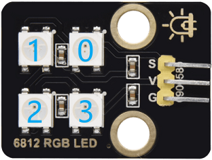
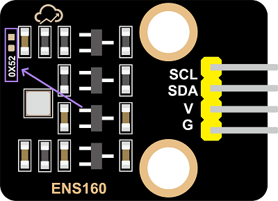
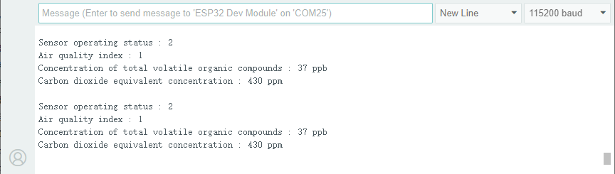
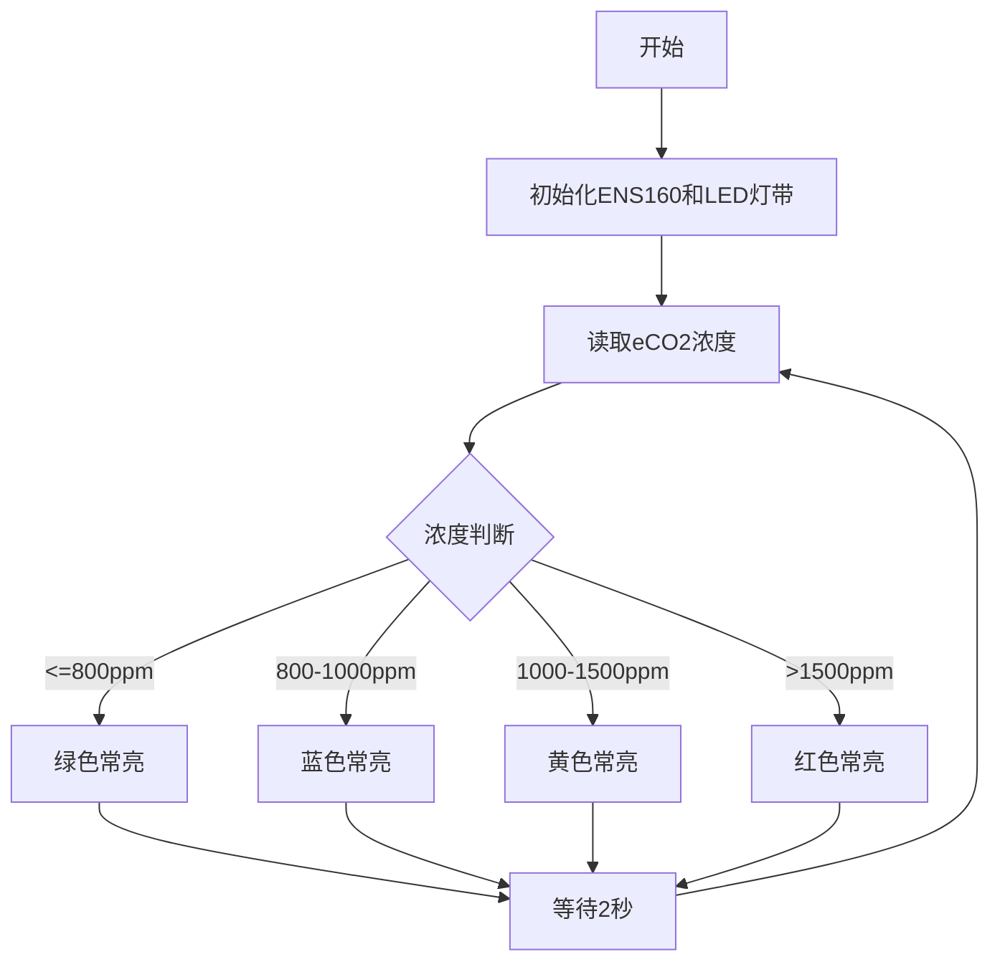
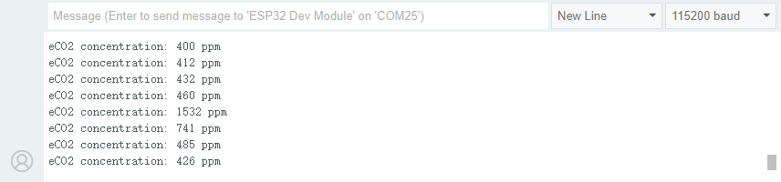

## 2. 智能教室空气质量监测系统

让我们用 ENS160 传感器模块和6812 RGB LED 灯模块，打造一个智能教室空气质量监测系统，当空气质量不佳时，RGB 灯会发出警报，为师生创造一个健康舒适的学习环境！

### 2.1 6812 RGB LED模块

我们这款 6812 RGB LED 灯模块集成了四个可编程 RGB LED ，支持多种颜色和动态效果，可通过简单的信号控制实现丰富的灯光效果。


#### 2.1.1 参数

- 工作电压 : DC 3.3 ~ 5V 

- 最大功率 : 1W

- IC型号 : 4颗/SK6812

- 灰度等级 : 25

- 发光角度 : 180°

- 发光颜色 : 可以通过控制器调为白，红，黄，蓝，绿，等

- 工作温度 ：-10°C ~ +50°C

- 尺寸 ：32 x 23 x 8mm

- 定位孔大小 ：直径为 4.8 mm

- 接口 ：间距2.54 mm，3pin防反接口


#### 2.1.2 原理

6812 RGB LED模块采用单线串行通信协议，每个灯珠内置驱动IC，通过数据线逐级传输信号，可独立控制每颗灯珠的亮度和颜色，形成动态光效。

每个灯珠包含红（R）、绿（G）、蓝（B）三个颜色的 LED，可以通过调节三原色的亮度混合出任意颜色。

**灯珠序号：**




#### 2.1.3 实验代码

```c#
#include <Adafruit_NeoPixel.h>

#define LED_PIN 4      // 控制信号引脚
#define LED_COUNT 4    // LED 灯珠数量

// 创建 NeoPixel 对象
Adafruit_NeoPixel leds(LED_COUNT, LED_PIN, NEO_GRB + NEO_KHZ800);

void setup() {
  leds.begin();           // 初始化 LED 灯带
  leds.show();            // 关闭所有灯珠
  leds.setBrightness(50); // 设置亮度（0~255）
}

void loop() {
  // 设置第一个灯珠为红色
  leds.setPixelColor(0, 255, 0, 0);
  // 设置第二个灯珠为绿色
  leds.setPixelColor(1, 0, 255, 0);
  // 设置第三个灯珠为蓝色
  leds.setPixelColor(2, 0, 0, 255);
  // 设置第四个灯珠为白色
  leds.setPixelColor(3, 255, 255, 255);
  // 更新显示
  leds.show();
  delay(1000);

  // 关闭所有灯珠
  leds.clear();
  leds.show();
  delay(1000);
}
```


#### 2.1.4 代码说明

**1. 硬件与库配置**

```c++
#include <Adafruit_NeoPixel.h>
```

- 引入 Adafruit_NeoPixel 库，该库用于控制 SK6812可编程 RGB LED 灯带。

```c++
#define LED_PIN 4
```

- 定义控制信号引脚为主板的 IO4 引脚。

```c++
#define LED_COUNT 4
```

- 定义 LED 灯珠的数量为 4 个。

```c++
Adafruit_NeoPixel leds(LED_COUNT, LED_PIN, NEO_GRB + NEO_KHZ800);
```

- 创建一个 NeoPixel 对象，命名为 `leds`。

- 参数说明：
  
  - `LED_COUNT`：灯珠数量（4 个）。
  
  - `LED_PIN`：控制信号引脚（IO4）。
  
  - `NEO_GRB + NEO_KHZ800`：指定 LED 灯珠的颜色顺序（红-绿-蓝）和通信频率（800kHz）。

<br>

**2. 初始化设置(setup函数)**

```c++
leds.begin();
```

- 初始化 LED 灯带，设置引脚模式和通信协议。

```c++
leds.show();
```

- 更新 LED 灯带的显示状态。由于此时没有设置颜色，所有灯珠会关闭。

```c++
leds.setBrightness(50);
```

- 设置 LED 灯珠的亮度，范围为 0（最暗）到 255（最亮）。

<br>

**3. 主循环(loop函数)**

```c++
leds.setPixelColor(index, red, green, blue);
```

- 设置指定序号的灯珠颜色。

- 参数说明：

  - `index`：灯珠的序号（从 0 开始）
  
  - `red`：红色分量（0~255）
  
  - `green`：绿色分量（0~255）
  
  - `blue`：蓝色分量（0~255）

```
leds.show();
```

- 更新 LED 灯带的显示状态，使设置的颜色生效。

```
delay(1000);
```

- 延时 1 秒，保持当前灯珠状态。

```
leds.clear();
```

- 关闭所有灯珠。

```
leds.show();
```

- 更新显示状态，关闭所有灯珠。

```
delay(1000);
```

- 延时 1 秒，保持灯珠关闭状态。


#### 2.1.5 实验结果

代码上传成功后，你能看到循环过程：

- 4 个 LED 灯珠会依次点亮为红色、绿色、蓝色和白色，持续 1 秒，由于速度过快你可能看不到依次点亮的这个过程。

- 然后所有灯珠关闭，持续 1 秒。

---


### 2.2 ENS160空气质量传感器

ENS160 是一款高精度数字空气质量传感器，能够实时检测空气中的挥发性有机化合物（VOCs）、二氧化碳（CO₂）和空气质量指数（IAQ），广泛应用于环境监测、智能家居和健康设备中。


#### 2.2.1 参数

- 工作电压 ：DC 3.3 ~ 5V 

- 工作电流 ：29 mA 

- 预热时间 ：<3 分钟 

- 通讯接口 ：I2C

- I2C地址 ：默认为0x53，可修改为0x52

- 工作温度 ：-10°C ~ +50°C

- 工作湿度 ：5 %RH ~ 95 %RH

- eCO₂测量范围 ：400 ppm~65000 ppm

- TVOC测量范围 ：0 ppb~65000 ppb

- 尺寸 ：32 x 23 x 8mm

- 定位孔大小：直径为 3.2 mm

- 接口 ：间距2.54 mm，4pin防反接口


#### 2.2.2 原理

**ENS160 的工作原理**

ENS160 通过内置的金属氧化物半导体传感器检测空气中的气体成分，具体原理如下：

**VOCs 检测**：

- **检测原理**

  传感器表面的金属氧化物与空气中的 VOCs 发生化学反应，导致电阻变化，通过测量电阻变化来检测 VOCs 浓度。

  不过，它无法区分具体是哪种 VOCs，而是将所有可检测的 VOCs 混合信号 **折算为总挥发性有机物（TVOC）浓度**（单位ppb）输出。

  因此，ENS160 直接提供的是 **TVOC 数据**，而非单一 VOCs 成分，适合快速评估空气整体污染水平，但无法精确分析具体气体种类。

- **TVOC检测范围**

  输出单位：ppb（parts per billion，十亿分之一）

  检测范围：0~65,000 ppb（注：实际有效精度范围通常为0~10,000 ppb）

- **TVOC（总挥发性有机物浓度）等级参考**

  | **TVOC浓度 (ppb)** | **等级划分** | **健康影响与建议**                                           |
  | ------------------ | ------------ | ------------------------------------------------------------ |
  | 0-250              | 优秀         | 空气质量极佳，对人体无影响，适合长时间停留                   |
  | 250-500            | 良好         | 空气质量良好，敏感人群可能出现轻微不适，建议适度通风         |
  | 500-1000           | 轻度污染     | 空气质量可接受，长期暴露可能导致头痛、疲劳，需加强通风       |
  | 1000-3000          | 中度污染     | 空气质量不佳，可能引发眼喉刺激、嗜睡，建议减少暴露并排查污染源 |
  | >3000              | 重度污染     | 严重污染，可能导致神经系统损伤、肝肾毒性，必须立即通风或撤离 |

<br>

**CO₂ 估算**：

- **估算原理**

  ENS160 无法直接测量 CO₂，而是通过检测空气中的 VOCs（挥发性有机物）浓度，结合内置算法估算出 eCO₂（等效二氧化碳）。eCO₂ 是一种间接的 CO₂ 近似值，适用于趋势监测，但精度不如专业 CO₂ 传感器。

- **eCO₂输出范围**

- 单位：ppm（parts per million，百万分之一）

- 检测范围：400~65,000 ppm（注：实际有效精度范围通常为400~5,000 ppm）

- **eCO₂等级参考**

- | eCO₂      | 等级     | 建议                                       |
  | --------- | -------- | ------------------------------------------ |
  | 400-600   | 优秀     | 空气质量极佳，通风良好，<br>适合长时间停留 |
  | 600-800   | 良好     | 空气质量可接受，建议适度通风               |
  | 800-1000  | 轻度污染 | 空气质量下降，需加强通风                   |
  | 1000-1500 | 重度污染 | 明显闷浊感，<br>建议减少人员密度或强制换气 |
  | >1500     | 危险     | 严重缺氧环境，必须立即通风或撤离           |


**IAQ 计算**

- **计算原理**

  根据 TVOC 和 eCO₂ 的浓度，结合内置算法计算出室内空气质量指数（IAQ）。

- **AQI（空气质量指数）等级参考**

  | AQI指数 | AQI等级 | 健康影响                       |
  | ------- | ------- | ------------------------------ |
  | 1       | 优秀    | 空气清新，无健康风险           |
  | 2       | 良好    | 基本安全，敏感人群或轻微不适   |
  | 3       | 中等    | 可察觉异味，可能引发头痛、疲劳 |
  | 4       | 较差    | 明显刺激眼喉，长期暴露有害健康 |
  | 5       | 极差    | 强烈不适，急性健康风险高       |

<br>

**ENS160 的控制原理**

ENS160 的控制原理基于 **I²C 通信协议**，通过发送和接收特定的命令和数据来控制传感器并读取测量结果。

**I²C 通信地址**

默认 I²C 通信地址为 `0x53`。

如需更改为 `0x52`，可在模块的 `0X52` 空焊盘处焊接一个 0603 封装的 0 欧电阻，**同时修改代码中的设备地址**。




#### 2.2.3 实验代码

```c++
#include <DFRobot_ENS160.h>
#include <Wire.h>

// 使用I2C通信，地址默认为0x53
DFRobot_ENS160_I2C ENS160(&Wire, 0x53);

void setup(void)
{
  Serial.begin(115200);

  // 初始化传感器
  while(NO_ERR != ENS160.begin()) {
    Serial.println("Communication with device failed, please check connection");
    delay(3000);
  }
  Serial.println("Begin ok!");

  // 设置电源模式为标准气体感应模式
  ENS160.setPWRMode(ENS160_STANDARD_MODE);

  // 设置环境温度和湿度用于校准（示例值：25°C，50%RH）
  ENS160.setTempAndHum(25.0, 50.0);
}

void loop()
{
  // 获取传感器工作状态
  uint8_t Status = ENS160.getENS160Status();
  Serial.print("Sensor operating status: ");
  Serial.println(Status);

  // 获取空气质量指数(1-5)
  uint8_t AQI = ENS160.getAQI();
  Serial.print("Air quality index: ");
  Serial.println(AQI);

  // 获取TVOC浓度(0-65000 ppb)
  uint16_t TVOC = ENS160.getTVOC();
  Serial.print("TVOC concentration: ");
  Serial.print(TVOC);
  Serial.println(" ppb");

  // 获取等效CO2浓度(400-65000 ppm)
  uint16_t ECO2 = ENS160.getECO2();
  Serial.print("eCO2 concentration: ");
  Serial.print(ECO2);
  Serial.println(" ppm");

  Serial.println();
  delay(1000);
}
```


#### 2.2.4 代码说明

**1. 头文件引入和初始化库配置**

```c++
#include <DFRobot_ENS160.h>
#include <Wire.h>

DFRobot_ENS160_I2C ENS160(&Wire, 0x53);
```

- `DFRobot_ENS160_I2C ENS160(&Wire, 0x53)`：创建 ENS160 传感器对象
  
  - 使用 I2C 通信（&Wire）
  
  - 传感器地址为 0x53（默认地址）

<br>

**2. 初始化设置(setup函数)**

```c++
void setup(void) {
  Serial.begin(115200);
  
  // 初始化传感器
  while(NO_ERR != ENS160.begin()) {
    Serial.println("Communication with device failed, please check connection");
    delay(3000);
  }
  Serial.println("Begin ok!");

  ENS160.setPWRMode(ENS160_STANDARD_MODE);
  ENS160.setTempAndHum(25.0, 50.0);
}
```

**传感器初始化**：

- `ENS160.begin()`：尝试初始化传感器

- 使用 while 循环持续尝试，直到初始化成功

- 每次失败后等待 3 秒（delay(3000)）

**工作模式设置**：

- `setPWRMode(ENS160_STANDARD_MODE)`：设置传感器为标准工作模式

**环境参数设置**：

- `setTempAndHum(25.0, 50.0)`：提供环境温度和湿度，用于传感器校准和补偿

<br>

**3. 主循环(loop函数)**

```c++
void loop() {
  // 获取传感器状态
  uint8_t Status = ENS160.getENS160Status();
  Serial.print("Sensor operating status: ");
  Serial.println(Status);

  // 获取空气质量指数
  uint8_t AQI = ENS160.getAQI();
  Serial.print("Air quality index: ");
  Serial.println(AQI);

  // 获取TVOC浓度
  uint16_t TVOC = ENS160.getTVOC();
  Serial.print("TVOC concentration: ");
  Serial.print(TVOC);
  Serial.println(" ppb");

  // 获取eCO2浓度
  uint16_t ECO2 = ENS160.getECO2();
  Serial.print("eCO2 concentration: ");
  Serial.print(ECO2);
  Serial.println(" ppm");

  Serial.println();
  delay(1000);
}
```

- 首先，通过`getENS160Status()`获取传感器工作状态，确保设备正常运行

- 然后依次读取三种关键参数：

  `getAQI()`获取1-5级的综合空气质量指数

  `getTVOC()`检测挥发性有机物浓度

  `getECO2()`测量等效二氧化碳值

- 最后，所有数据通过串口输出显示，并以`delay(1000)`控制每秒采集一次的频率，形成完整的空气质量监测循环。


#### 2.2.5 实验结果

代码上传成功后打开串口监视器，设置波特率为115200。

传感器首次上电需预热1-2分钟达到稳定，稳定后可以看到打印数据：



---

### 2.3 智能教室空气质量监测系统

在前面的课程中，我们已经掌握了 6812 RGB灯模块 的色彩控制原理和 ENS160空气质量传感器 的数据采集方法。现在，让我们将这些技术结合起来，动手制作一个智能教室空气质量监测系统！

通过这个项目，我们将实现一个能够实时监测教室内的 eCO₂浓度（等效二氧化碳浓度）的智能装置。当空气质量下降（eCO₂浓度过高）时，系统会自动触发 RGB灯红色警报，提醒师生及时通风换气，保障健康的学习环境。

让我们一起打造这个既实用又富有科技感的智能监测系统吧！

#### 2.3.1 流程图




#### 2.3.2 实验代码

```c++
#include <DFRobot_ENS160.h>
#include <Adafruit_NeoPixel.h>

// 硬件配置
#define LED_PIN     4       // RGB灯控制引脚
#define LED_COUNT   4       // LED灯珠数量
#define I2C_ADDR    0x53    // ENS160默认I2C地址

// eCO2浓度等级阈值 (ppm)
#define ECO2_EXCELLENT   400
#define ECO2_GOOD       800
#define ECO2_MODERATE   1000
#define ECO2_POOR       1500

// 创建对象
DFRobot_ENS160_I2C ENS160(&Wire, I2C_ADDR);
Adafruit_NeoPixel leds(LED_COUNT, LED_PIN, NEO_GRB + NEO_KHZ800);

void setup() {
  Serial.begin(115200);
  
  // 初始化ENS160
  while (NO_ERR != ENS160.begin()) {
    Serial.println("Communication with device failed, please check connection");
    delay(3000);
  }
  Serial.println("Begin ok!");
  
  // 设置传感器模式
  ENS160.setPWRMode(ENS160_STANDARD_MODE);
  ENS160.setTempAndHum(25.0, 50.0);  // 设置校准温湿度

  // 初始化RGB灯带
  leds.begin();
  leds.show();  // 初始清空灯带
  leds.setBrightness(100);  // 中等亮度
}

void loop() {
  // 获取eCO2浓度
  uint16_t eco2 = ENS160.getECO2();
  Serial.print("eCO2 concentration: ");
  Serial.print(eco2);
  Serial.println(" ppm");

  // 根据空气质量控制LED
  updateAirQualityLED(eco2);

  delay(2000);  // 每2秒更新一次
}

// 空气质量可视化函数
void updateAirQualityLED(uint16_t eco2) {
  if (eco2 <= ECO2_GOOD) {
    // 优/良（绿色常亮）
    setAllLEDs(0, 255, 0);
  } 
  else if (eco2 <= ECO2_MODERATE) {
    // 一般（蓝色常亮）
    setAllLEDs(0, 0, 255);
  }
  else if (eco2 <= ECO2_POOR) {
    // 差（黄色常亮）
    setAllLEDs(255, 255, 0);
  }
  else {
    // 严重污染（红色常亮）
    setAllLEDs(255, 0, 0);
  }
}

// 设置所有LED颜色
void setAllLEDs(uint8_t r, uint8_t g, uint8_t b) {
  for (int i = 0; i < LED_COUNT; i++) {
    leds.setPixelColor(i, leds.Color(r, g, b));
  }
  leds.show();
}
```


#### 2.3.3 代码说明

**1. 硬件配置与对象初始化**

**硬件与参数配置**

```c++
#define LED_PIN     4       // RGB灯控制引脚
#define LED_COUNT   4       // LED灯珠数量
#define I2C_ADDR    0x53    // ENS160默认I2C地址

// eCO2浓度等级阈值 (ppm)
#define ECO2_EXCELLENT   400
#define ECO2_GOOD       800
#define ECO2_MODERATE   1000
#define ECO2_POOR       1500
```

- 定义了硬件连接方式和关键参数
- 设置了4个eCO2浓度阈值等级

**对象初始化**

```c++
DFRobot_ENS160_I2C ENS160(&Wire, I2C_ADDR);
Adafruit_NeoPixel leds(LED_COUNT, LED_PIN, NEO_GRB + NEO_KHZ800);
```

- 创建ENS160传感器对象，初始化NeoPixel LED灯带

<br>

**2. 初始化设置(setup函数)**

```c++
void setup() {
  Serial.begin(115200);
  
  // 初始化ENS160
  while (NO_ERR != ENS160.begin()) {
    Serial.println("Communication with device failed, please check connection");
    delay(3000);
  }
  Serial.println("Begin ok!");
  
  // 设置传感器模式
  ENS160.setPWRMode(ENS160_STANDARD_MODE);
  ENS160.setTempAndHum(25.0, 50.0);  // 设置校准温湿度

  // 初始化RGB灯带
  leds.begin();
  leds.show();  // 初始清空灯带
  leds.setBrightness(100);  // 中等亮度
}
```

- 完成所有硬件初始化

- 设置传感器工作模式和校准参数

- 配置RGB LED模块

<br>

**3. 主循环(loop函数)**

**eCO₂浓度读取**

```c++
uint16_t eco2 = ENS160.getECO2();
```

- 从ENS160传感器读取 eCO₂ 浓度值

**串口输出监测数据**

```c++
Serial.print("eCO2 concentration: ");
Serial.print(eco2);
Serial.println(" ppm");
```

- 通过串口输出浓度值

**LED可视化控制**

```c++
updateAirQualityLED(eco2);
```

- 调用LED显示函数更新状态，根据eCO₂浓度值控制LED显示状态

**循环延迟控制**

```c++
delay(2000);  // 每2秒更新一次
```

- 避免传感器频繁读取导致数据不稳定、使LED效果有足够时间显示

<br>

**4. 核心功能函数**

**LED可视化函数**

```c++
void updateAirQualityLED(uint16_t eco2) {
  if (eco2 <= ECO2_GOOD) {
    // 优/良（绿色常亮）
    setAllLEDs(0, 255, 0);
  } 
  else if (eco2 <= ECO2_MODERATE) {
    // 一般（蓝色常亮）
    breathingEffect(0, 0, 255, 500);
  }
  else if (eco2 <= ECO2_POOR) {
    // 差（黄色常亮）
    blinkWarning(255, 255, 0, 300);
  }
  else {
    // 严重污染（红色常亮）
    emergencyAlert(255, 0, 0, 100);
  }
}
```

- 根据eCO₂浓度选择不同的显示效果，4种显示模式对应4个空气质量等级：

1. 优/良状态：绿色常亮

2. 一般状态：蓝色常亮

3. 差状态 ：黄色常亮

4. 严重污染状态：红色常亮


**设置所有LED颜色函数**

```c++
void setAllLEDs(uint8_t r, uint8_t g, uint8_t b) {
  for (int i = 0; i < LED_COUNT; i++) {
    leds.setPixelColor(i, leds.Color(r, g, b));
  }
  leds.show();
}
```


#### 2.3.4 实验结果

代码上传成功后，ENS160传感器每2秒读取一次eCO₂浓度值。

根据eCO₂浓度值分为4个等级，并通过 RGB LED 灯直观显示当前空气质量等级：

- 优/良(≤800ppm)：绿色常亮

- 一般(≤1000ppm)：蓝色常亮

- 差(≤1500ppm)：黄色常亮

- 严重污染(>1500ppm)：红色常亮

您可以通过深吸气后向ENS160传感器缓慢呼气来模拟空气质量变化，此时eCO₂浓度值将上升，同时可观察到RGB LED灯的颜色和动态效果随之改变。对着模块呼气并不能将eCO2浓度值达到严重污染的级别。



