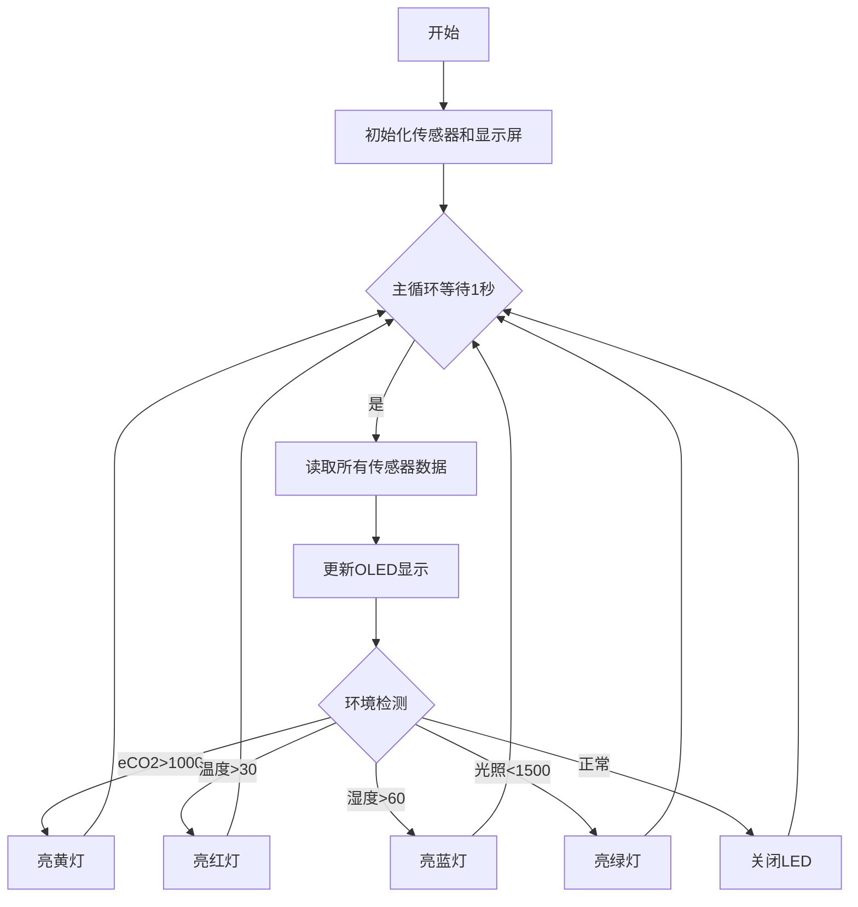
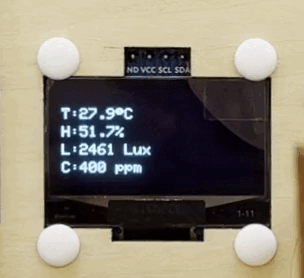

## 4. 教室环境监测显示与报警

### 4.1 教室环境监测显示与报警

在前面的学习中，我们已经掌握了光敏传感器、ENS160空气质量传感器、6812 RGB灯模块和OLED显示屏的使用方法。现在，我们将整合这些技术，开发一个智能教室环境监测系统！

项目功能：

- 实时监测：通过OLED屏显示光照、温湿度、空气质量（eCO₂）
- 智能报警：当参数异常时，RGB灯自动切换颜色提示：
  - eCO₂浓度过高 → 黄色
  - 温度升高 → 红色
  - 湿度超标 → 蓝色
  - 光照异常 → 绿色

这个系统不仅能直观展示教室环境状况，还能通过色彩设计视觉报警，帮助师生快速识别环境问题。现在，让我们开始构建这个集监测、显示与智能报警于一体的装置吧！


#### 流程图




#### 实验代码

```c++
#include <Wire.h>
#include <AHT20.h>
#include <Adafruit_GFX.h>
#include <Adafruit_SH110X.h>
#include <DFRobot_ENS160.h>
#include <Adafruit_NeoPixel.h>

// 硬件配置
#define SCREEN_WIDTH 128
#define SCREEN_HEIGHT 64
#define OLED_RESET -1
#define I2C_ADDRESS 0x3C
#define LED_PIN 4
#define LED_COUNT 4

// 环境阈值
#define LIGHT_THRESHOLD 1500
#define TEMP_THRESHOLD 30
#define HUMI_THRESHOLD 60
#define ECO2_THRESHOLD 1000

// 创建对象
AHT20 aht20;
DFRobot_ENS160_I2C ENS160(&Wire, 0x53);
Adafruit_NeoPixel leds(LED_COUNT, LED_PIN, NEO_GRB + NEO_KHZ800);
Adafruit_SH1106G display(SCREEN_WIDTH, SCREEN_HEIGHT, &Wire, OLED_RESET);

// 更新时间控制
unsigned long lastUpdate = 0;
const unsigned long updateInterval = 2000;

const int lightSensorPin = 34;

void setup() {
  Serial.begin(115200);
  Wire.begin();
  
  // 初始化OLED
  display.begin(I2C_ADDRESS, true);
  display.clearDisplay();
  display.setTextSize(1);
  display.setTextColor(SH110X_WHITE);
  
  // 初始化传感器
  aht20.begin();
  ENS160.begin();
  ENS160.setPWRMode(ENS160_STANDARD_MODE);
  
  // 初始化RGB
  leds.begin();
  leds.setBrightness(100);
  leds.show();
}

void loop() {
  if(millis() - lastUpdate >= updateInterval) {
    lastUpdate = millis();
    
    // 读取传感器数据
    float temperature = aht20.getTemperature();
    float humidity = aht20.getHumidity();
    int illum = analogRead(lightSensorPin);
    uint16_t eco2 = ENS160.getECO2();
    
    // 更新显示
    display.clearDisplay();
    display.setCursor(0, 12);
    display.print("T:");
    display.print(temperature, 1);
    display.cp437(true);
    display.write(248); // °符号
    display.println("C");
    
    display.setCursor(0, 24);
    display.print("H:");
    display.print(humidity, 1);
    display.println("%");
    
    display.setCursor(0, 36);
    display.print("L:");
    display.print(illum);
    display.println(" Lux");
    
    display.setCursor(0, 48);
    display.print("C:");
    display.print(eco2);
    display.println(" ppm");
    
    display.display();
    
    // 控制LED
    setAllLEDs(0, 0, 0); // 先关闭
    
    if(eco2 > ECO2_THRESHOLD) {
      setAllLEDs(255, 255, 0); // 黄色
    } 
    else if(temperature > TEMP_THRESHOLD) {
      setAllLEDs(255, 0, 0);   // 红色
    }
    else if(humidity > HUMI_THRESHOLD) {
      setAllLEDs(0, 0, 255);   // 蓝色
    }
    else if(illum < LIGHT_THRESHOLD) {
      setAllLEDs(0, 255, 0);   // 绿色
    }
  }
}

// 设置LED颜色
void setAllLEDs(uint8_t r, uint8_t g, uint8_t b) {
  for (int i = 0; i < LED_COUNT; i++) {
    leds.setPixelColor(i, leds.Color(r, g, b));
  }
  leds.show();
}
```


#### 代码说明

**1. 初始化设置(setup函数)**

```c++
void setup() {
  // 通信协议初始化
  Serial.begin(115200);    // 串口调试
  Wire.begin();            // I2C总线初始化
  
  // 外设初始化序列
  display.begin(0x3C, true);  // OLED初始化
  aht20.begin();              // 温湿度传感器
  ENS160.begin();             // 空气质量传感器
  leds.begin();               // RGB灯带初始化
}
```

<br>

**2. 主循环(loop函数)**

定时更新，每2秒执行一次完整的监测循环：

1. **数据采集**：读取所有传感器数据
    - `aht20.getTemperature()` → 温度（℃）
    - `aht20.getHumidity()` → 湿度（%）
    - `analogRead(lightSensorPin)` → 光照强度
    - `ENS160.getECO2()` → eCO2（ppm）
2. **数据处理**：格式化和单位转换
3. **显示更新**：OLED屏幕刷新
4. **状态判断**：环境参数阈值比较
5. **告警触发**：RGB灯光控制：
   - 高eCO2（>1000ppm）→ 亮黄灯
   - 高温（>30℃）→ 亮红灯（`255,0,0`）
   - 高湿（>60%）→ 亮蓝灯（`0,0,255`）
   - 低光照（<1500）→ 亮绿灯（`0,255,0`）


#### 实验结果

代码上传成功后，通过AHT20传感器、ENS160传感器和光敏电阻传感器实时采集环境数据并每2秒更新在 OLED 显示屏 ，同时用 RGB LED 提供视觉反馈。

- 高eCO2（>1000ppm）→ 亮黄灯
- 高温（>30℃）→ 亮红灯
- 高湿（>60%）→ 亮蓝灯
- 低光照（<1500）→ 亮绿灯


