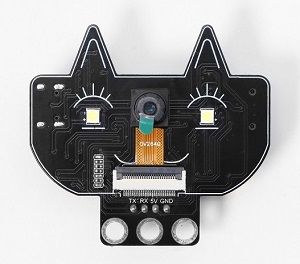
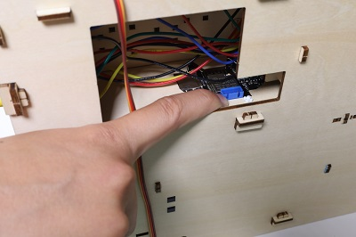
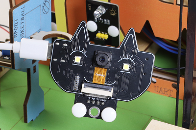
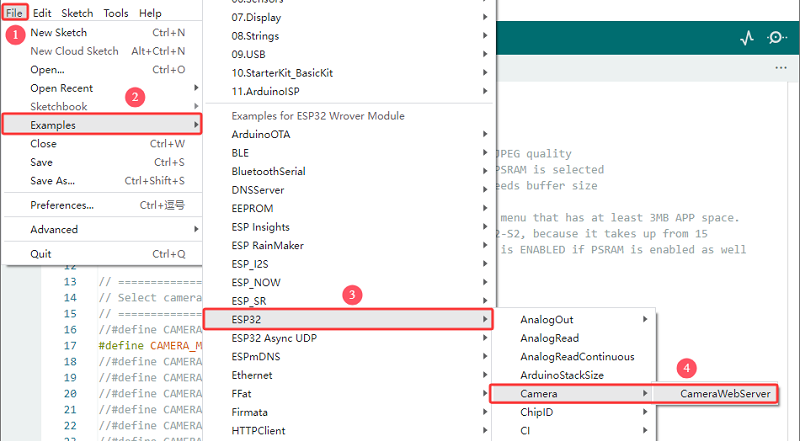
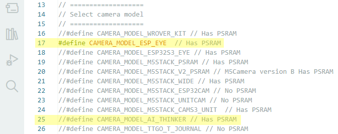
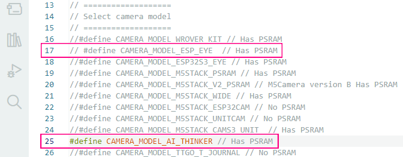
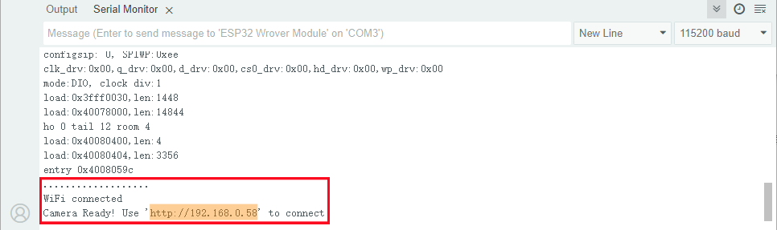
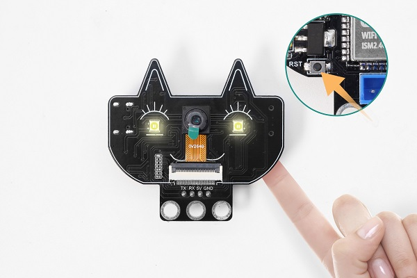
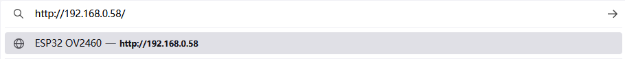
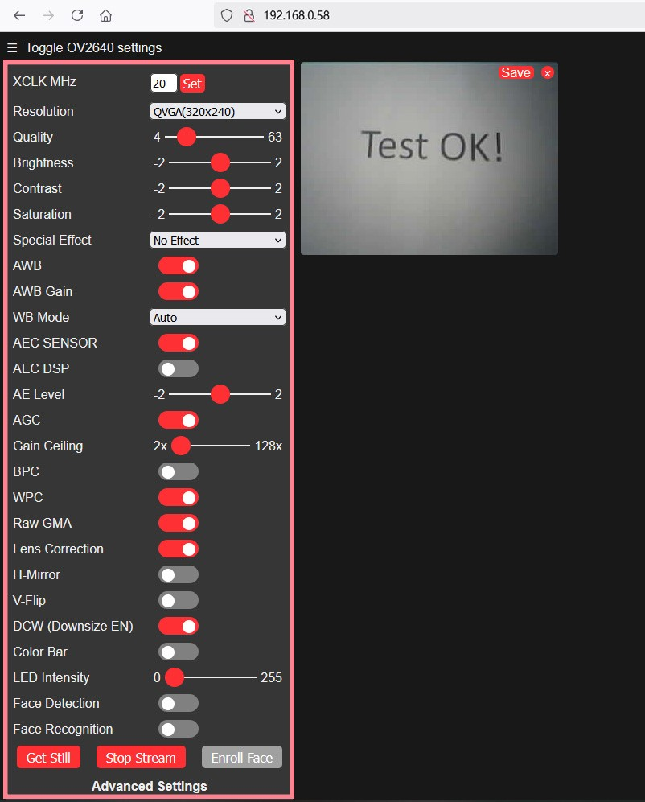

## 9. 校园安防监控系统

这是一款集成 ESP32-S 模组与 OV2640 摄像头的低成本AI视觉开发模块，支持Wi-Fi图传，适用于智能监控等物联网视觉应用。



#### 参数

供电范围 ：5V

工作电流 ：0.21A

产品尺寸 ：55 * 51 * 15.5 mm

采用低功耗、双核 32 位 CPU，可作为应用处理器。

主频高达 240MHz，算力达到 600 DMIPS。

内置 520 KB SRAM，外部 8MB PSRAM。


#### 实验代码

首先取下摄像头。



然后使用USB线连接到电脑。



打开示例代码：File  ->  Examples  ->  ESP32  ->  Camera  ->  CameraWebServer



修改摄像头类型：注释掉 `#define CAMERA_MODEL_ESP_EYE` ，使用 `\#define CAMERA_MODEL_AI_THINKER` 。



修改成功：



将WiFi 名称和密码替换为你的。


```c++
#include "esp_camera.h"
#include <WiFi.h>

//
// WARNING!!! PSRAM IC required for UXGA resolution and high JPEG quality
//            Ensure ESP32 Wrover Module or other board with PSRAM is selected
//            Partial images will be transmitted if image exceeds buffer size
//
//            You must select partition scheme from the board menu that has at least 3MB APP space.
//            Face Recognition is DISABLED for ESP32 and ESP32-S2, because it takes up from 15
//            seconds to process single frame. Face Detection is ENABLED if PSRAM is enabled as well

// ===================
// Select camera model
// ===================
//#define CAMERA_MODEL_WROVER_KIT // Has PSRAM
// #define CAMERA_MODEL_ESP_EYE  // Has PSRAM
//#define CAMERA_MODEL_ESP32S3_EYE // Has PSRAM
//#define CAMERA_MODEL_M5STACK_PSRAM // Has PSRAM
//#define CAMERA_MODEL_M5STACK_V2_PSRAM // M5Camera version B Has PSRAM
//#define CAMERA_MODEL_M5STACK_WIDE // Has PSRAM
//#define CAMERA_MODEL_M5STACK_ESP32CAM // No PSRAM
//#define CAMERA_MODEL_M5STACK_UNITCAM // No PSRAM
//#define CAMERA_MODEL_M5STACK_CAMS3_UNIT  // Has PSRAM
#define CAMERA_MODEL_AI_THINKER // Has PSRAM
//#define CAMERA_MODEL_TTGO_T_JOURNAL // No PSRAM
//#define CAMERA_MODEL_XIAO_ESP32S3 // Has PSRAM
// ** Espressif Internal Boards **
//#define CAMERA_MODEL_ESP32_CAM_BOARD
//#define CAMERA_MODEL_ESP32S2_CAM_BOARD
//#define CAMERA_MODEL_ESP32S3_CAM_LCD
//#define CAMERA_MODEL_DFRobot_FireBeetle2_ESP32S3 // Has PSRAM
//#define CAMERA_MODEL_DFRobot_Romeo_ESP32S3 // Has PSRAM
#include "camera_pins.h"

// ===========================
// Enter your WiFi credentials
// ===========================
const char *ssid = "**********";
const char *password = "**********";

void startCameraServer();
void setupLedFlash(int pin);

void setup() {
  Serial.begin(115200);
  Serial.setDebugOutput(true);
  Serial.println();

  camera_config_t config;
  config.ledc_channel = LEDC_CHANNEL_0;
  config.ledc_timer = LEDC_TIMER_0;
  config.pin_d0 = Y2_GPIO_NUM;
  config.pin_d1 = Y3_GPIO_NUM;
  config.pin_d2 = Y4_GPIO_NUM;
  config.pin_d3 = Y5_GPIO_NUM;
  config.pin_d4 = Y6_GPIO_NUM;
  config.pin_d5 = Y7_GPIO_NUM;
  config.pin_d6 = Y8_GPIO_NUM;
  config.pin_d7 = Y9_GPIO_NUM;
  config.pin_xclk = XCLK_GPIO_NUM;
  config.pin_pclk = PCLK_GPIO_NUM;
  config.pin_vsync = VSYNC_GPIO_NUM;
  config.pin_href = HREF_GPIO_NUM;
  config.pin_sccb_sda = SIOD_GPIO_NUM;
  config.pin_sccb_scl = SIOC_GPIO_NUM;
  config.pin_pwdn = PWDN_GPIO_NUM;
  config.pin_reset = RESET_GPIO_NUM;
  config.xclk_freq_hz = 20000000;
  config.frame_size = FRAMESIZE_UXGA;
  config.pixel_format = PIXFORMAT_JPEG;  // for streaming
  //config.pixel_format = PIXFORMAT_RGB565; // for face detection/recognition
  config.grab_mode = CAMERA_GRAB_WHEN_EMPTY;
  config.fb_location = CAMERA_FB_IN_PSRAM;
  config.jpeg_quality = 12;
  config.fb_count = 1;

  // if PSRAM IC present, init with UXGA resolution and higher JPEG quality
  //                      for larger pre-allocated frame buffer.
  if (config.pixel_format == PIXFORMAT_JPEG) {
    if (psramFound()) {
      config.jpeg_quality = 10;
      config.fb_count = 2;
      config.grab_mode = CAMERA_GRAB_LATEST;
    } else {
      // Limit the frame size when PSRAM is not available
      config.frame_size = FRAMESIZE_SVGA;
      config.fb_location = CAMERA_FB_IN_DRAM;
    }
  } else {
    // Best option for face detection/recognition
    config.frame_size = FRAMESIZE_240X240;
#if CONFIG_IDF_TARGET_ESP32S3
    config.fb_count = 2;
#endif
  }

#if defined(CAMERA_MODEL_ESP_EYE)
  pinMode(13, INPUT_PULLUP);
  pinMode(14, INPUT_PULLUP);
#endif

  // camera init
  esp_err_t err = esp_camera_init(&config);
  if (err != ESP_OK) {
    Serial.printf("Camera init failed with error 0x%x", err);
    return;
  }

  sensor_t *s = esp_camera_sensor_get();
  // initial sensors are flipped vertically and colors are a bit saturated
  if (s->id.PID == OV3660_PID) {
    s->set_vflip(s, 1);        // flip it back
    s->set_brightness(s, 1);   // up the brightness just a bit
    s->set_saturation(s, -2);  // lower the saturation
  }
  // drop down frame size for higher initial frame rate
  if (config.pixel_format == PIXFORMAT_JPEG) {
    s->set_framesize(s, FRAMESIZE_QVGA);
  }

#if defined(CAMERA_MODEL_M5STACK_WIDE) || defined(CAMERA_MODEL_M5STACK_ESP32CAM)
  s->set_vflip(s, 1);
  s->set_hmirror(s, 1);
#endif

#if defined(CAMERA_MODEL_ESP32S3_EYE)
  s->set_vflip(s, 1);
#endif

// Setup LED FLash if LED pin is defined in camera_pins.h
#if defined(LED_GPIO_NUM)
  setupLedFlash(LED_GPIO_NUM);
#endif

  WiFi.begin(ssid, password);
  WiFi.setSleep(false);

  Serial.print("WiFi connecting");
  while (WiFi.status() != WL_CONNECTED) {
    delay(500);
    Serial.print(".");
  }
  Serial.println("");
  Serial.println("WiFi connected");

  startCameraServer();

  Serial.print("Camera Ready! Use 'http://");
  Serial.print(WiFi.localIP());
  Serial.println("' to connect");
}

void loop() {
  // Do nothing. Everything is done in another task by the web server
  delay(10000);
}

```


#### 代码说明

**1. 硬件配置**

```c++
#define CAMERA_MODEL_AI_THINKER // 使用AI Thinker开发板
#include "camera_pins.h"
```

- 选择了AI Thinker ESP32-CAM模块
- 包含对应的引脚定义文件

**2. 网络配置**

```c++
const char *ssid = "**********";      // 需要填入你的WiFi名称
const char *password = "**********";  // 需要填入你的WiFi密码
```

- **需要将星号替换为你的WiFi名称和密码**

**3. 摄像头配置**

代码中设置了详细的摄像头参数：

```c++
camera_config_t config;
config.ledc_channel = LEDC_CHANNEL_0;
config.pin_d0 = Y2_GPIO_NUM;
// ... 其他引脚配置
config.xclk_freq_hz = 20000000;      // 20MHz时钟
config.frame_size = FRAMESIZE_UXGA;  // 最高分辨率
config.pixel_format = PIXFORMAT_JPEG;// JPEG格式，适合流媒体
config.jpeg_quality = 12;            // JPEG质量(0-63，越小质量越好)
config.fb_count = 1;                 // 帧缓冲区数量
```

**4. PSRAM优化配置**

```c++
if (psramFound()) {
  config.jpeg_quality = 10;          // 有PSRAM时提高质量
  config.fb_count = 2;               // 增加帧缓冲区
  config.grab_mode = CAMERA_GRAB_LATEST; // 获取最新帧
}
```

- 自动检测PSRAM并优化配置
- 没有PSRAM时会降低分辨率以保证运行

PSRAM是一种特殊类型的内存，结合了DRAM（动态RAM）和SRAM（静态RAM）的特点。

PSRAM带来的优势：高分辨率支持、图像质量提升、流畅度改善。

**5. WiFi连接过程**

```c++
WiFi.begin(ssid, password);
WiFi.setSleep(false);  // 禁用WiFi睡眠，提高稳定性

while (WiFi.status() != WL_CONNECTED) {
  delay(500);
  Serial.print(".");
}
```

**6. 服务器启动**

```c++
startCameraServer();  // 启动摄像头服务器
Serial.print("Camera Ready! Use 'http://");
Serial.print(WiFi.localIP());  // 显示获取到的IP地址
Serial.println("' to connect");
```


#### 实验结果

代码上传成功后，串口监视器出现以下内容说明WiFi连接成功：



若串口监视器无内容显示，按一下复位键。



先将电脑与开发板连接相同的WIFI，然后将串口监视器打印IP地址输入到谷歌或者火狐浏览器的搜索框（用其他浏览器可能导致不兼容），按下回车键跳转到页面。 



参考下图红框内的参数去设置，然后点击 Start Stream，摄像头开始工作，画面清晰可见。

此过程中WIFI模块发热，串口会显示大量通信数据是正常工作现象，有条件可以将模块置于通风的位置。



若模块输入电源不足，会导致图片出现水纹，如下所示：


