## Mixly 开发环境

### **1. 下载软件**

Mixly For Windows（注意电脑是32位还是64位的系统，一般都是64位的（即下载带x64的，也就是第3和第4个）：

[https://pan.baidu.com/s/1Phhp3JF4891kIDUc1pK_yQ?pwd=keye](https://pan.baidu.com/s/1Phhp3JF4891kIDUc1pK_yQ?pwd=keye)

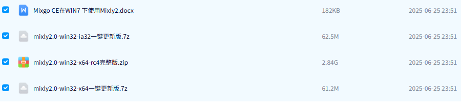

Mixly For Mac(根据系统选择)：

[https://pan.baidu.com/s/1QAOE_Wloskwn8UqI7f68Wg?pwd=keye](https://pan.baidu.com/s/1QAOE_Wloskwn8UqI7f68Wg?pwd=keye)

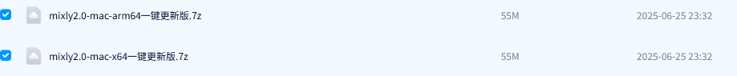

### **2. 安装软件**

**1\. Windows版本安装：**

**特别提醒**：建议解压到硬盘根目录，路径不能包含中文及特殊字符(如:._( )等)。

因为Mixly是一个绿色免安装软件，所以 “**mixly2.0-win32-x64-rc4完整版**” 版本在解压之后就可以直接使用了。如果是下载 “**一键更新版**” 版本的压缩包，压缩包解压后，需要左键双击打开“一键更新.bat”按照提示更新Mixly。

完整的Mixly文件夹中的内容如下图所示：

**启动软件：**

这里双击 “**Mixly.exe**” 就能打开Mixly软件。如下图所示：

打开Mixly软件后，找到并且单击 “**Arduino ESP32**” 就可以进入Mixly编程界面。软件界面如下图所示：

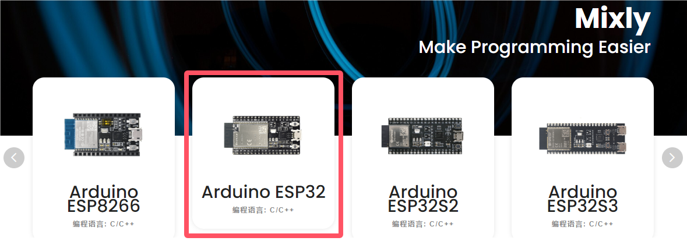

**2\. Mac版本安装：**

这里有MAC安装Mixly2.0.txt文件说明。

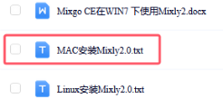

**页面介绍：**

总体来说，Mixly软件界面分为4部分。

1\. 界面左侧为模块区，这里包含了Mixly中所有能用到的程序模块，根据功能的不同，大概分为以下几类:“输入/输出”、“控制”、“数学”、“逻辑”、“文本”、“数组”、“变量”、“函数”、“串口”、“传感器”、“执行器”、“显示器”、“通信”、“存储”、“网络”。每种类型的模块都用不同的颜色块表示，其中每一个分类中的模块会在附录A中有专门的介绍。

2\. 模块区的右侧是程序构建区，模块区的模块可通过鼠标拖拽放到程序构建区，拖诟过来的模块会在这里组合成一段有一定逻辑关系的程序块。这个区域有点类似代码程序编辑软件中写代码的地方，在这个区域的右下角有一个垃圾桶，当我们删除模块时，就要将模块拖到垃圾桶中，在垃圾桶的上方有三个圆形的按钮，能够实现程序构建区的放大、缩小以及居中。

3\. 模块区和程序构建区的上方是基本功能区，类似一般软件的菜单区。这里不仅包含了“新建”、“打开”、“保存”、“另存为”、“导出库”和“管理库”软件都具有的按钮，还包含了硬件编程软件中需要用到的“编译”、“上传”、“控制板选择”、“串口端口”、“串口”这样的按钮。

4\. 界面的最下方是提示区，这里在软件编译、上传的过程中会显示相应的提示信息。我们可以通过提示信息来解决编译上传过程中出现的一些问题。

最后还要补充两点：

第一点是：Mixly支持多国语言，我们可以通过如下界面找到并且点击  进入个性化设置页面，找到语言下面的简体中文下拉菜单，选择不同的语言版本，此时这个下拉菜单显示的是简体中文，如下图所示：

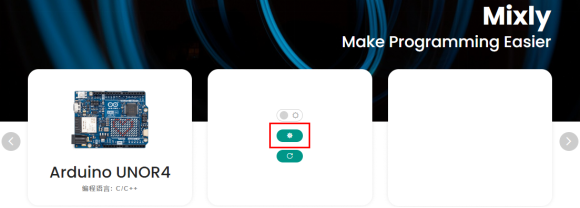

第二点是：在界面最上方右侧有一个  按钮，单击这个按钮就能进入纯代码形式，如下图所示：

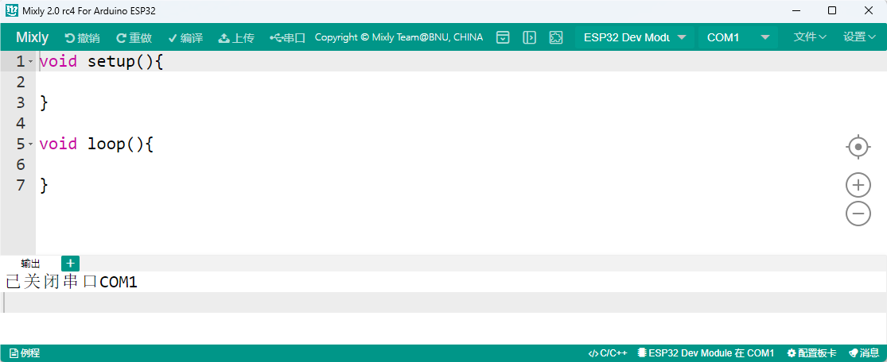

Mixly作为一款将图形化编程方式和代码编程方式融合在一起的开发环境，如果只能单独地显示代码或显示图形程序块，那么肯定是不够好的。在Mixly中是能够将代码和图形程序块一起呈现在屏幕上的，这个功能可以通过界面最上方右侧有一个按钮实现，单击这个  按钮之后，如下图所示：

这时，在程序构建区的右侧会显示出对应的代码，这段代码是与程序构建区中的模块所组成的程序块对应的，会随着模块的变化而变化，不过区域中的代码是不可编辑的。同时，界面最右侧那个向左的箭头按钮变成了向右的箭头。

### **3. 添加Mixly库文件**

注意：Mixly库文件(index库) 必须添加好，否则后面涉及到相关模块的示例代码是打不开的。

**特别提醒：** 库文件在上面 **资料下载** 处提供有，请下载并且安装好库文件。

Mixly软件下载安装后，点击 Arduino ESP32 进入代码编辑器，先点击右上角 “**设置**”，再点击 “**管理库**” 进入添加库文件界面。如下图所示：

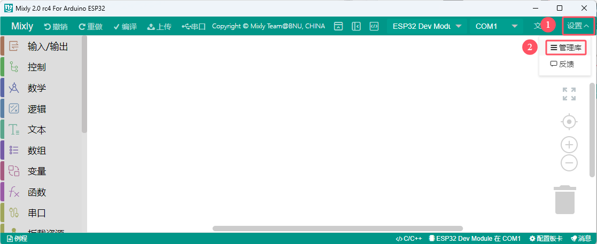

先点击 “**导入库**”，再点击  进入库文件所放的位置，找到 **index.xml** 库文件并选中它，然后单击“ 确定 ”。之后，就可以看到库文件在导入中，一会儿会出现 “**导入成功**” 字样，说明库文件导入成功。如下图所示：

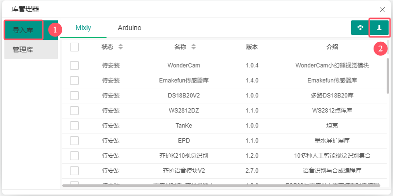

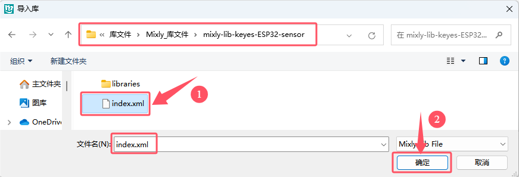

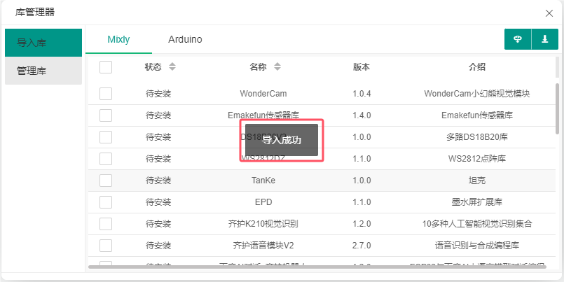

点击 “**管理库**”，可以看到添加成功的库文件。如下图所示：

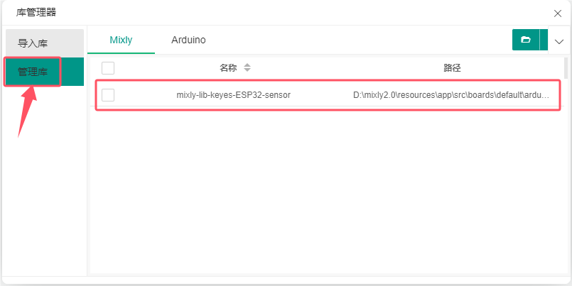

关闭添加库文件的窗口界面，在代码编辑器左侧看到所添加的库文件。如下图所示：

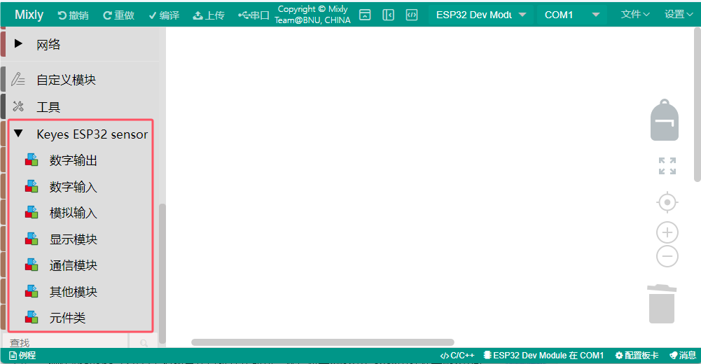

### **4. 编写代码并上传至 ESP32 主控板**

（**后面上传项目代码的步骤也一样，即：同下。**）

确保ESP32主控板与计算机连接成功，然后双击 “**Mixly.exe**” 图标打开Mixly软件。

方法①：从直接拖动代码块到程序构建区进行代码编写，选用管脚IO15，如下图所示：

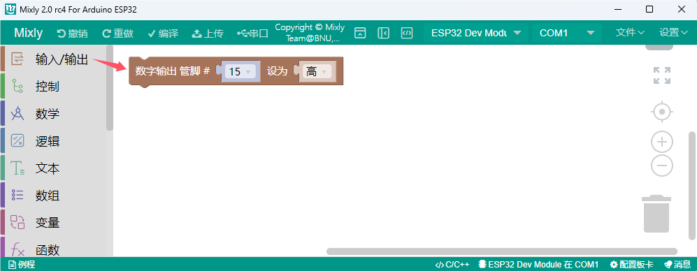

编写完成后保存到电脑上，单击 “**文件**” --> “**另存为**”，如下图所示：

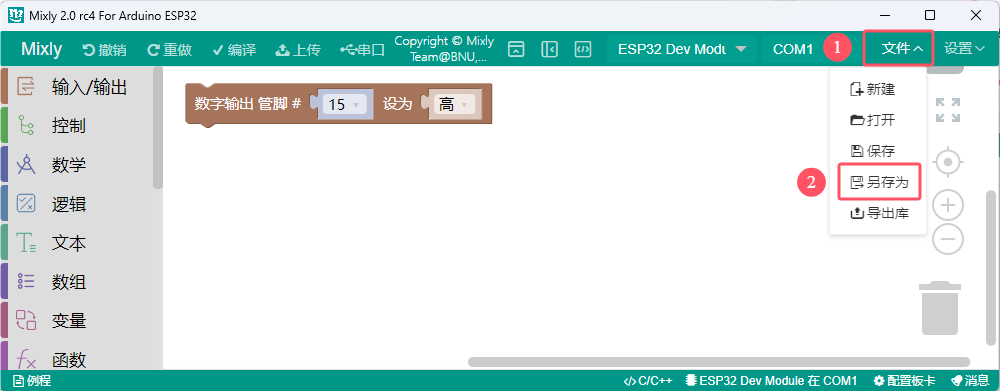

选择ESP32主控板的板型 “ESP32 Dev Moduel” 和串口端口（COM6）（提示：不同的电脑，串口端口是不一样的，(注意：将ESP32主板通过USB线连接到计算机后才能看到对应的端口。)，如下图所示：

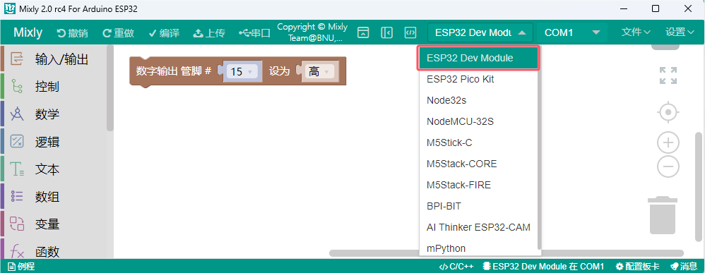

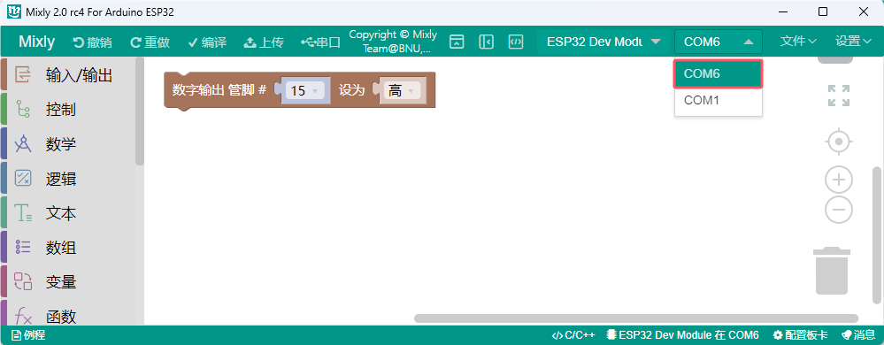

单击  将代码上传到ESP32主控板，如下图所示：

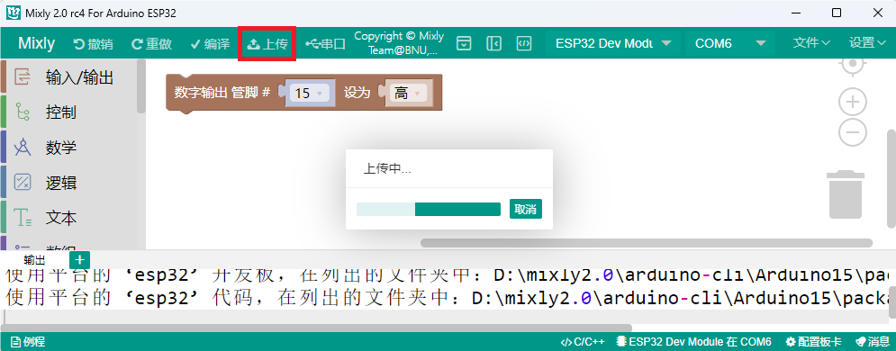

方法②：从电脑打开已经编写好的代码  

将我们提供的代码文件压缩包解压，把解压后的代码文件夹保存到方便使用的位置。

“**文件**” --> “**打开**”，然后选择保存代码的路径，选中代码文件打开即可。如下图所示：

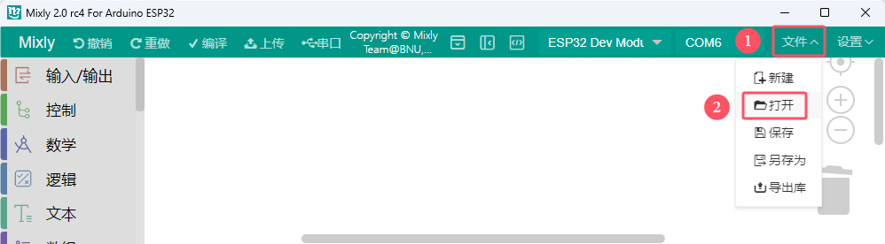

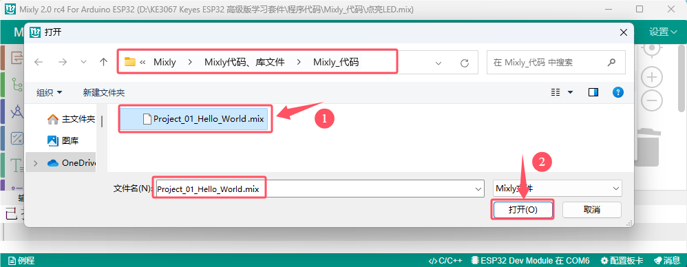

代码文件打开后，需要手动选择ESP32主控板的板型 “ESP32 Dev Moduel” 和串口端口（COM6）（提示：不同的电脑，串口端口是不一样的，(注意：将ESP32主板通过USB线连接到计算机后才能看到对应的端口。)，如下图所示：

单击  将代码上传到ESP32主控板，如下图所示：

