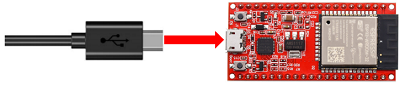
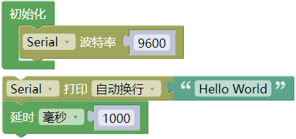
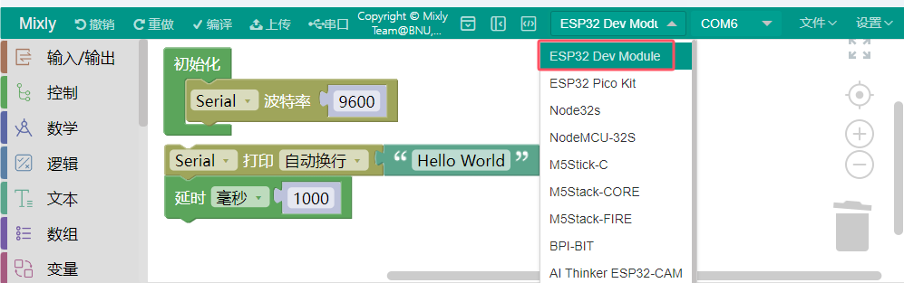
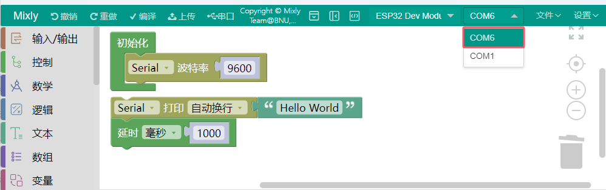
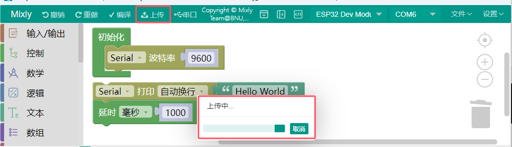
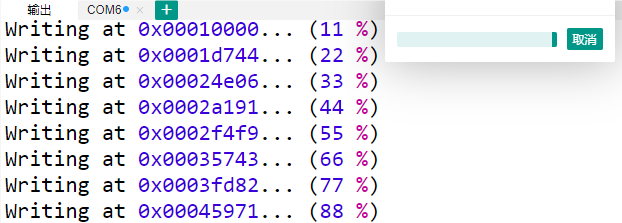
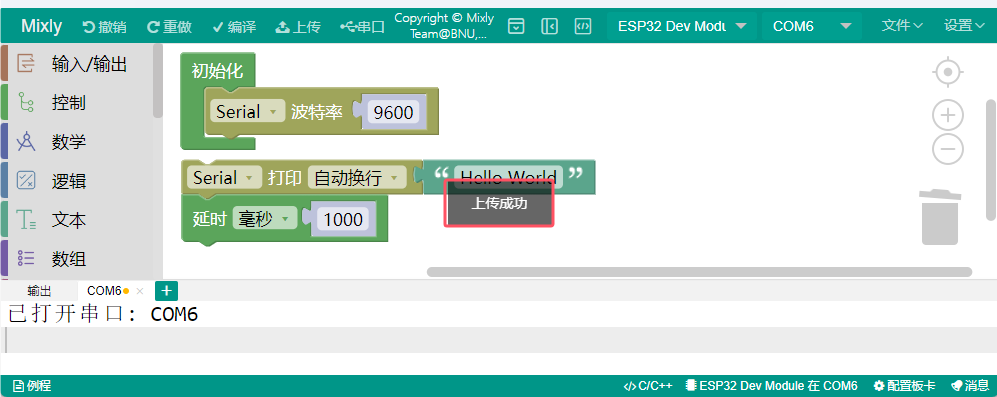
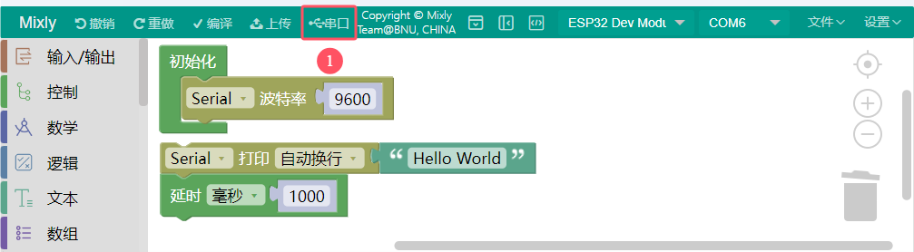
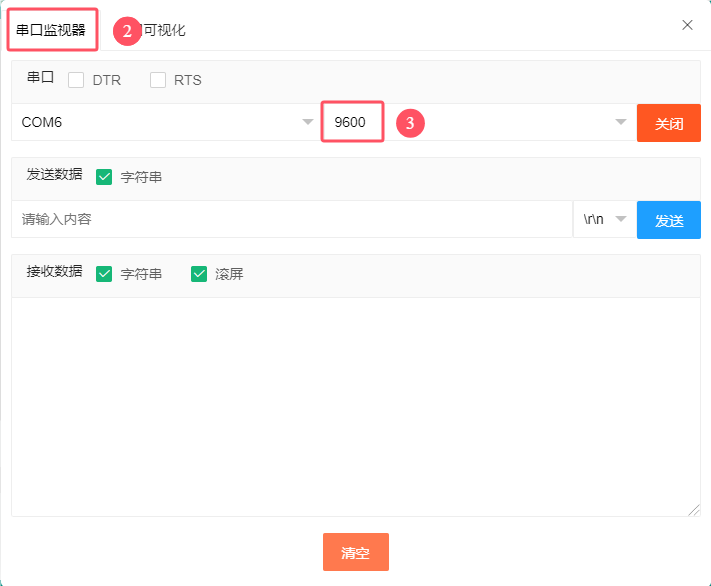
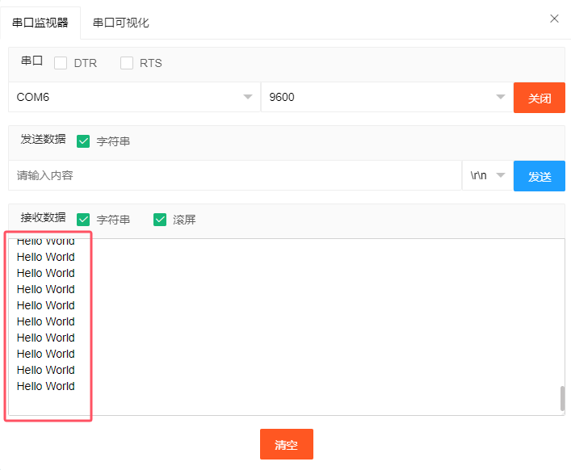

## 项目01 Hello World

**1. 项目介绍：**

对于ESP32的初学者，我们将从一些简单的东西开始。在这个项目中，你只需要一个ESP32主板，USB线和电脑就可以完成“ Hello World! ”项目。它不仅是ESP32主板和电脑的通信测试，也是ESP32的初级项目。

**2. 项目元件：**

|||
| :--: | :--: |
| ESP32*1 | USB 线*1 |

**3. 项目接线：**

在本项目中，我们通过USB线将ESP32和电脑连接起来。

**4. 代码说明：**

设置串口波特率，一般是设置为9600。

自动换行输出数据。从串行端口输出数据，跟随一个回车和一个换行符。

从串行端口不换行输出数据。

将程序的执行暂停一段时间，也就是延时。单位是毫秒。 

**5. 项目代码：**

代码可以从前面“资料下载”中找到，建议直接使用下载的资料里面的代码。

你也可以自己编写代码，其如下：

1. 从 “” 拖出 “”。

2. 从 “” 拖出 “” 放入 “”。

3. 从 “” 拖出 “”。

4. 从 “” 拖出 “” 放入 “”，将 hello 修改为 Hello World。

5. 从 “” 拖出 “”。

完整代码：

在上传项目代码到ESP32之前，需要手动选择Arduino ESP32主控板的板型 “ESP32 Dev Moduel” 和串口端口（COM6）（提示：不同的电脑，串口端口是不一样的）。(注意：将ESP32主板通过USB线连接到计算机后才能看到对应的端口。) （**后面上传项目代码的步骤也一样，即：同下。**）

单击  将项目代码上传到ESP32主板上。(**下同**)

**注意**：（**下同**） 如果上传代码不成功，可以再次点击 后用手按住ESP32主板上的Boot键 ，出现上传进度百分比数后再松开Boot键，如下图所示：

项目代码上传成功！

**6. 项目结果：** 

项目代码上传成功后，利用USB线上电，单击图标  进入串行监视器，设置波特率为9600，这样串口监视器打印 “Hello World!”。

