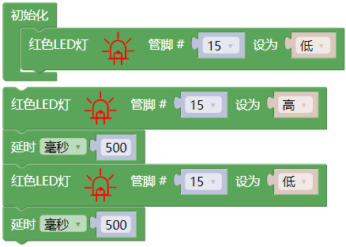

## 项目03 LED闪烁

**1. 项目介绍：**

在这个项目中，我们将向你展示LED闪烁效果。我们使用ESP32的数字引脚打开LED，让它闪烁。

**2. 项目元件：**

||||
| :--: | :--: | :--: |
|ESP32*1|面包板*1|红色LED*1|
|| ||
|220Ω电阻*1|跳线*2|USB 线*1|

**3. 项目接线图：**

首先，切断ESP32的所有电源。然后根据电路图和接线图搭建电路。电路搭建好并验证无误后，用USB线将ESP32连接到电脑上。

注意：避免任何可能的短路(特别是连接3.3V和GND)!

警告：短路可能导致电路中产生大电流，造成元件过热，并对硬件造成永久性损坏。 

注意: 

怎样连接LED 

怎样识别五色环220Ω电阻

**4. 项目代码：**

代码也可以从前面“资料下载”中找到，建议直接使用下载的资料里面的代码。（注意：从本课程开始后续课程不再进行此提示）

你也可以自己编写代码，其如下：

1. 从 “” 拖出 “”。

2. 从 “” 拖出 “  ” 放入 “”，管脚为 15 ，设为 “低” 。

3. 从 “” 拖出 “  ” ，管脚为 15 ，设为 “高” 。

4. 从 “” 拖出 “”，设置延时为500毫秒。

5. 复制代码块 “ ” 1 次，将 “高” 改为 “低”。

完整代码：

**5. 项目现象：**

项目代码上传成功后，利用USB线上电，可以看到的现象是：可以看到电路中的LED会反复闪烁。

