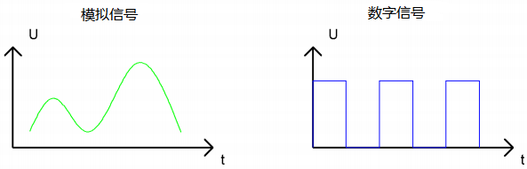
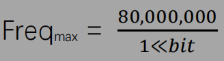
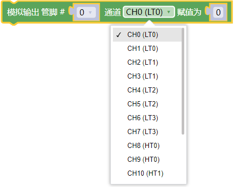
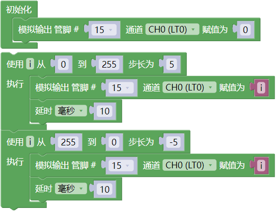

## 项目04 呼吸灯

**1. 项目介绍：**

在之前的研究中，我们知道LED有亮/灭状态，那么如何进入中间状态呢?如何输出一个中间状态让LED“半亮”?这就是我们将要学习的。呼吸灯，即LED由灭到亮，再由亮到灭，就像“呼吸”一样。那么，如何控制LED的亮度呢? 我们将使用ESP32的PWM来实现这个目标。

**2. 项目元件：**

||||
| :--: | :--: | :--: |
|ESP32*1|面包板*1|红色LED*1|
|| ||
|220Ω电阻*1|跳线*2|USB 线*1|

**3. 元件知识：**

**模拟信号 & 数字信号** 

模拟信号在时间和数值上都是连续的信号。相反，数字信号或离散时间信号是由一系列数字组成的时间序列。生活中的大多数信号都是模拟信号，一个熟悉的模拟信号的例子是：全天的温度是连续不断变化的，而不是突然从0到10的瞬间变化。然而，数字信号的值可以瞬间改变。这个变化用数字表示为1和0(二进制代码的基础)。如下图所示，我们可以更容易地看出它们的差异。

在实际应用中，我们经常使用二进制作为数字信号，即一系列的0和1。由于二进制信号只有两个值(0或1)，因此具有很大的稳定性和可靠性。最后，可以将模拟信号和数字信号相互转换。

**PWM：**

脉宽调制(PWM)是一种利用数字信号控制模拟电路的有效方法。普通处理器不能直接输出模拟信号。PWM技术使这种转换(将数字信号转换为模拟信号)非常方便。PWM技术利用数字引脚发送一定频率的方波，即高电平和低电平的输出，交替持续一段时间。每一组高电平和低电平的总时间一般是固定的，称为周期(注:周期的倒数是频率)。高电平输出的时间通常称为脉宽，占空比是脉宽(PW)与波形总周期(T)之比的百分比。高电平输出持续时间越长，占空比越长，模拟信号中相应的电压也就越高。下图显示了对应于脉冲宽度0%-100%的模拟信号电压在0V-3.3V(高电平为3.3V)之间的变化情况.

PWM占空比越长，输出功率越高。既然我们了解了这种关系，我们就可以用PWM来控制LED的亮度或直流电机的速度等等。从上面可以看出，PWM并不是真实的模拟信号，电压的有效值等于相应的模拟信号。因此，我们可以控制LED和其他输出模块的输出功率，以达到不同的效果。

**ESP32 与 PWM**

在ESP32上，LEDC(PWM)控制器有16个独立通道，每个通道可以独立控制频率，占空比，甚至精度。与传统的PWM引脚不同，ESP32的PWM输出引脚是可配置的，每个通道有一个或多个PWM输出引脚。最大频率与比特精度的关系如下公式所示：

其中比特的最大值为31。例如: 生成PWM的8位精度(2ˆ8 = 256。取值范围为0 ~ 255)，最大频率为80,000,000/255 = 312,500Hz。)

**4. 项目接线图：** 

**5. 代码说明：**

向指定管脚设置通道，赋值可以为0 ~ 255。

将数字管脚15的通道设置为CH0(LT0)，赋值为0 ，是LED熄灭。

将管脚 15 的通道设置为CH0(LT0)，赋值为i。

设置一个变量 i ，i从 0 逐渐增加到 255，每一次都加 5，总共加了 51 次， 每次以10毫秒的频率增加 5，LED逐渐变亮。

设置一个变量i，i从 255 逐渐减少到 0，每一次都减5，总共减了51次， 每次以 10 毫秒的频率减 5，LED逐渐变暗。

**6. 项目代码：**

本项目设计使GPIO15 输出PWM，脉宽由0%逐渐增加到100%，再由100%逐渐减小到0%。

你也可以自己编写代码，其如下：

1. 从 “” 拖出 “”。

2. 从 “” 拖出 “  ” 放入 “”，管脚为 15 ，通道设置为CH0(LT0)，赋值为 0。

3. 从 “” 拖出 “  ” ，从 1 到 10 步长为 1 改成从 0 到 255 步长为 5。

4. 从 “” 拖出 “  ” 放入 “  ”，管脚为 15 ，通道设置为CH0(LT0)；又从 “ ” 拖出 “ ” 放入赋值为 0 处。

5. 从 “” 拖出 “” 放入 “  ”，设置延时为10毫秒。

6. 复代码块 “  ” 1 次，从 0 到 255 步长为 5 改成从 255 到 0 步长为 -5。

完整代码：

**7. 项目现象：**

项目代码上传成功后，利用USB线上电，可以看到的现象是：电路中的LED从暗逐渐变亮，再从亮逐渐变暗，就像呼吸一样。

