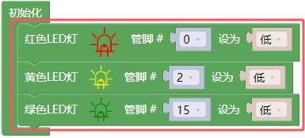
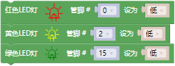
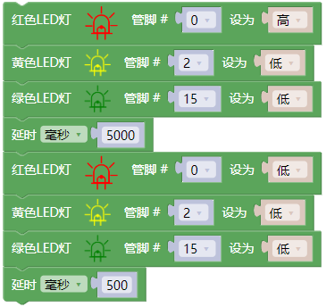
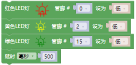
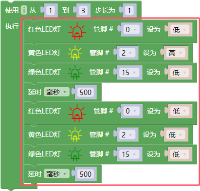
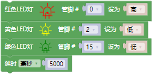
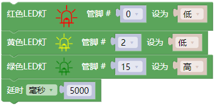
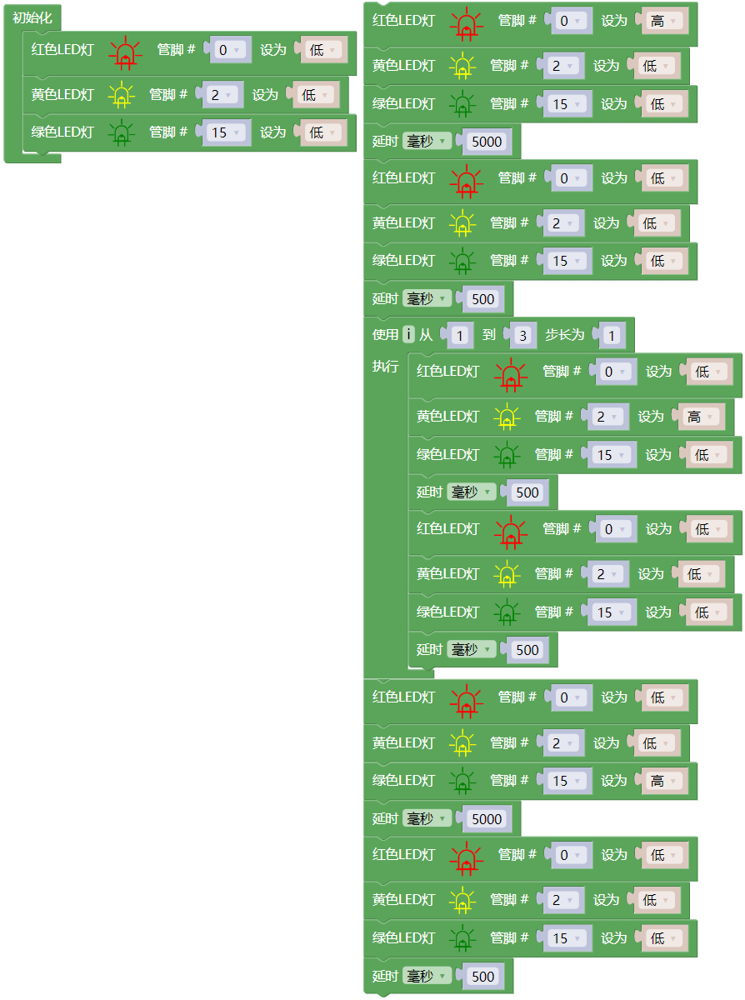

## 项目05 交通灯

**1. 项目介绍：**

交通灯在我们的日常生活中很普遍。根据一定的时间规律，交通灯是由红、黄、绿三种颜色组成的。每个人都应该遵守交通规则，这可以避免许多交通事故。

在这个项目中，我们将使用ESP32和一些led(红，黄，绿)来模拟交通灯。

**2. 项目元件：**

|||||
| :--: | :--: | :--: | :--: |
|ESP32*1|面包板*1|红色LED*1|黄色 LED*1|
||| ||
|绿色LED*1|220Ω电阻*3|跳线若干|USB 线*1|

**3. 项目接线图：** 

**4. 项目代码：**

你也可以自己编写代码，其如下：

1. 从 “” 拖出 “”。

2. 从 “” 分别拖出 “  ” 、 “  ” 、 “  ” 放入 “”，红色LED管脚为 0 、黄色LED管脚为 2 、绿色LED管脚为 15 ，全部设为 “低”。

3. 复制代码块 “  ” 1 次，将红色LED设为 “高”；又从 “” 拖出 “”，设置延时为5000毫秒；再复制复制代码块 “  ” 1次，延时为500毫秒。

4. 从 “” 拖出 “  ” ，从 1 到 10 步长为 1 改成从 1 到 3 步长为 1。

5. 复制代码块 “  ” 1 次 放入 “  ”，将黄色LED设为 “低” 改成设为 “高”，再复制代码块 “  ” 1 次放入 “  ” ，

6. 复制代码块 “  ” 1次，将红色LED设为 “高” 改成 “低” ，再把绿色LED设为 “低” 改成设为 “高”。

7. 复制代码块 “  ” 1次。

完整代码：

**5. 项目现象：**

项目代码上传成功后，利用USB线上电，你会看到的现象是：1.首先，红灯会亮5秒，然后熄灭；2.其次，黄灯会闪烁3次，然后熄灭；3.然后，绿灯会亮5秒，然后熄灭；4.继续运行上述1-3个步骤。

