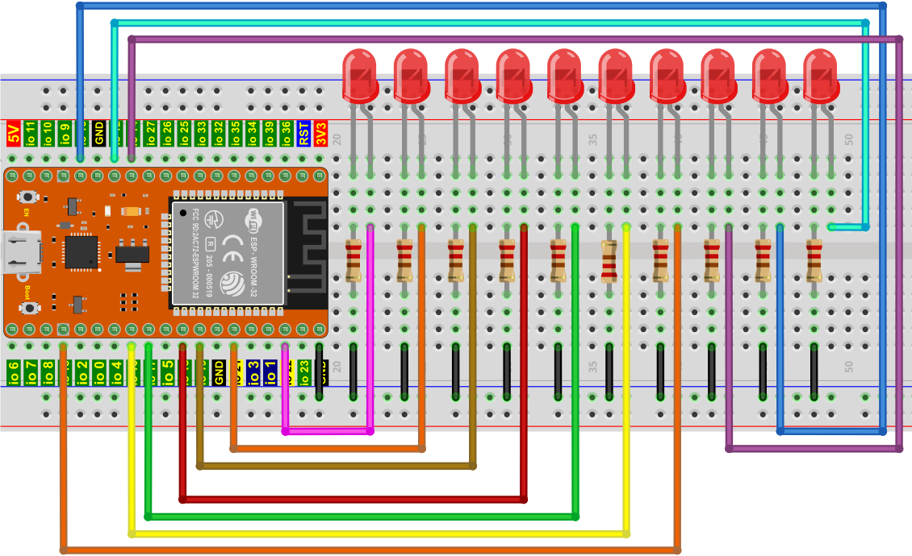
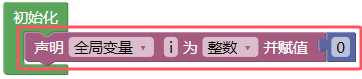
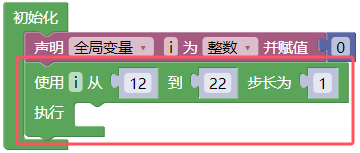
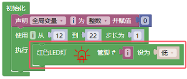
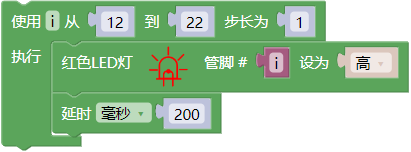
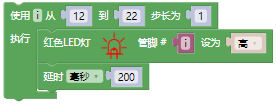
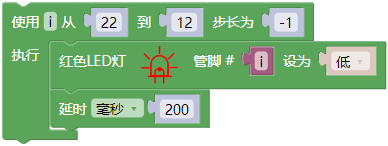
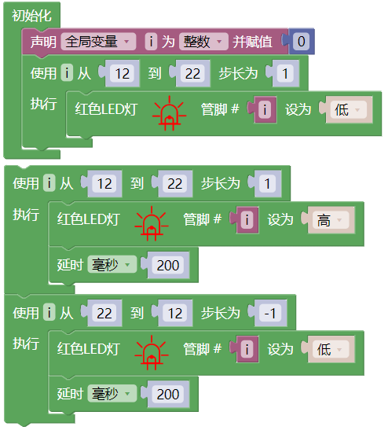
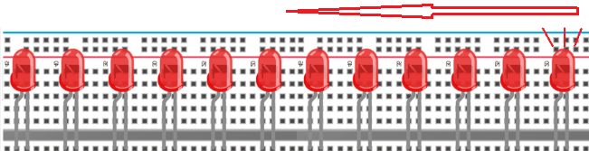
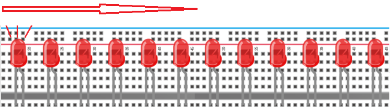

## 项目07 流水灯

**1. 项目介绍：**

在日常生活中，我们可以看到许多由不同颜色的led组成的广告牌。他们不断地改变灯光(像流水一样)来吸引顾客的注意。

在这个项目中，我们将使用ESP32控制10个leds实现流水的效果。

**2. 项目元件：**

||||
| :--: | :--: | :--: |
|ESP32*1|面包板*1|红色LED*10|
|| ||
|220Ω电阻*10|跳线若干|USB 线*1|

**3. 项目接线图:**

**4. 项目代码：**

本项目是设计制作一个流水灯。这是这些行动：首先打开LED 1，然后关闭它。然后打开LED 2，然后关闭…并对所有10个LED重复同样的操作，直到最后一个LED关闭。这一过程反复进行，以实现流水的“运动”。

你可以打开我们提供的代码，也可以自己编写代码，其如下：

1. 从 “” 拖出 “”。

2. 先从 “ ” 拖出 “” 放入 “” 中；再从 “” 拖出 “” 放入 “”中，将 “item” 改成 “ i ” 。

3. 从 “” 拖出 “  ” 放入 “”，从 1 到 10 步长为 1 改成从 12 到 22 步长为 1。

4. 先从 从 “” 拖出 “  ”  放入 “ ” ；再从 “ ” 拖出 “  ” 放入 “管脚 0 ” 处 ，“ 高 ” 改成 “ 低 ”。

5. 先从 “” 拖出 “  ” ，从 1 到 10 步长为 1 改成从 12 到 22 步长为 1 ；又从 “” 拖出 “  ” 放入 “ ”；再从 “ ” 拖出 “  ” 放入 “管脚 0 ” 处 ；添加延时200毫秒。

6. 复制代码块 “  ” 1次，从 12 到 22 步长为 1 改成从 22 到 12 步长为 -1 ，“ 高 ” 改成 “ 低 ”。

完整代码：

**5. 项目现象：**

代码上传成功后，利用USB线上电后，你会看到的现象是：10个LED将从右到左点亮，然后从左到右返回。

