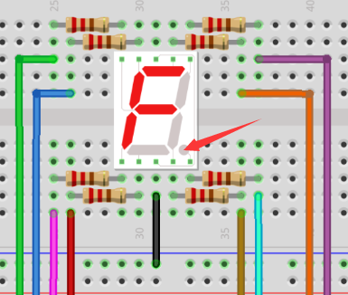
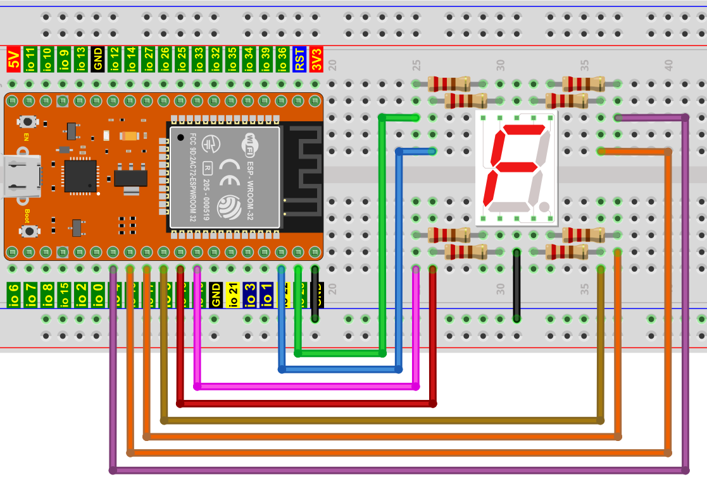

## 项目08 一位数码管

**1. 项目介绍：**

七段数码管是一种显示十进制数字的电子显示设备，广泛应用于数字时钟、电子仪表、基本计算器和其他显示数字信息的电子设备。甚至我们在电影中看到的炸弹也有七段数码管。也许七段数码管看起来不够现代，但它们是更复杂的点阵显示器的替代品，在有限的光线条件下和强烈的阳光下都很容易使用。

在这个项目中，我们将使用ESP32控制一位数码管显示数字。

**2. 项目元件：**

||||
| :--: | :--: | :--: |
|ESP32*1|面包板*1|一位数码管*1|
|| ||
|220Ω电阻*8|跳线若干|USB 线*1|

**3. 元件知识：**

**一位数码管显示原理：** 数码管显示是一种半导体发光器件。它的基本单元是一个发光二极管(LED)。数码管显示根据段数可分为7段数码管和8段数码管。8段数码管比7段多一个LED单元(用于小数点显示)。七段LED显示屏的每段是一个单独的LED。根据LED单元接线方式，数码管可分为共阳极数码管和共阴极数码管。

在共阴极7段数码管中，分段LED的所有阴极(或负极)都连接在一起，你应该把共阴极连接到GND，要点亮一个分段LED，你可以将其关联的引脚设置为HIGH。

在共阳极7段数码管中，所有段的LED阳极(正极)都连接在一起，你应该把共阳极连接到+5V。要点亮一个分段LED，你可以将其关联的引脚设置为LOW。

数码管的每个部分由一个LED组成。所以当你使用它的时候，你也需要使用一个限流电阻。否则，LED会被烧坏。在这个实验中，我们使用了一个普通的共阴极一位数码管。正如我们上面提到的，你应该将公共阴极连接到GND。要点亮一个分段LED，你可以将其关联的引脚设置为HIGH。

**4. 项目接线图：**

注意：插入面包板的七段数码管方向与接线图一致，右下角多一个点。

**5. 代码说明：**

初始化一位数码管的管脚，二维数组等等。

这是显示数字的一位数码管指令方块，可以显示 1 位数字：0 ~ 9。

**6. 项目代码：**

数字显示分7段，小数点显示分1段。当显示某些数字时，相应的段将被点亮。例如，当显示数字1时，b和c段将被打开。

你可以打开我们提供的代码，也可以自己编写代码，其如下：

1. 从 “” 拖出 “”。

2. 从 “” 拖出 “  ” 放入 “”。

3. 从 “  ” 拖出 “  ”，数字 0 改成 9 。

4. 从 “” 拖出 “”，设置延时为1000毫秒。

5. 复制代码块 “” 9次，将数字 9 分别改成 8、7、6、5、4、3、2、1、0。

完整代码：

**7. 项目现象：**

代码上传成功后，利用USB线上电后，你会看到的现象是：一位数码管将显示从9到0的数字。

