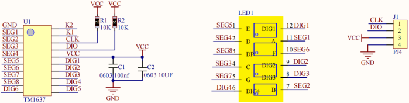
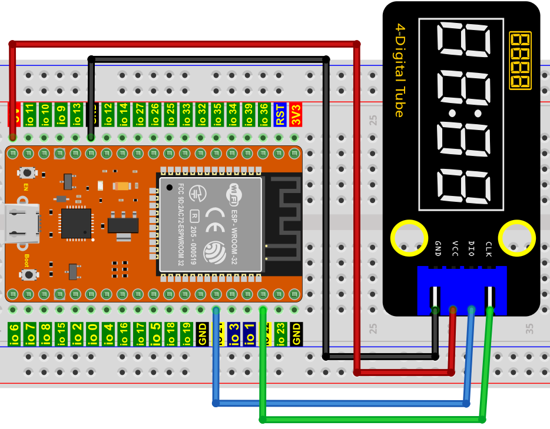
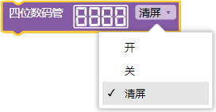
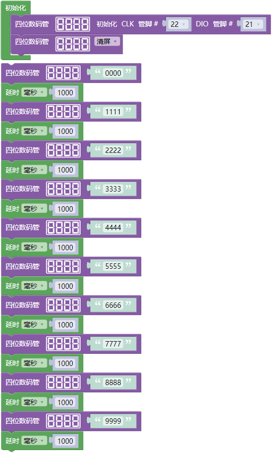

## 项目09 四位数码管

**1. 项目介绍：**

四位数码管是一种非常实用的显示器件，电子时钟的显示，球场上的记分员，公园里的人数都是需要的。由于价格低廉，使用方便，越来越多的项目将使用4位数码管。

在这个项目中，我们使用ESP32控制四位数码管来显示四位数字。

**2. 项目元件：**

||||
| :--: | :--: | :--: |
|ESP32*1|面包板*1|四位数码管*1|
||| |
|4P转杜邦线公单*1|USB 线*1| |

**3. 元件知识：**

**TM1650四位数码管：** 是一个12脚的带时钟点的四位共阴数码管（0.36英寸）的显示模块，驱动芯片为TM1650，只需2根信号线即可使单片机控制四位数码管。控制接口电平可为5V或3.3V。

G：电源负极

V：电源正极，+5V

DIO：数据IO模块，可以接任意的数字引脚

CLK：时钟引脚，可以接任意的数字引脚

**4位数码管模块规格参数：**

工作电压：DC 3.3V-5V

工作电流：≤100MA

最大功率：0.5W

数码管显示颜色：红色

**4位数码管模块原理图：**

**4. 项目接线图：**

**5. 代码说明：**

初始化TM1650四位数码管模块的管脚。

打开/关闭，或清屏四位数码管模块

四位数码管模块显示 4 位字符串（数字或字母等等）。

**6. 项目代码：**

你可以打开我们提供的代码，也可以自己编写代码，其如下：

1. 从 “” 拖出 “”。

2. 从 “” 分别拖出 “” 和 “” 放入 “”，CLK管脚为 22 ，DIO管脚为 21。

3. 先从 “” 拖出 “” ，将字符串 1234 改成 0000；再从 “” 拖出 “”，设置延时为1000毫秒。

4. 复制代码块 “” 9次，分别将字符串 0000 改成 1111、2222、3333、4444、5555、6666、7777、8888、9999。

完整代码：

**7. 项目现象：**

代码上传成功后，利用USB线上电后，你会看到的现象是：四位数码管显示四位数字0000-9999，并在一个无限循环中重复这些动作。

