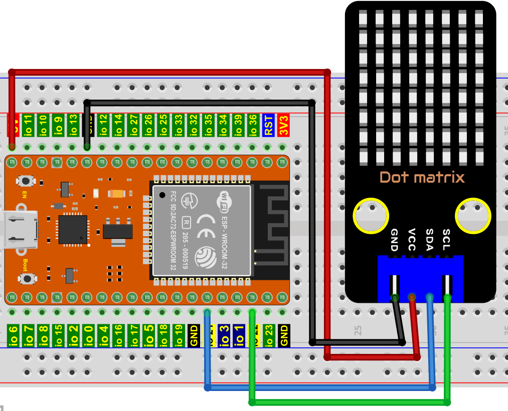
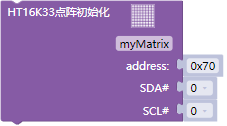
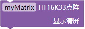
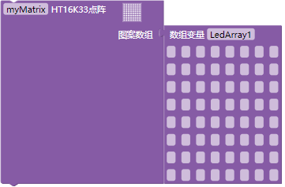
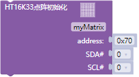
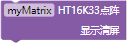
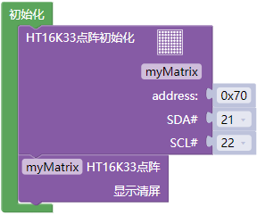
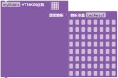
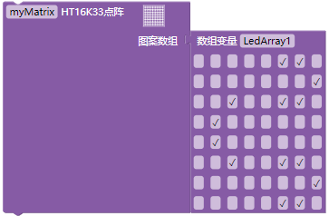
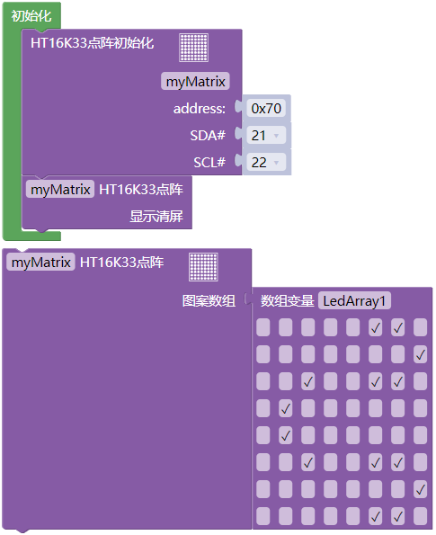

## 项目10 8×8点阵屏

**1. 项目介绍：**

点阵屏是一种电子数字显示设备，可以显示机器、钟表、公共交通离场指示器和许多其他设备上的信息。

在这个项目中，我们将使用ESP32控制8x8 LED点阵来显示图案。

**2. 项目元件：**

||||
| :--: | :--: | :--: |
|ESP32*1|面包板*1|8×8点阵屏*1|
||| |
|4P转杜邦线公单*1|USB 线*1| |

**3. 元件知识：**

**8×8点阵屏模块：** 8×8的点阵由64个LED组成，每个LED被放置在一排和一列的交叉点上。利用单片机驱动一个8×8点阵时，我们总共需要用到16个数字口，这样就极大的浪费单片机资料。为此，我们特别设计了这个模块，利用HT16K33芯片驱动1个8×8点阵，只需要利用单片机的I2C通信端口控制点阵，大大的节约了单片机资源。

**8×8点阵屏模块规格参数：**

工作电压：DC 5V

工作电流：≤200MA

最大功率：1W

**8×8点阵屏模块原理：**

如原理图所示，如果想要点亮第一行第一列的LED灯，只需要把C1置高电平，R1置低电平，它就亮了。如果我们想让第一行led全部点亮，那么我们让R1为低电平，C1~C8全部为高电平就可以了，原理非常简单。但是这样的话我们总共需要用到16个IO口，这样就极大的浪费单片机资源。为此，我们特别设计了这个模块，利用HT16K33芯片驱动1个8*8点阵，只需要利用单片机的I2C通信端口控制点阵，大大的节约了单片机资源。

有些模块上自带3个拨码开关，可以让你随意拨动开关，这是用来设置I2C通信地址的，设置方法如下表格。我们的这个模块中，模块已经固定了通信地址，A0，A1，A2全部接地，即地址为0x70。

**4. 项目接线图：**

**5. 代码说明：**

初始化HT16K338×8点阵屏模块的地址和管脚。

对HT16K338×8点阵屏模块清屏

可以对HT16K338×8点阵屏设置图案，每个灰点对应于模块上的LED ，勾选其中一个灰点，模块上对应的LED点亮。

**6. 项目代码：**

你可以打开我们提供的代码，也可以自己编写代码，其如下：

1. 从 “” 拖出 “”。

2. 从 “” 分别拖出 “” 和 “” 放入 “”，SDA管脚为 21 ，SCL管脚为 22，地址默认为 0x70 。

3. 从 “” 拖出 “” ，点击灰点(√)，设置显示的图案。

完整代码：

**7. 项目现象：**

代码上传成功后，利用USB线上电，你会看到的现象是：8*8点阵屏显示“笑脸”图案。

