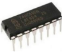
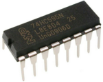
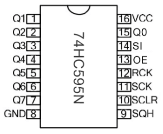
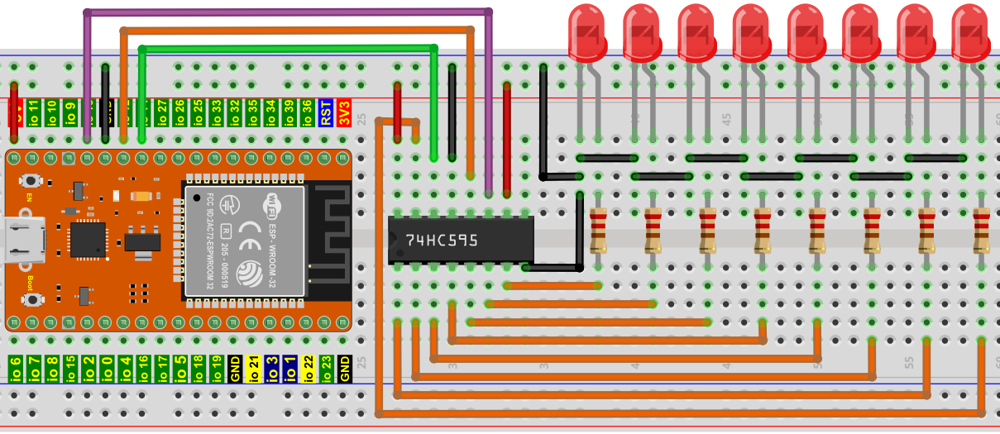
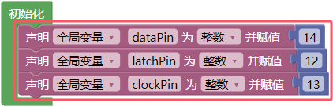
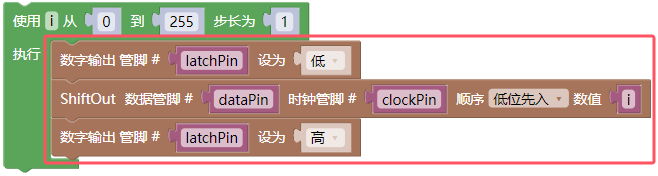
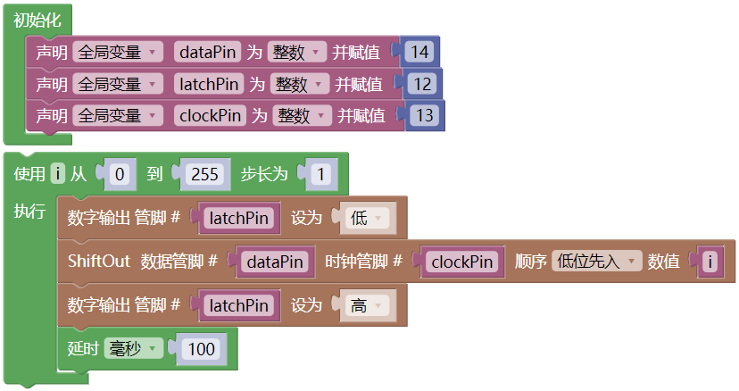
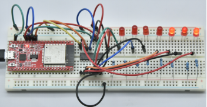

## 项目11 74HC595N控制8个LED

**1. 项目介绍：**

在之前的项目中，我们已经学过了怎样点亮一个LED。

ESP32上只有32个IO端口，我们如何点亮大量的led呢? 有时可能会耗尽ESP32上的所有引脚，这时候就需要用移位寄存器扩展它。你可以使用74HC595N芯片一次控制8个输出，而只占用你的微控制器上的几个引脚。你还可以将多个寄存器连接在一起，以进一步扩展输出。

在这个项目中，我们将使用ESP32，74HC595芯片和LED制作一个流水灯来了解74HC595芯片的功能。

**2. 项目元件：**

|||||
| :--: | :--: | :--: | :--: |
|ESP32*1|面包板*1|74HC595N芯片*1|红色LED*8|
|| || |
|220Ω电阻*8|跳线若干|USB 线*1| |

**3. 元件知识：**

**74HC595N芯片：** 简单来说就是具有8 位移位寄存器和一个存储器，以及三态输出功能。移位寄存器和存储器同步于不同的时钟，数据在移位寄存器时钟SCK的上升沿输入，在存储寄存器时钟RCK的上升沿进入的存储寄存器中去。如果两个时钟连在一起，则移位寄存器总是比存储寄存器早一个脉冲。移位寄存器有一个串行移位输入端（SI）和一个用于级联的串行输出端（SQH）,8位移位寄存器可以异步复位（低电平复位），存储寄存器有一个8位三态并行的总线输出，当输出使能（OE）被使能（低电平有效）将存储寄存器中输出至74HC595N的引脚（总线）。

**引脚说明：**

| 引脚： | 引脚说明： |
| :--: | :--: |
| 13引脚OE|	是一个输出使能引脚，用于确保锁存器的数据是否输入到Q0-Q7引脚。在低电平时，不输出高电平。在本实验中，我们直接连接GND，保持低电平输出数据。|
|14引脚SI/DS|这是74HC595接收数据的引脚，即串行数据输入端，一次只能输入一位，那么连续输入8次，就可以组成一个字节了。|
|10引脚SCLR/MR|一个初始化存储寄存器管脚的管脚。在低电平时初始化内部存储寄存器。在这个实验中，我们连接VCC以保持高水平。|
|11引脚SCK/SH_CP|移位寄存器的时钟引脚，上升沿时，移位寄存器中的数据整体后移，并接收新的数据输入。|
|12引脚RCK/ST_CP|存储寄存器的时钟输入引脚。上升沿时，数据从移位寄存器转存到存储寄存器中。这时数据就从Q0~Q7端口并行输出。|
|9引脚SQH|引脚是一个串行输出引脚，专门用于芯片级联，接下一个74HC595的SI端。|
|Q0--Q7(15引脚，1-7引脚)|八位并行输出端，可以直接控制数码管的8个段。|

**4. 项目接线图：**

注意：需要注意74HC595N芯片插入的方向。

**5. 项目代码：**

你可以打开我们提供的代码，也可以自己编写代码，其如下：

1. 从 “” 拖出 “”。

2. 先从 “  ” 拖出 “” 3 次 放入 “” 中；再从 “” 拖出 “” 3 次 放入 “”中，将 item 分别改成 dataPin、latchPin、clockPin，对应的赋值后面数字 0 改成 14、12、13 。

3. 从 “” 拖出 “” ，从 1 到 10 步长为 1 改成从 0 到 255 步长为 1。

4. 从 “” 分别拖出 “” 、“” 、“ ” 放入 “  ” 中，再从 “” 分别拖出 “”、“”、“”、“”，“” 依次对应的放入；将 第 1 个管脚 latchPin 后面的 “ 高 ” 改成 “ 低 ”，“ 高位先入 ” 改成 “ 低位先入 ” 。

5. 从 “” 拖出 “” 放入 “” 中，设置延时为100毫秒。

完整代码：

**6. 项目现象：**

代码上传成功后，利用USB线上电，可以看到的现象是：8个LED开始以流水模式闪烁。

