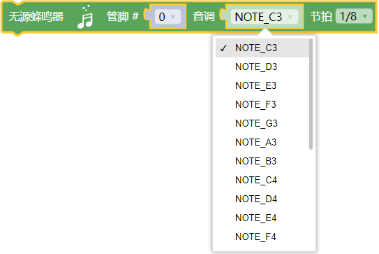
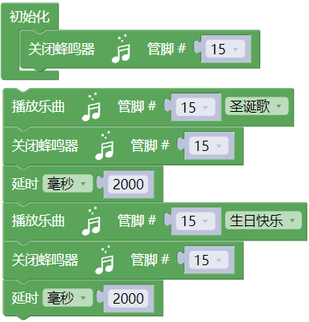
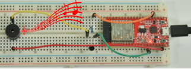

## 项目13 无源蜂鸣器

**1. 项目介绍：**

在之前的项目中，我们研究了有源蜂鸣器，它只能发出一种声音，可能会让你觉得很单调。这个项目将学习另一种蜂鸣器，无源蜂鸣器。与有源蜂鸣器不同，无源蜂鸣器可以发出不同频率的声音。

在这个项目中，你将使用ESP32控制无源蜂鸣器工作。

**2. 项目元件：**

|||||
| :--: | :--: | :--: | :--: |
|ESP32*1|面包板*1|无源蜂鸣器*1|NPN型晶体管(S8050)*1|
|| || |
|1KΩ电阻*1|跳线若干|USB线*1| |

**3. 元件知识：**

  

**无源蜂鸣器：** 它是一种内部没有振动源的集成电子蜂鸣器。它必须由2K-5K方波驱动，而不是直流信号。与有源蜂鸣器的外观非常相似，但是一个带有绿色电路板的蜂鸣器是无源蜂鸣器，而另一个带有黑色胶带的是有源蜂鸣器。无源蜂鸣器不能区分正极性而有源蜂鸣器是可以。

**晶体管:** 请参考**项目12** 。

**4. 项目接线图:**

**5. 代码说明：**

向指定管脚关闭无源蜂鸣器，使蜂鸣器不发声。

向指定管脚设置无源蜂鸣器发声的音调和节拍。

向指定管脚设置无源蜂鸣器播放特定音乐。

**6. 项目代码：**

你可以打开我们提供的代码，也可以自己编写代码，其如下：

1. 从 “” 拖出 “”。

2. 从 “” 拖出 “  ” 放入 “”，管脚为 15  。

3. 先从 “” 拖出 “  ” ，管脚为 15 ，选择 “圣诞歌” ；再拖出 “  ” ，管脚为 15 。

4. 从 “” 拖出 “”，设置延时为2000毫秒。

5. 复制代码块 “  ” 1次，选择 “生日快乐歌” 。

完整代码：

**7. 项目现象：**

代码上传成功后，利用USB线上电，你会看到的现象是：无源蜂鸣器播放音乐。

