## 项目14 小台灯

**1. 项目介绍：**

你知道ESP32可以在你按下外接按键的时候点亮LED吗?

 在这个项目中，我们将使用ESP32，一个按键开关和一个LED来制作一个迷你台灯。

**2. 项目元件：**

||||
| :--: | :--: | :--: |
|ESP32*1|面包板*1|按键*1|
||||
|10KΩ电阻*1|红色 LED*1|220Ω电阻*1|
|| ||
|按键帽*1|跳线若干|USB 线*1|

**3. 元件知识：**

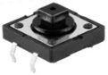

**按键：** 按键可以控制电路的通断，把按键接入电路中，不按下按键的时候电路是断开的，一按下按键电路就通啦，但是松开之后就又断了。可是为什么按下才通电呢？这得从按键的内部构造说起。没按下之前，电流从按键的一端过不去另一端；按下的时候，按键内部的金属片把两边连接起来让电流通过。

按键内部结构如图：，未按下按键之前，1、2就是导通的，3、4也是导通的，但是1、3或1、4或2、3或2、4是断开（不通）的；只有按下按键时，1、3或1、4或2、3或2、4才是导通的。

在设计电路时，按键开关是最常用的一种元件。

**按键的原理图:**

**什么是按键抖动？**

我们想象的开关电路是“按下按键-立刻导通”“再次按下-立刻断开”，而实际上并非如此。按键通常采用机械弹性开关，而机械弹性开关在机械触点断开闭合的瞬间（通常 10ms左右），会由于弹性作用产生一系列的抖动，造成按键开关在闭合时不会立刻稳定的接通电路，在断开时也不会瞬时彻底断开。

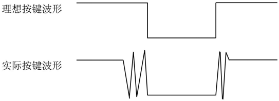

**那又如何消除按键抖动呢？**

常用除抖动方法有两种：软件方法和硬件方法。这里重点讲讲方便简单的软件方法。

我们已经知道弹性惯性产生的抖动时间为10ms 左右，用延时命令推迟命令执行的时间就可以达到除抖动的效果。

所以我们在代码中加入了0.02秒的延时以实现按键防抖的功能。

**4. 项目接线图：**

注意: 

怎样连接LED 

怎样识别五色环220Ω电阻和五色环10KΩ电阻

**5. 代码说明：**

从指定的数字管脚读取按键开关的数字信号(高/低电平)。

布尔型（bool）变量的值只有真 （true) 和假 （false）。 C++中如果值非零就为True,为零就是False。这里可以知道ledState初始值为0。

将ledState的当前值取反后再赋值给ledState本身。

这里延时的作用是软件方法消抖。按键机械触点断开、闭合时，由于触点的弹性作用，按键开关不会马上稳定接通或一下子断开，在闭合及断开的瞬间均伴随有一连串的抖动，为了不产生这种现象而作的措施就是按键消抖。代码中检测出键闭合后执行一个延时程序，10ms的延时，让前沿抖动消失后再一次检测键的状态，如果仍保持闭合状态电平，则确认为真正有键按下.

**6. 项目代码：**

你可以打开我们提供的代码，也可以自己编写代码，其如下：

1. 从 “” 拖出 “”。

2. 从 “” 拖出 “  ” 放入 “”，管脚为 4 ，设为 “低” 。

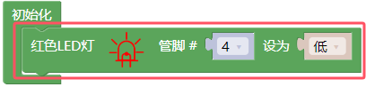

3. 先从 “ ” 拖出 “” 放入 “” 中，将 “ 整数 ” 改成 “布尔” ，“item” 改成 “ledState” ；再从 “” 拖出 “” 放入 “”中，选择 “假”。

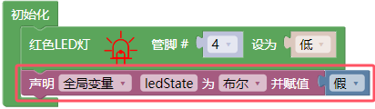

4. 先从 “” 拖出 “” ；接着从 “” 拖出 “” 放入 “” 中；再从 “” 拖出 “  ” 放入 “ = ” 左侧，管脚为 15 ；最后从 “” 拖出 “” 放入 “ = ” 右侧。

5. 从 “” 拖出 “”，设置延时为10毫秒。

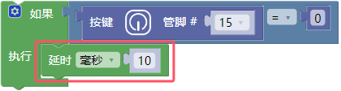

6. 先复制代码块 “  ” 1次，将延时10毫秒改成200毫秒；再复制代码块 “  ” 1次，将数字 0 改成 1.

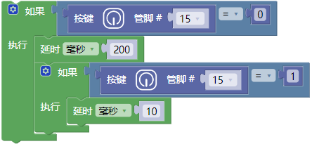

7. 复制代码块 “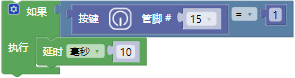 ” 1次，将延时10毫秒移除，接着从 “ ” 拖出 “” ，再从 “  ” 拖出 “ ”，最后又从 “ ” 拖出 “  ”。

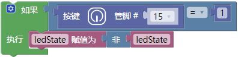

8. 从 “” 拖出 “  ” ，管脚为 4 ，又从 “ ” 拖出 “  ” 放入 “高” 处。

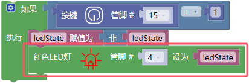

完整代码：

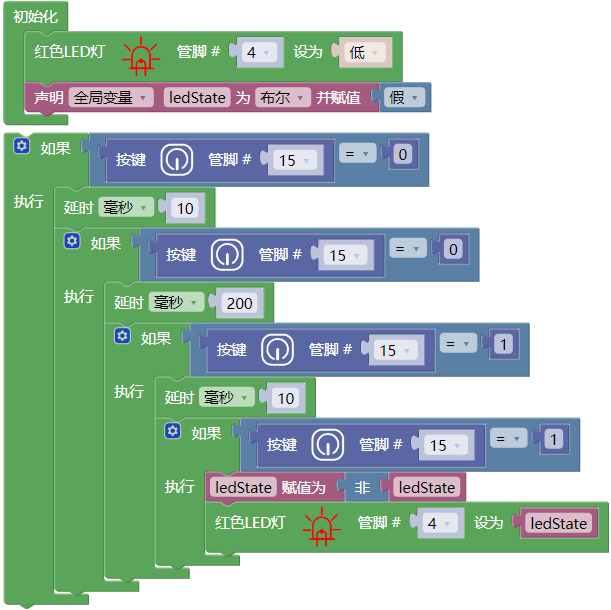

**7. 项目现象：**

代码上传成功后，利用USB线上电，你会看到的现象是：按下按钮，LED亮起；当按钮松开时，LED仍亮着。再次按下按钮，LED熄灭；当按钮释放时，LED保持关闭。是不是很像个小台灯？

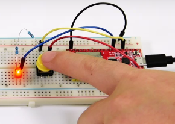

