## 项目15 模拟沙漏

**1. 项目介绍：**

古代人没有电子时钟，就发明了沙漏来测时间，沙漏两边的容量比较大，在一边装了细沙，中间有个很小的通道，将沙漏直立，有细沙的一边在上方，由于重力的作用，细沙就会往下流通过通道到沙漏的另一边，当细沙都流到下边了，就倒过来，把一天反复的次数记录下来，第二天就可以通过沙漏反复流动的次数而知道这一天大概的时间了。

这一课我们将利用ESP32控制倾斜开关和LED灯来模拟沙漏，制作一个电子沙漏。

**2. 项目元件：**

|||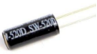||
| :--: | :--: | :--: | :--: |
|ESP32*1|面包板*1|倾斜开关*1|10KΩ电阻*1|
||| ||
|红色 LED*4|220Ω电阻*1|跳线若干|USB 线*1|

**3. 元件知识：**

倾斜开关也叫数字开关或球形开关，里面有一个金属球。它用于检测小角度的倾斜。

原理很简单：当开关倾斜一定角度时，里面的球会向下滚动，接触到连接到外面引脚的两个触点，从而触发电路。否则，球将远离触点，从而断开电路。

这里用倾斜开关的内部结构来说明它是如何工作的，显示如下图：

**4. 项目接线图：**

注意: 

怎样连接LED 

怎样识别五色环220Ω电阻和五色环10KΩ电阻

**5. 代码说明：**

从指定的数字管脚读取倾斜开关的数字信号(高/低电平)。

**6. 项目代码：**

你可以打开我们提供的代码，也可以自己编写代码，其如下：

1. 从 “” 拖出 “”。

2. 从 “” 拖出 “” 放入 “”。

3. 先从 “ 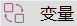” 拖出 “” 放入 “” 中；再从 “” 拖出 “” 放入 “”中，将 “ 整数 ” 改成 “字节” ，将 “item” 改成 “switch_state” 。

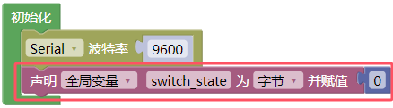

4. 先从 “” 拖出 “” ，再从 “” 拖出 “  ” ，管脚为 15 。

5. 先从 “” 拖出 “  ”，再从 “ ” 拖出 “ ” 。

6. 先从 “” 拖出 “” ；接着从 “” 拖出 “” 放入 “” 中；再从 “ ” 拖出 “ ”  放入 “ = ” 左侧 ；最后从 “” 拖出 “” 放入 “ = ” 右侧。

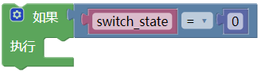

7. 先从 “” 拖出 “ 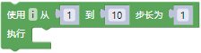 ” 放入 “ 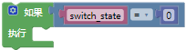 ”
，将从 1 到 10 步长为 1 改成从 16 到 19 步长为 1；又从 “” 拖出 “ 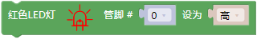 ” 放入 “  ”；再从 “ ” 拖出 “  ” 放入 “管脚 0 ” 处 ；添加延时500毫秒。

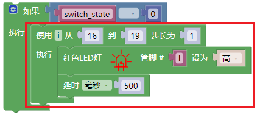

8. 复制代码块 “ 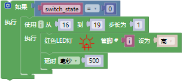 ” 1次，将 “ = ” 右侧的数字 0 改成 1，从 16 到 19 步长为 1 改成从 19 到 16 步长为 -1 ，“ 高 ” 改成 “ 低 ” 。

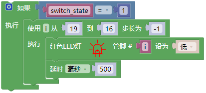

完整代码：

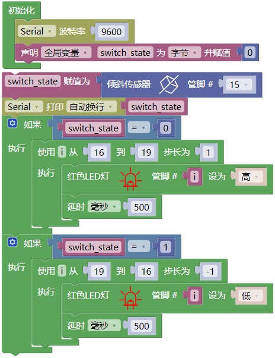

**7. 项目现象：**

代码上传成功后，利用USB线上电，你会看到的现象是：将面包板倾斜到一定角度，led就会一个一个地亮起来。当回到上一个角度时，led会一个一个关闭。就像沙漏一样，随着时间的推移，沙子漏了出来。

