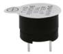
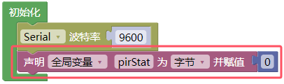
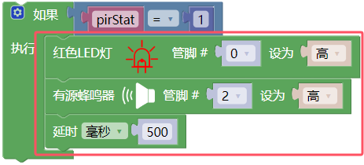
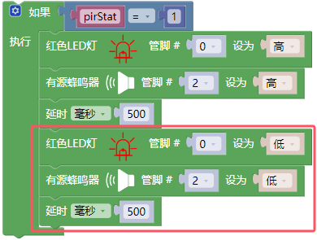
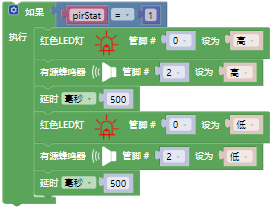
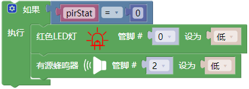
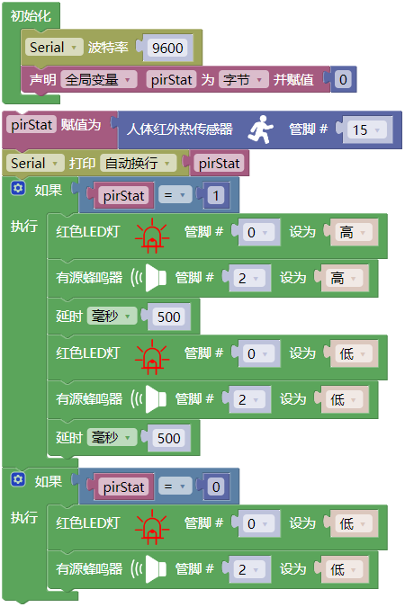

## 项目16 防窃警报器

**1. 项目介绍：**

人体红外传感器测量运动物体发出的热的红外(IR)线。该传感器可以检测人、动物和汽车的运动，从而触发安全警报和照明。它们被用来检测移动，是安全的理想选择，如防盗警报和安全照明系统。

在这个项目中，我们将使用ESP32控制人体红外传感器、蜂鸣器和LED来模拟防盗报警器。

**2. 项目元件：**

|||||
| :--: | :--: | :--: | :--: |
|ESP32*1|面包板*1|人体红外传感器*1|NPN型晶体管(S8050)*1|
|||||
|有源蜂鸣器*1|红色 LED*1|220Ω电阻*1|1KΩ电阻*1|
|  | || |
|3P转杜邦线公单*1|跳线若干|USB 线*1| |

**3. 元件知识：**

**人体红外传感器：** 是一款基于热释电效应的人体红外传感器，能检测到人体或动物身上发出的红外线，配合菲涅尔透镜能使传感器探测范围更远更广。它主要采用RE200B-P传感器元件，当附近有人或者动物运动时，该模块会输出一个高电平1；否则输出低电平0。特别注意，这个传感器可以检测在运动中的人、动物和汽车，静止中的人、动物和汽车是检测不到的，检测最远距离大约为7米左右。

注意：人体红外传感器应避开日光、汽车头灯、白炽灯直接照射，也不能对着热源(如暖气片、加热器)或空调，以避免环境温度较大的变化而造成误报。同时还易受射频辐射的干扰。

**传感器技术参数：**

最大输入电压：DC 5-15V 

最大工作电流：50MA

最大功率：0.3W

静态电流: <50uA

工作温度：-20 ~ 85℃

控制信号：数字信号(1/0)

延迟时间：大约2.3到3秒钟

感应角度：小于100度锥角

检测最远距离：大约7米左右

**传感器原理图：**

**4. 项目接线图：**

**5. 代码说明：**

从指定的数字管脚读取人体红外传感器的数字信号(高/低电平)，是用来检测附近是否有人或者动物运动。如果检测到附近有人或者动物运动时，输出一个高电平 1 ；否则，输出低电平 0 。

**6. 项目代码：**

你可以打开我们提供的代码，也可以自己编写代码，其如下：

1. 从 “” 拖出 “”。

2. 从 “” 拖出 “” 放入 “”。

3. 先从 “ ” 拖出 “” 放入 “” 中，将 “ 整数 ” 改成 “字节” ，将 “item” 改成 “pirStat” ；再从 “” 拖出 “” 放入 “”中。

4. 先从 “” 拖出 “” ，再从 “” 拖出 “  ” ，管脚为 15 。

5. 先从 “” 拖出 “  ”，再从 “ ” 拖出 “  ” 。

6. 先从 “” 拖出 “” ；接着从 “” 拖出 “” 放入 “” 中；再从 “ ” 拖出 “  ”  放入 “ = ” 左侧 ；最后从 “” 拖出 “” 放入 “ = ” 右侧，将数字 0 改成 1 。

7. 从 “” 分别拖出 “  ” 和 “  ” 放入 “  ” ，红色LED灯的管脚为 0 ，有源蜂鸣器的管脚为2 ；再从 “” 拖出 “”，设置延时为500毫秒。

8. 复制代码块 “  ” 1 次放入“  ”，2个 “ 高 ” 都改成 “ 低 ” 。

9. 复制代码块 “  ” 1次，将 “=” 右侧的数字 1 改成 0 ，删除代码块 “  ” 和 2 个延时500毫秒的指令方块。

完整代码：

**7. 项目现象：**

代码上传成功后，利用USB线上电，你会看到的现象是：如果人体红外传感器检测到附近有人移动时，蜂鸣器就会不断地发出警报，且LED不断地闪烁。

