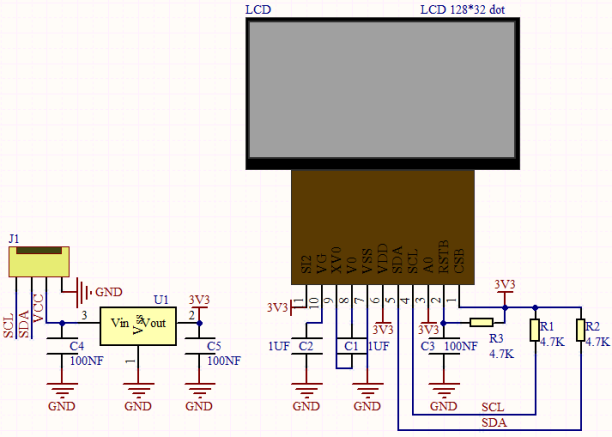
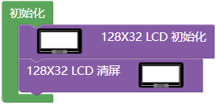
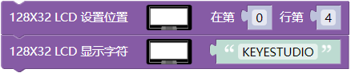
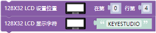
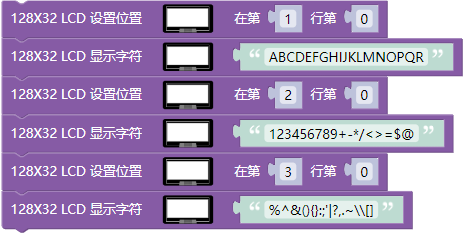
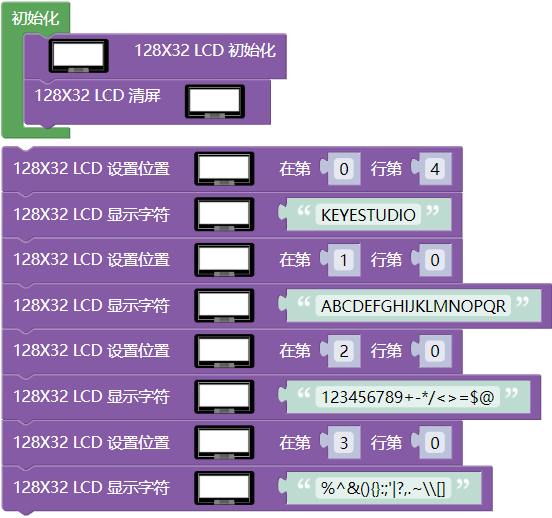

## 项目17 I2C 128×32 LCD

**1. 项目介绍：**

在生活中，我们可以利用显示器等模块来做各种实验。你也可以DIY各种各样的小物件。例如，用一个温度传感器和显示器做一个温度测试仪，或者用一个超声波模块和显示器做一个距离测试仪。下面，我们将使用LCD_128X32_DOT模块作为显示器，将其连接到ESP32控制板上。将使用ESP32主板控制LCD_128X32_DOT显示屏显示各种英文文字、常用符号和数字。

**2. 项目元件：**

||||
| :--: | :--: | :--: |
|ESP32*1|面包板*1|LCD_128X32_DOT*1|
||| |
|4P转杜邦线公单*1|USB 线*1| |

**3. 元件知识：**

**LCD_128X32_DOT：** 一个像素为128*32的液晶屏模块，它的驱动芯片为ST7567A。模块使用IIC通信方式，它不仅可以显示英文字母、符号，还可以显示中文文字和图案。使用时，还可以在代码中设置，让英文字母和符号等显示不同大小。

**LCD_128X32_DOT原理图：**

**LCD_128X32_DOT技术参数：**

显示像素：128*32 字符

工作电压：DC 5V

工作电流：100mA (5V)

模块最佳工作电压：5V

亮度、对比度可通过程序指令控制

**4. 项目接线图：**

**5. 代码说明：**

初始化LCD_128X32_DOT的管脚。

对LCD_128X32_DOT清屏

设置LCD_128X32_DOT显示内容的位置。

LCD_128X32_DOT显示字符串（数字，符号和字母等等）。

**6. 项目代码：**

你可以打开我们提供的代码，也可以自己编写代码，其如下：

1. 从 “” 拖出 “”。

2. 从 “” 分别拖出 “” 和 “” 放入 “” 。

3. 从 “” 分别拖出 “” 和 “” ，设置第 0 行第4，将字符串 abcd 改成 KEYESTUDIO 。

4. 复制代码块 “” 3次，将（0，4）分别改成（1，0）、（2，0）、（3，0）；将字符串 KEYESTUDIO 分别改成 ABCDEFGHIJKLMNOPQR 、123456789+-*/<>=$@ 、%^&(){}:;'|?,.~\\[] 。

完整代码：

**7. 项目现象：**

代码上传成功后，利用USB线上电，你会看到的现象是：128X32LCD模块显示屏第一行显示“KEYESTUDIO”、第二行显示“ABCDEFGHIJKLMNOPQR”、第三行显示“123456789+-*/<>=$@”、第四行显示“%^&(){}:;'|?,.~\\[]”。

