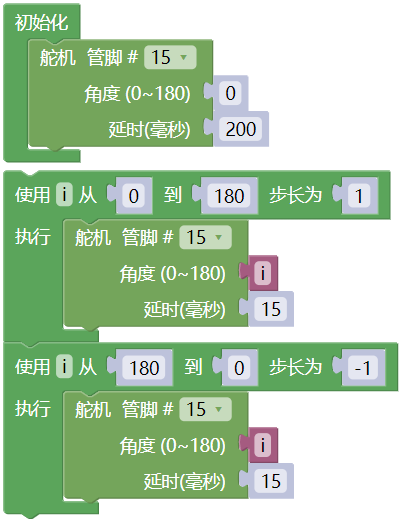

## 项目19 舵机

**1. 项目介绍：**

舵机是一种可以非常精确地旋转的电机。目前已广泛应用于玩具车、遥控直升机、飞机、机器人等领域。

在这个项目中，我们将使用ESP32控制舵机转动。

**2. 项目元件：**

||||
| :--: | :--: | :--: |
|ESP32*1|面包板*1|舵机*1|
||| |
|跳线若干|USB 线*1| |

**3. 元件知识：**

**舵机：** 舵机是一种位置伺服的驱动器，主要是由外壳、电路板、无核心马达、齿轮与位置检测器所构成。其工作原理是由接收机或者单片机发出信号给舵机，其内部有一个基准电路，产生周期为20ms，宽度为1.5ms 的基准信号，将获得的直流偏置电压与电位器的电压比较，获得电压差输出。经由电路板上的IC 判断转动方向，再驱动无核心马达开始转动，透过减速齿轮将动力传至摆臂，同时由位置检测器送回信号，判断是否已经到达定位。适用于那些需要角度不断变化并可以保持的控制系统。当电机转速一定时，通过级联减速齿轮带动电位器旋转，使得电压差为0，电机停止转动。一般舵机旋转的角度范围是0度到180 度。

控制舵机的脉冲周期为20ms，脉冲宽度为0.5ms ~ 2.5ms，对应位置为-90°~ +90°。下面是以一个180°角的舵机为例：

舵机有多种规格，但它们都有三根连接线，分别是棕色、红色、橙色(不同品牌可能有不同的颜色)。棕色为GND，红色为电源正极，橙色为信号线。

**4. 项目接线图：**

舵机供电时请注意，电源电压应为3.3V-5V。请确保在将舵机连接到电源时不会出现任何错误。

**5. 代码说明：**

向指定管脚设置舵机的转动角度和延时。

**6. 项目代码：**

你可以打开我们提供的代码，也可以自己编写代码，其如下：

1. 从 “” 拖出 “”。

2. 从 “  ” 拖出 “  ” 放入 “”，管脚为 15 ，角度为 0 ，延时 200 毫秒。

3. 先从 “” 拖出 “  ” 将 从 1 到 10 步长为 1 改成 从 0 到 180 步长为 1；又从 “  ” 拖出 “  ” 放入 “  ” ，管脚为 15 ；再从 “ ” 拖出 “  ” 放入 “角度 0 ” 处 ；延时15毫秒。

4. 复制代码块 “  ” 1 次，将 从 0 到 180 步长为 1 改成 从 180 到 0 步长为 -1 。

完整代码：

**7. 项目现象：**

代码上传成功后，利用USB线上电，你会看到的现象是：舵机将从0°旋转到180°，然后反转方向使其从180°旋转到0°，并在一个无限循环中重复这些动作。

