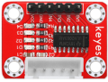
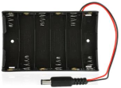
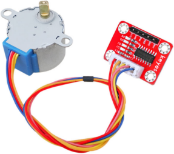
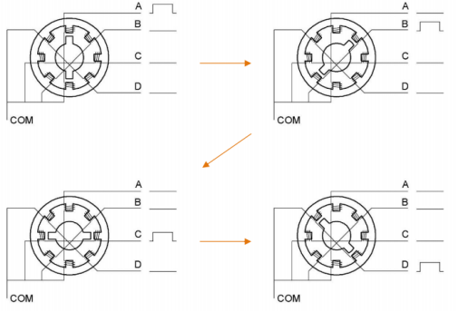
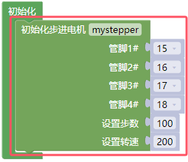
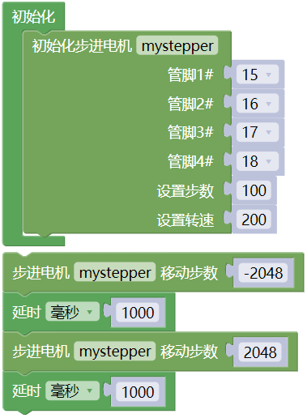

## 项目20 步进电机

**1. 项目介绍：**

步进电机定位准确，是工业机器人、3D打印机、大型车床等机械设备中最重要的部件。

在这个项目中，我们将使用ESP32控制ULN2003步进电机驱动板来驱动步进电机转动。

**2. 项目元件：**

||||
| :--: | :--: | :--: |
|ESP32*1|面包板*1|ULN2003步进电机驱动板*1|
||||
|面包板专用电源模块*1|6节5号电池盒*1|步进电机*1|
||||
|公对母杜邦线若干|5号电池(自备)*6|USB 线*1|

**3. 项目知识：** 

**步进电机：** 是由一系列电磁线圈控制的电机。它可以根据需要旋转精确的度数(或步数)，允许你将它移动到一个精确的位置并保持该位置。它是通过在很短的时间内为电机内部的线圈供电来做到这一点的，但你必须一直为电机供电，以保持它在你想要的位置。有两种基本类型的步进电机，单极步进和双极步进。在本项目中，我们使用的是单极步进电机28-BYJ48。

 
      
**28BYJ-48步进电机工作原理：**

步进电机主要由定子和转子组成，定子是固定不动的，如下图绕着A、B、C、D线圈组的部分，线圈组导通电就会产生磁场；转子就是转动的部分，如下图定子中间的部分，两极是永磁铁。
                         
单步4节拍的转动原理：开始A组线圈导通，转子两极正对着A组线圈；接着A组线圈断开，B组线圈导通，转子就会顺时针转到B组线圈，转子转了一步；B断开，C导通，转子转到C组；C断开，D导通，转子转到D组；D组断开，A组导通，转子转到A组线圈。这样转子就转了半圈180度，接着再重复一次，B-C-D-A，转子转回到A组线圈，这样转子就转了一圈，总共转动了8步。如下图所示，这就是步进电机单节拍转动的原理A - B - C - D - A ....。

 如果想让步进电机逆时针转动，那只要把节拍顺序反过来就行，D - C - B - A - D .....。

半步8节拍转动原理：8节拍，采用的是单双拍的形式，A - AB - B - BC - C - CD - D - DA - A ...... ，这样运转一拍，转子只会转动半步，例如，A组线圈导通，转子转到正对着A组线圈；接着A和B组一起导通，这样产生的磁场最强的地方在AB组线圈中间，转子两极就会转到AB组线圈中间，也就是顺时针转了半步。

**步进电机参数：**

我们所提供的步进电机需要转动32步，转子才能转一圈，还经过了1:64的减速齿轮组带动输出轴，这样输出轴转动一圈需要：32 * 64 = 2048 步。

电压5V，4相步进电机 ，4节拍模式的步进角为11.25， 8节拍模式步进角为5.625， 减速比为1:64。

**ULN2003步进电机驱动板：** ULN2003型步进电机驱动器，将微弱信号转换为更强的控制信号，从而驱动步进电机。

下面的原理图显示了如何使用ULN2003步进电机驱动板接口将一个单极步进电机接到ESP32的引脚上，并显示了如何使用四个TIP120的接口。 

**4. 项目接线图：**

**5. 代码说明：**

初始化步进电机的管脚，步数和速度的设置。

设置步进电机的移动步数，正负值与转动方向有关。

**6. 项目代码：**

你可以打开我们提供的代码，也可以自己编写代码，其如下：

1. 从 “” 拖出 “”。

2. 从 “  ” 拖出 “  ” 放入 “”，管脚1#为 15 ，管脚2#为 16 ，管脚3#为 17 ，管脚4# 18 ，设置步数为 100 ，设置转速为 200 。

3. 先从 “  ” 拖出 “  ” ，设置移动步数为 -2048 ；再从 “” 拖出 “”，设置延时为1000毫秒。

4. 复制代码块 “  ” 1 次，将 -2048 改成 2048 。

完整代码：

**7. 项目现象：**

代码上传成功后，外接电源，上电后，你会看到的现象是：ULN2003驱动模块上的D1,D2,D3,D4四个LED点亮，步进电机旋转，并保持此状态循环。

