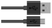
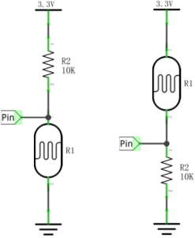
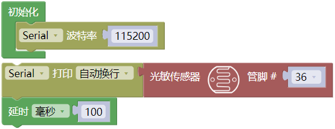
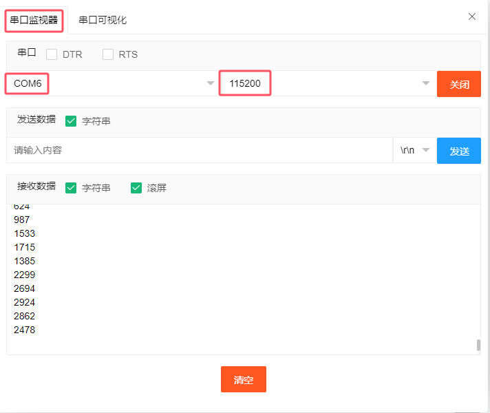
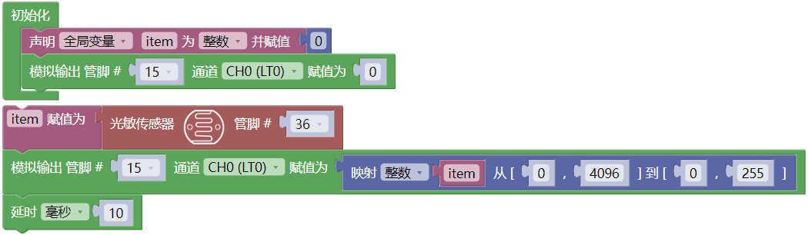
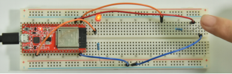

## 项目24 小夜灯

**1. 项目介绍：**

传感器或元件在我们的日常生活中是无处不在的。例如，一些公共路灯在晚上会自动亮起，而在白天会自动熄灭。为什么呢? 事实上，这些都是利用了一种光敏元件，可以感应外部环境光强度的元件。晚上，当室外亮度降低时，路灯会自动打开；到了白天，路灯会自动关闭。这其中的原理是很简单的，在本实验中我们使用ESP32控制LED就来实现这个路灯的效果。

**2. 项目元件：**

|||||
| :--: | :--: | :--: | :--: |
|ESP32*1|面包板*1|光敏电阻*1|红色 LED*1|
||| ||
|220Ω电阻*1|10KΩ电阻*1|跳线若干 |USB 线*1|

**3. 元件知识：**

光敏电阻：是一种感光电阻，其原理是光敏电阻表面上接收亮度(光)降低电阻，光敏电阻的电阻值会随着被探测到的环境光的强弱而变化。有了这个特性，我们可以使用光敏电阻来检测光强。光敏电阻及其电子符号如下：

下面的电路是用来检测光敏电阻电阻值的变化：

在上述电路中，当光敏电阻的电阻因光强的变化而改变时，光敏电阻与电阻R2之间的电压也会发生变化。因此，通过测量这个电压就可以得到光的强度。本项目是采用上图左边的电路来接线的。 

**4. 读取光敏电阻的模拟值：**

我们首先用一个简单的代码来读取光敏电阻的模拟值并打印出来。接线请参照以下接线图：

**代码说明：**

从指定的模拟管脚读取光敏电阻的模拟信号（光照强度），模拟信号的范围为：0 ~ 4095 。

你可以打开我们提供的代码，也可以自己编写代码，其如下：

1. 从 “” 拖出 “”。

2. 从 “” 拖出 “” 放入 “”，设置波特率为 115200 。

3. 先从 “” 拖出 “” ；接着从 “  ”，管脚为 36 。

4. 从 “” 拖出 “”，设置延时为100毫秒。

完整代码：

编译并上传代码到ESP32，代码上传成功后，利用USB线上电，单击图标  进入串行监视器，设置波特率为 115200。可以看到的现象是：串口监视器窗口将打印光敏电阻读取的模拟值，当逐渐减弱光敏电阻所处环境中的光线强度时，模拟值逐渐增大；反之，模拟逐渐减小。

**5. 光控灯的接线图：**

我们在前面做了一个小小的调光灯，现在我们来做一个光控灯。它们的原理是相同的，即通过ESP32获取传感器的模拟值，然后调节LED的亮度。

**6. 项目代码：**

**7. 项目现象：**

编译并上传代码到ESP32，代码上传成功后，利用USB线上电，你会看到的现象是：当减弱光敏电阻所处环境中的光线强度时，LED变亮，反之，LED变暗。

