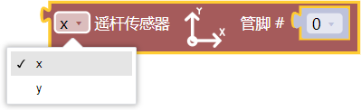
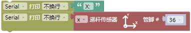
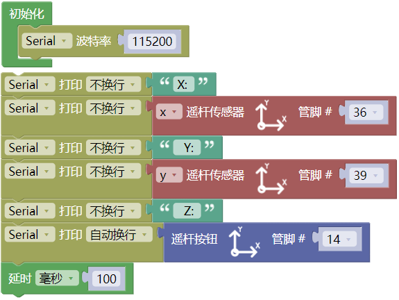
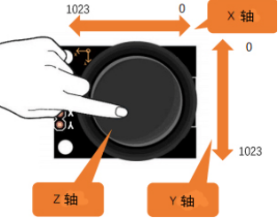
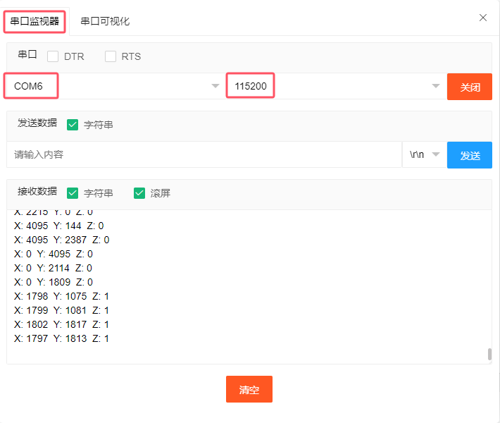
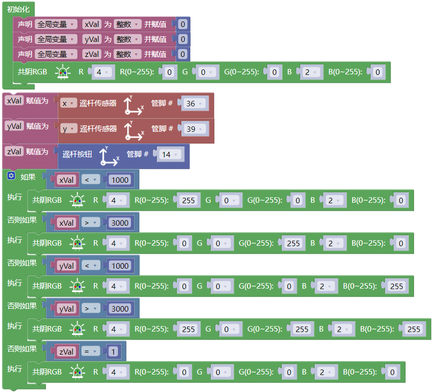
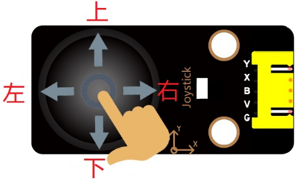

## 项目28 摇杆控制RGB灯

**1. 项目介绍：**

摇杆模块是一个有两个模拟输入和一个数字输入的组件。广泛应用于游戏操作、机器人控制、无人机控制等领域。

在这个项目中，我们使用ESP32和摇杆模块控制RGB。这样，你可以在实践中对摇杆模块的原理和操作有更深入的了解。 

**2. 项目元件：**

|||||
| :--: | :--: | :--: | :--: |
|ESP32*1|面包板*1|摇杆模块*1|RGB LED*1|
|| |||
|220Ω电阻*3|跳线若干|USB 线*1|5P转杜邦线公单*1|

**3. 元件知识：**

**摇杆模块：** 主要是采用PS2手柄摇杆元件，实际上摇杆模块有3个信号端引脚，模拟3维空间，摇杆模块的引脚分别是GND、VCC、信号端（B、X、Y），其中信号端X、Y模拟空间的X轴和Y轴，控制时，模块的X、Y信号端是连接控制板模拟口，通过控制2个模拟输入值来控制物体在空间X、Y轴的坐标。信号端B模拟空间Z轴，它一般是接数字口，做按键使用。

VCC接控制板的电源输出端V/VCC（3.3/5V），GND接控制板的G/GND，原始状态下读出电压大约为1.65V/2.5V左右，对于X轴方向，当随箭头方向逐渐移动，读出电压值随着增加，且可以达到最大电压；随箭头相反方向逐渐移动，读出电压值逐渐减少，减少到最小电压。对于Y轴方向，当沿着模块上的箭头方向逐渐按下，读出电压值随着增加，且可以达到最大电压；随箭头相反方向逐渐按下，读出电压值逐渐减少，减少到最小电压。对于Z轴方向，信号端B接数字口，原始状态下输出0，按下输出1。这样，我们可以读取两个模拟值和一个数字口的高低电平情况，来判断模块上摇杆的工作状态。

**模块参数：**

- 输入电压：DC 3.3V ~ 5V
- 输出信号：X/Y双轴模拟值+Z轴数字信号
- 适用范围：适用于控制点坐标在平面内的运动，双自由度舵机的控制等。
- 产品特点：外观精美，摇杆手感优越，操作简单，反应灵敏，使用寿命长。

**4. 读取摇杆模块的值：**

我们必须使用ESP32的模拟IO口从摇杆模块的X/Y引脚读取值，并使用数字IO口读取按钮的数字信号。请按照下面的接线图进行接线：

**代码说明：**

读取摇杆模块在X轴、Y轴方向上的模拟值。

读取摇杆模块在Z轴方向上的按键值。

你可以打开我们提供的代码，也可以自己编写代码，其如下：

1. 从 “” 拖出 “”。

2. 从 “” 拖出 “” 放入 “”，设置波特率为 115200 。

3. 先从 “” 拖出 “” ，将 “自动换行” 改成 “不换行”；接着从 “  ” 拖出 “  ”，将 hello 改成 X: 。

4. 先从 “” 拖出 “” ，将 “自动换行” 改成 “不换行”；接着从 “  ” 拖出 “  ”，管脚为 36 ，选择 x 。

5. 复制代码块 “” 1次，将 X: 改成 Y：，选择 y ，管脚为 39 。

6. 先复制代码块 “” 1 次 ，将 Y: 改成 Z: ；接着从 “” 拖出 “” ，再从 “  ” 拖出 “  ”，管脚为 14 。

7. 从 “” 拖出 “”，设置延时为100毫秒。

完整代码：

编译并上传代码到ESP32，代码上传成功后，利用USB线上电，单击图标  进入串行监视器，设置波特率为 115200。可以看到的现象是：串口监视器窗口将打印当前摇杆的模拟值和数字值，移动摇杆或按下摇杆帽将改变串口监视器窗口中的模拟值和数字值。

**5. 摇杆模块控制RGB的接线图：**

我们刚读了摇杆模块的值，这里我们需要用摇杆模块和RGB做一些事情，按照下图连接：

**6. 项目代码：**

**7. 项目现象：**

编译并上传代码到ESP32，代码上传成功后，利用USB线上电，你会看到的现象是：①如果摇杆在X方向上移动到最左边，RGB亮红灯; ②如果摇杆在X方向上移动到最右边，RGB亮绿灯; ③如果摇杆在Y方向上移动到最上面，RGB亮白灯; ④如果摇杆在Y方向上移动到最下面，RGB亮蓝灯；⑤如果按下摇杆帽，RGB熄灭。

