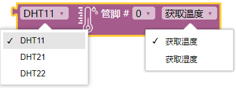
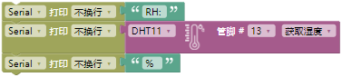
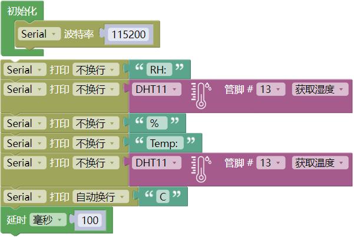
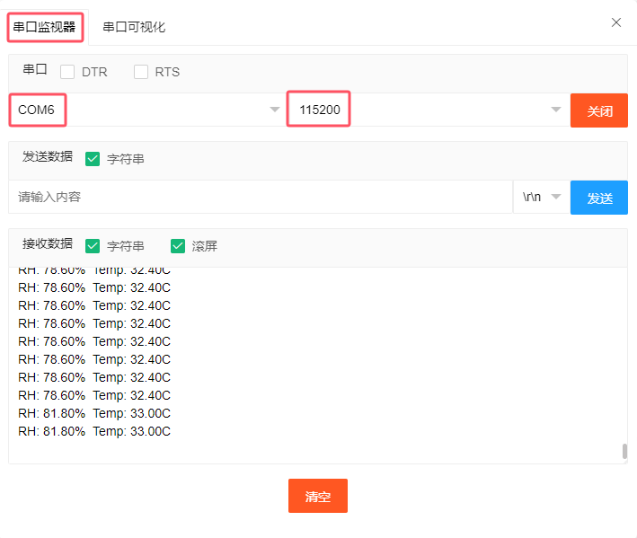
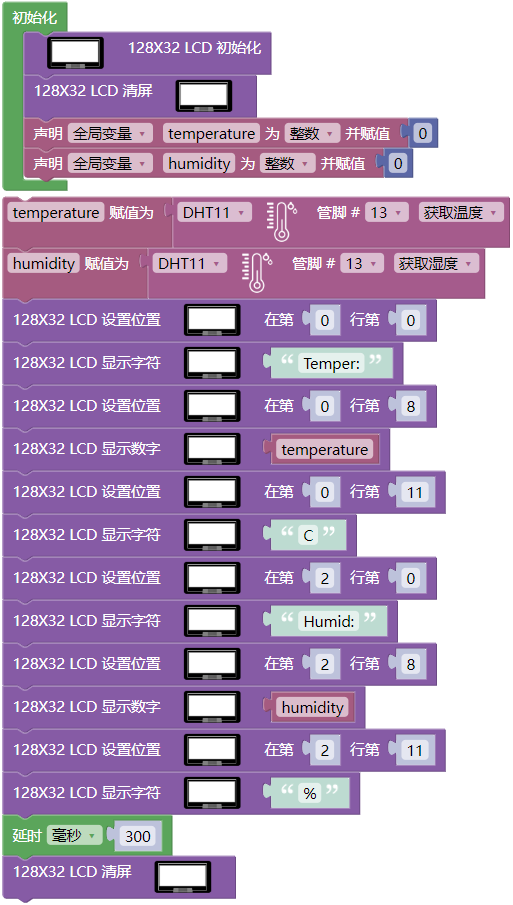

## 项目29 温湿度表

**1. 项目介绍：**

在冬季时，空气中的湿度很低，就是空气很干燥，再加上寒冷，人体的皮肤就容易过于干燥而裂，所以需要在用加湿器给家里的空气增加湿度，但是怎么知道空气过于干燥了呢？那就需要检测空气湿度的设备。

这节课就来学习温湿度传感器的使用。我们使用温湿度传感器制作一个温湿度计，并且还结合LCD 128X32 DOT来显示温度和湿度值。

**2. 项目元件：**

|||||
| :--: | :--: | :--: | :--: |
|ESP32*1|面包板*1|LCD_128X32_DOT*1|温湿度传感器*1|
| ||| |
|3P转杜邦线公单*1|4P转杜邦线公单*1|USB 线*1| |

**3. 元件知识：**

**温湿度传感器：** 是一款含有已校准数字信号输出的温湿度复合传感器，其精度湿度±5%RH，温度±2℃，量程湿度20-90%RH， 温度0~50℃。温湿度传感器应用专用的数字模块采集技术和温湿度传感技术，确保产品具有极高的可靠性和卓越的长期稳定性。温湿度传感器包括一个电阻式感湿元件和一个NTC测温元件，非常适用于对精度和实时性要求不高的温湿度测量场合。
工作电压在3.3V-5.5V范围内。

温湿度传感器有三个引脚，分别为VCC，GND和S。S为数据输出的引脚。使用的是串行通讯。

**温湿度传感器的单总线格式定义：**

| 名称 |单总线格式定义 |
| :--: | :--: |
| 起始信号| 微处理器把数据总线(SDA)拉低一段时间至少 18ms(最大不得超过 30ms)，通知传感器准备数据。 | 
| 响应信号 | 传感器把数据总线（SDA）拉低 83µs，再接高 87µs 以响应主机的起始信号。 |
| 湿度 | 湿度高位为湿度整数部分数据，湿度低位为湿度小数部分数据  |
| 温度 |温度高位为温度整数部分数据，温度低位为温度小数部分数据，且温度低位 Bit8 为 1 则表示负温度，否则为正温度 |
| 校验位 | 校验位＝湿度高位+湿度低位+温度高位+温度低位 |

**温湿度传感器数据时序图：** 

用户主机（MCU）发送一次开始信号后，温湿度传感器从低功耗模式转换到高速模式，待主机开始信号结束后，温湿度传感器发送响应信号，送出 40bit 的数据，并触发一次信采集。信号发送如图所示。 

温湿度传感器可以很容易地将温湿度数据添加到您的DIY电子项目中。它是完美的远程气象站，家庭环境控制系统，和农场或花园监测系统。

**温湿度传感器的参数：**

- 工作电压：+5 V
- 温度范围：0-50 °C ，误差：± 2 °C
- 湿度范围：20-90% RH ，误差：± 5% RH
- 数字接口

**温湿度传感器的原理图：**

**4. 读取温湿度值：**

**代码说明：**

这是读取温湿度传感器检测的温度和湿度，温湿度传感器有 3 种型号，根据不同型号选择，这里是选择 DHT11 型号。

你可以打开我们提供的代码，也可以自己编写代码，其如下：

1. 从 “” 拖出 “”。

2. 从 “” 拖出 “” 放入 “”，设置波特率为 115200 。

3. 先从 “” 拖出 “” ，将 “自动换行” 改成 “不换行”；接着从 “  ” 拖出 “  ”，将 hello 改成 RH:  。

4. 先从 “” 拖出 “” ，将 “自动换行” 改成 “不换行”；接着从 “  ” 拖出 “  ”，管脚为 13 ，选择 “获得湿度” 。

5. 复制代码块 “  ” 1次，将 RH: 改成 % 。 

6. 复制代码块 “” 1次，将 RH: 改成 Temp: ，选择 “获得温度” ，将 % 改成 C ，将最下面的 “不换行” 改成 “自动换行” 。

7. 从 “” 拖出 “”，设置延时为100毫秒。

完整代码：

编译并上传代码到ESP32，代码上传成功后，利用USB线上电，单击图标  进入串行监视器，设置波特率为 115200。你会看到的现象是：串口监视器窗口将打印当前显示当前环境中的温湿度数据，如下图。

**5. 温湿度仪表的接线图：**

现在我们开始用LCD_128X32_DOT打印温湿度传感器的值，我们会在LCD_128X32_DOT的屏幕上看到相应的值。让我们开始这个项目吧。请按照下面的接线图进行接线：

**6. 项目代码：**

**7. 项目现象：**

编译并上传代码到ESP32，代码上传成功后，利用USB线上电，你会看到的现象是：LCD 128X32 DOT的屏幕上显示温湿度传感器检测环境中相应的温度值和湿度值。

