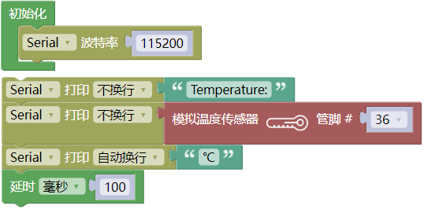
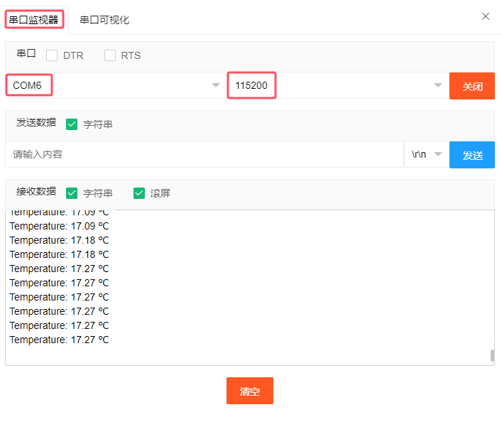
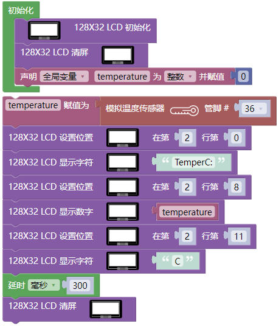
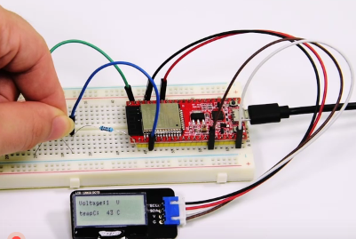

## 项目31 温度仪表

**1. 项目介绍：**

热敏电阻是一种电阻，其阻值取决于温度和温度的变化，广泛应用于园艺、家庭警报系统等装置中。因此，我们可以利用这一特性来制作温度仪表。

**2. 项目元件：**

|||||
| :--: | :--: | :--: | :--: |
|ESP32*1|面包板*1|LCD_128X32_DOT*1|热敏电阻*1|
||||  |
|10KΩ电阻*1|4P转杜邦线公单*1|USB 线*1|跳线若干 |

**3. 元件知识：**

**热敏电阻：** 热敏电阻是一种温度敏感电阻。当热敏电阻感应到温度的变化时，它的电阻就会发生变化。我们可以利用热敏电阻的这种特性来检测温度强度。热敏电阻及其电子符号如下所示。

热敏电阻的电阻值与温度的关系为：

式中：

Rt为热敏电阻在T2温度下的电阻；

R为热敏电阻在T1温度下的标称阻值；

EXP[n]是e的n次幂；

B为温度指数；

T1，T2是开尔文温度(绝对温度)，开尔文温度=273.15 +摄氏温度。对于热敏电阻的参数，我们使用：B=3950, R=10KΩ，T1=25℃。热敏电阻的电路连接方法与光敏电阻类似，如下所示：

我们可以利用ADC转换器测得的值来得到热敏电阻的电阻值，然后利用公式来得到温度值。因此，温度公式可以推导为：

**4. 读取热敏电阻的值：**

首先我们学习热敏电阻读取当前的温度值并将其打印出来。请按下面的接线图接好线：

**代码说明：**

读取模拟温度传感器(热敏电阻)的温度值。

你可以打开我们提供的代码，也可以自己编写代码，其如下：

1. 从 “” 拖出 “”。

2. 从 “” 拖出 “” 放入 “”，设置波特率为 115200 。

3. 先从 “” 拖出 “ ” ；接着从 “” 拖出  “” ；将 “自动换行” 改成 “不换行” ，“hello” 改成 “Temperature:” 。

4. 先从 “” 拖出 “ ” ；接着从 “” 拖出  “” ，管脚为 36 ；将 “自动换行” 改成 “不换行” 。

5. 复制代码块 “ ” 1次，将 “不换行” 改成 “自动换行” ，“Temperature:” 改成 “ ℃ ” ；再从 “” 拖出 “”，设置延时为100毫秒。

完整代码：

编译并上传代码到ESP32，代码上传成功后，利用USB线上电，单击图标  进入串行监视器，设置波特率为 115200。你会看到的现象是：串口监视器窗口将不断显示热敏电阻检测到当前环境中的温度值。试着用食指和拇指捏一下热敏电阻(不要碰触导线)一小段时间，你应该会看到温度值增加。

**5. 温度仪表的接线图：**

**6. 项目代码：**

**7. 项目现象：**

编译并上传代码到ESP32，代码上传成功后，利用USB线上电，你会看到的现象是：LCD 128X32 DOT的屏幕上显示热敏电阻检测到当前环境中的温度值。

