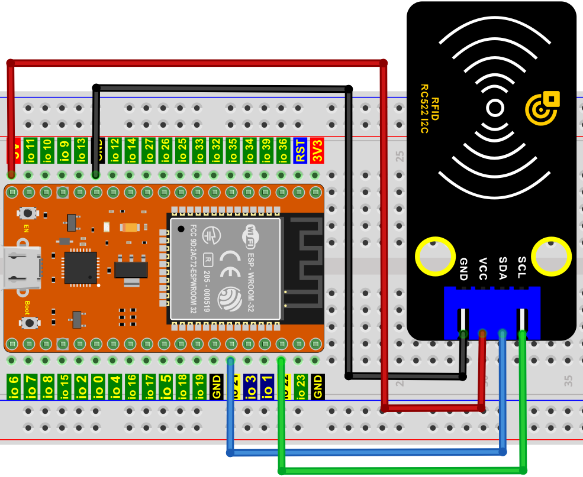
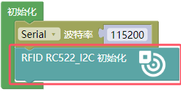
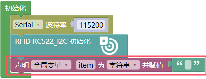
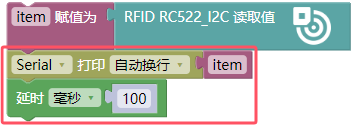
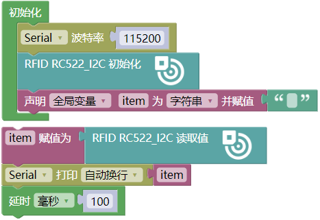
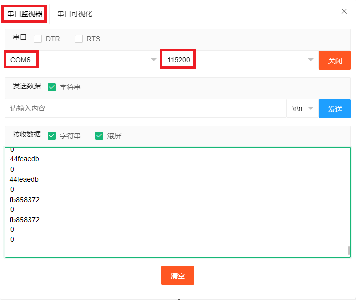
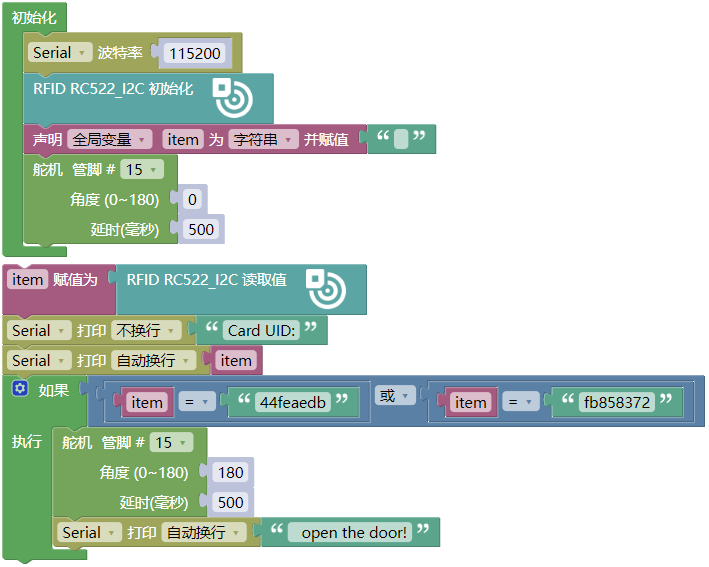
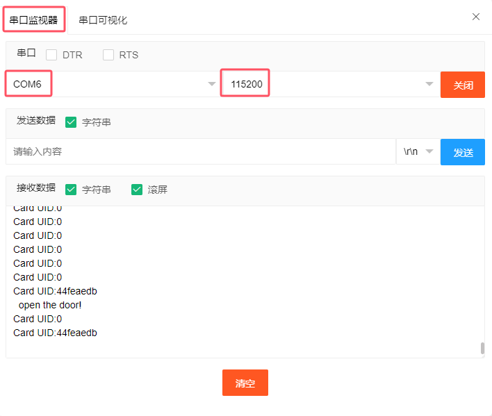

## 项目32 RFID

**1. 实验介绍：**

现在很多小区的门使用了刷卡开门这个功能，非常的方便。这节课我们将学习使用RFID(射频识别)无线通信技术和对卡（钥匙扣/白色磁卡）进行读、写操作及RFID-MFRC522模块控制舵机转动。   

**2. 实验元件：**

||||||
| :--: | :--: | :--: | :--: | :--: |
|ESP32*1|面包板*1|RFID-RC522模块*1|舵机*1|白色磁卡*1|
|||| | |
|4P转杜邦线公单*1|跳线若干|USB 线*1|钥匙扣*1 | |

**3. 元件知识：**

**RFID：** 无线射频识别，读卡器由频射模块及高平磁场组成。Tag应答器为待感应设备，此设备不包含电池。他只包含微型集成电路芯片及存储数据的介质以及接收和发送信号的天线。读取tag中的数据，首先要放到读卡器的读取范围内。读卡器会产生一个磁场，因为磁能生电由楞次定律，RFID Tag就会供电，从而激活设备。

**RFID-RC522模块：** 采用Philips MFRC522原装芯片设计读卡电路，使用方便，成本低廉，适用于设备开发、读卡器开发等高级应用的用户、需要进行射频卡终端设计/生产的用户。本模块可直接装入各种读卡器模具。模块采用电压为5V,通过SPI接口简单的几条线就可以直接与用户任何CPU主板或单片机相连接通信。

**规格参数：**

- 工作电压：DC 5V
- 工作电流：13—100mA/DC 5V
- 空闲电流：10-13mA/DC 5V
- 休眠电流：<80uA
- 峰值电流：<100mA
- 工作频率：13.56MHz
- 最大功率：0.5W
- 支持的卡类型：mifare1 S50、mifare1 S70、mifare UltraLight、mifare Pro、mifare Desfire
- 环境工作温度：摄氏-20—80℃
- 环境储存温度：摄氏-40—85℃
- 环境相对湿度：相对湿度5%—95%
- 数据传输速率：最大10Mbit/s

**4. RFID 读取 UID：**

我们将读取RFID卡的唯一ID号(UID)，识别RFID卡的类型，并通过串口显示相关信息，其接线图如下所示：

**代码说明：**

初始化RFID RC522 I2C模块的管脚等等。

RFID RC522 I2C模块读取白色磁卡和钥匙扣的值。

你可以打开我们提供的代码，也可以自己编写代码，其如下：

1. 从 “” 拖出 “”。

2. 从 “” 拖出 “” 放入 “”，设置波特率为 115200 。

3. 从 “” 拖出 “” 放入 “”中。

4. 先从 “ ” 拖出 “” 放入 “” 中，将 “ 整数 ” 改成 “字符串” ；再从 “” 拖出 “” 放入 “”中，删除 “hello”。

5. 从 “ ” 拖出 “” ，再从 “  ” 拖出 “  ” 。

6. 先从 “” 拖出 “ ”；接着从 “ ” 拖出 “” ；再从 “” 拖出 “”，设置延时为100毫秒。

完整代码：

编译并上传代码到ESP32，代码上传成功后，利用USB线上电，单击图标  进入串行监视器，设置波特率为115200。你会看到的现象是：将白色磁卡和钥匙扣分别靠近模块感应区，串口监视器窗口将分别显示白色磁卡和钥匙扣的卡号值。如下图所示：

特别注意：对于不同的RFID-RC522的白色磁卡和钥匙扣，其白色磁卡值和钥匙扣值可能都不一样。

**5. RFID MFRC522的接线图：**

现在使用RFID-RC522模块、白色磁卡/钥匙扣和舵机模拟做一个智能门禁系统。当白色磁卡/钥匙扣靠近RFID-RC522模块感应区舵机转动。按照下图进行接线。

**6. 项目代码：**

特别注意：对于不同的RFID-RC522的白色磁卡和钥匙扣，其RFID-RC522读取的白色磁卡和钥匙扣值可能都不一样。你们将自己的RFID-RC522模块读取的白色磁卡和钥匙扣的值替换程序代码中对应的白色磁卡和钥匙扣的值，要不然可能会导致白色磁卡和钥匙扣控制不了舵机。
 

例如: 你把程序代码中的 item 字符串替换成自己的RFID-RC522模块读取的白色磁卡和钥匙扣的值。
 

**7. 项目现象：**

编译并上传代码到ESP32，代码上传成功后，利用USB线上电，单击图标  进入串行监视器，设置波特率为 115200；你会看到的现象是：当我们使用白色磁卡或者钥匙卡刷卡时，串口监视器显示出白色磁卡或者钥匙卡信息和 “open the door”，如下图，舵机转动到对应的角度模拟开门。

