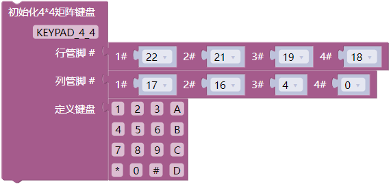
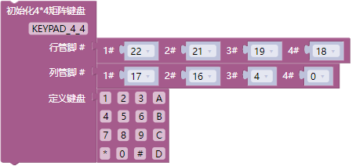
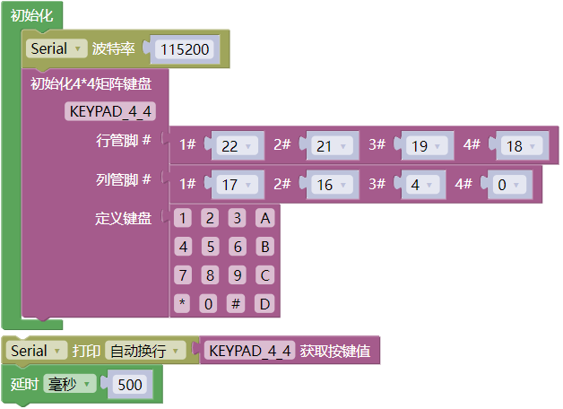
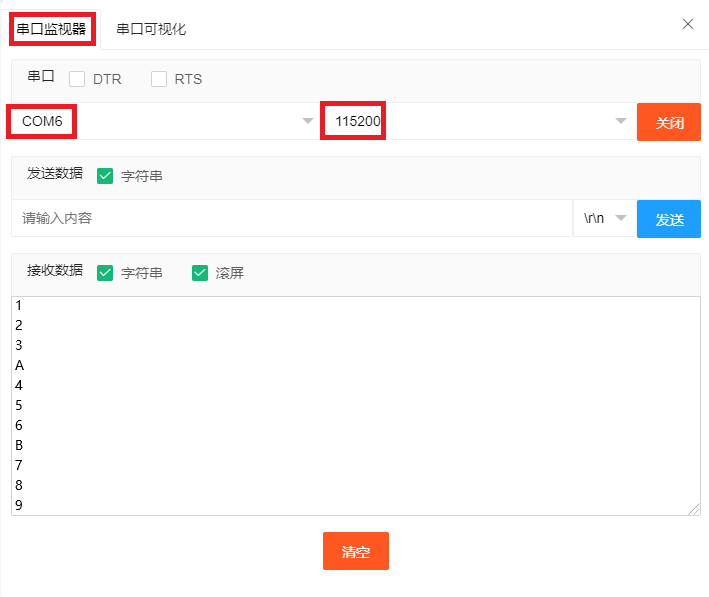
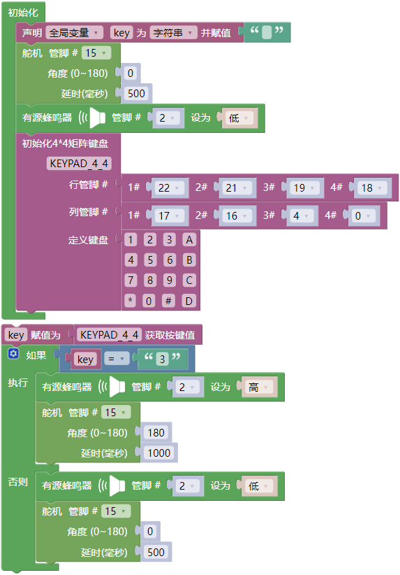

## 项目33 密码锁

**1. 项目介绍：**

常用的数字按钮传感器，一个按钮就使用一个IO口，而有时我们需要的按钮比较多时，就会占用过多的IO口，为了节省IO口的使用，把多个按钮做成了矩阵类型，通过行列线的控制，实现少IO口控制多个按钮。

在本项目中，我们将来学习ESP32和薄膜4*4矩阵键盘控制舵机和蜂鸣器。

**2. 项目元件：**

||||
| :--: | :--: | :--: | 
|ESP32*1|面包板*1|舵机*1|
||| |
|薄膜4×4矩阵键盘*1|USB 线*1| 跳线若干| 
||||
|NPN型晶体管(S8050)*1|有源蜂鸣器*1|1KΩ电阻*1|

**3. 元件知识：**

**薄膜4×4矩阵键盘：** 键盘是一种集成了许多键的设备。如下图所示，一个薄膜4x4键盘集成16个键。

与LED矩阵集成一样，在薄膜4x4矩阵键盘中，每排键都是用一根引脚连接，每一列键都是一样的。这样的连接可以减少处理器端口的占用。内部电路如下所示。

  

使用方法类似于矩阵LED，即使用行扫描或列扫描方法检测每列或每行上的键的状态。以列扫描法为例，向第4列(Pin4)发送低电平，检测第1、2、3、4行电平状态，判断A、B、C、D键是否按下。然后依次将低电平发送到列3、2、1，检测是否有其它键被按下。然后，你可以获得所有键的状态。

**4. 读取薄膜4*4矩阵键盘的键值：**

我们首先使用一个简单的代码读取薄膜4*4矩阵键盘的键值并将其打印出来，其接线图如下所示：

**代码说明**

初始化薄膜4*4矩阵键盘的行管脚和列管脚，定义键盘，等等。

获取薄膜4*4矩阵键盘的按键值。

你可以打开我们提供的代码，也可以自己编写代码，其如下：

1. 从 “” 拖出 “”。

2. 从 “” 拖出 “” 放入 “”，设置波特率为 115200 。

3. 从 “” 拖出 “” ，行管脚分别为：22、21、19、18；列管脚分别为：17、6、4、0 。

4. 先从 “” 拖出 “ ”，再从 “” 拖出 “” 。

5. 从 “” 拖出 “”，设置延时为500毫秒。

完整代码：

编译并上传代码到ESP32，代码上传成功后，利用USB线上电，单击图标  进入串行监视器，设置波特率为 115200。你会看到的现象是：按下薄膜4×4矩阵键盘上的按键，串口监视器窗口将打印对应的键值，如下图所示。

**5. 密码锁的接线图：**

在上一实验中，我们已经知道了薄膜4×4矩阵键盘的键值，接下来，我们使用薄膜4×4矩阵键盘作为键盘来控制舵机和蜂鸣器。

**6. 项目代码：**

**7. 项目现象：**

编译并上传代码到ESP32，代码上传成功后，利用USB线上电，你会看到的现象是：用手按下薄膜4*4矩阵按键盘上的按键 “ 3 ” ，舵机会转动180°角度，蜂鸣器鸣叫；然后松开，舵机又回到原来的位置，蜂鸣器不鸣叫。

