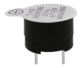
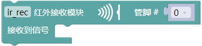
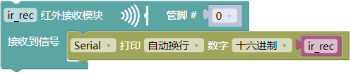
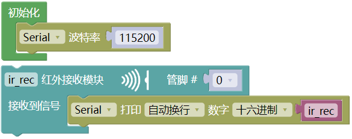
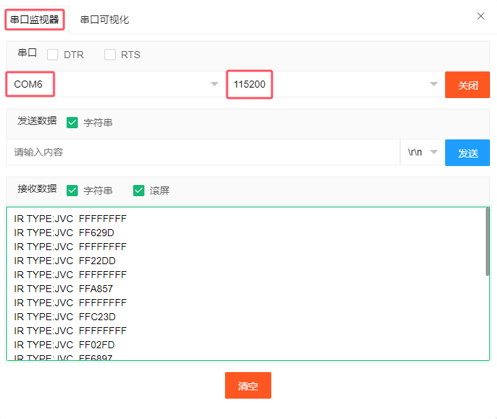
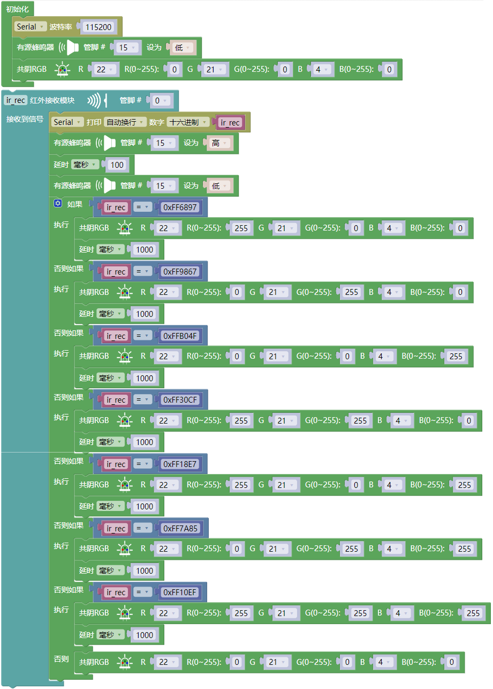

## 项目34 红外遥控控制声音和LED

**1. 项目介绍：**

红外遥控是一种低成本、易于使用的无线通信技术。IR光与可见光非常相似，除了它的波长稍长一点。这意味着红外线是人眼无法检测到的，这对于无线通信来说是完美的。例如，当你按下电视遥控器上的一个按钮时，一个红外LED会以每秒38000次的频率反复开关，将信息(如音量或频道控制)传送到电视上的红外感光器。

我们将首先解释常见的红外通信协议是如何工作的。然后我们将从一个遥控器和一个红外接收组件开始这个项目。

**2. 项目元件：**

|||||
| :--: | :--: | :--: | :--: |
|ESP32*1|面包板*1|红外接收器*1|RGB LED*1|
|||| |
|有源蜂鸣器*1|220Ω电阻*3|10KΩ电阻*1|红外遥控器*1|
|||| |
|NPN型晶体管(S8050)*1|1kΩ电阻*1 |USB 线*1| 跳线若干|

**3. 元件知识：**   

**红外(IR)遥控器：** 是一种可以发射红外光信号的设备。按下不同的按钮，位于遥控器前端的红外发射管会发出不同指令的红外线。红外遥控技术应用广泛，如电视、空调等。因此，在当今科技发达社会，红外遥控技术使你切换电视节目和调节空调温度都很方便。

我们使用的遥控器如下所示，该红外遥控器采用NEC编码。

**红外(IR)接收器：** 是VS1838B红外接收传感器元件，可以接收红外光，所以可以用它来检测红外遥控器发出的红外光信号。

红外接收器是集接收、放大、解调一体的器件，将接收到的红外光信号在其内部IC就已经完成了解调（将红外光信号转换回二进制），输出的就是数字信号，然后将信息传递给微控制器。它可接收标准38KHz调制的遥控器信号。

红外信号调制过程图：

**4. 解码红外信号：**

我们按照下面接线图将红外接收元件连接到ESP32。

**代码说明：**

红外接收器接收红外遥控器上按键值信号，初始化管脚。

串口端口自动换行打印接收到的十六进制的红外遥控器按键值信号。

你可以打开我们提供的代码，也可以自己编写代码，其如下：

1. 从 “” 拖出 “”。

2. 从 “” 拖出 “” 放入 “”，设置波特率为 115200 。

3. 从 “  ” 拖出 “  ” ，管脚为 0 。

4. 先从 “” 拖出 “” 放入 “  ” 中；再从 “” 拖出 “  ” 放入 “” 中数字 0 处，将 “不换行” 改成 “自动换行”。

完整代码：

编译并上传代码到ESP32，代码上传成功后，利用USB线上电，单击图标  进入串行监视器，设置波特率为 115200。你会看到的现象是：将红外遥控器发射器对准红外接收头，按下红外控制器上的按键，串口监视器将打印当前接收到的按键编码值。多次按下相同的按键以确保你拥有该按键的正确编码值。如果看到FFFFFFFF，请忽略它。

写下红外遥控器与每个按键相关联的按键编码值，因为你稍后将需要这些信息。

**5. 红外遥控的接线图：**

**6. 项目代码：**

**7. 项目现象：**

编译并上传代码到ESP32，代码上传成功后，利用USB线上电，你会看到的现象是：按红外遥控器的1~7键，蜂鸣器都会鸣响一次，同时RGB分别亮红灯，绿灯，蓝灯，黄灯，洋红灯，蓝绿灯，白灯。按其他另一按键（除1-7键以外），RGB熄灭。

