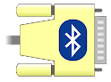
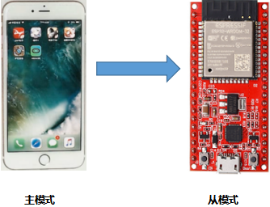
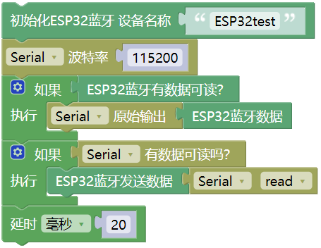
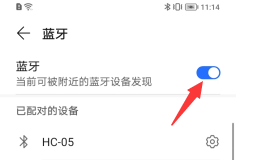
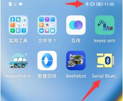
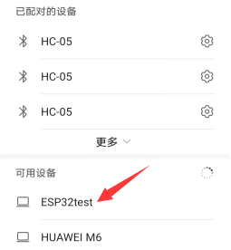
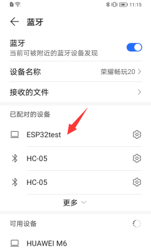
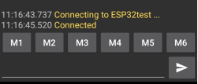
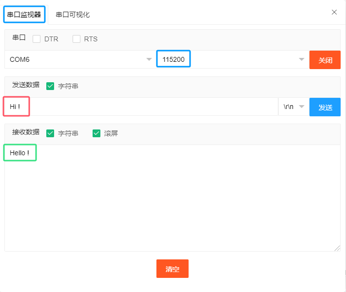
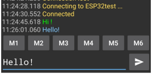

## 项目35 蓝牙

本章主要介绍如何通过ESP32的蓝牙与手机进行简单的数据传输。

**1. 项目元件：**

||||
| :--: | :--: |:--: |
| ESP32*1 | USB 线*1 |智能手机/平板电脑（自备）*1|

在本项目中，我们需要使用一个名为串口蓝牙终端的蓝牙应用程序来协助实验。如果您还没有安装它，请点击安装：[https://www.appsapk.com/serial-bluetooth-terminal/](https://www.appsapk.com/serial-bluetooth-terminal/) 。
下面是它的标志。

**2. 元件知识：**

蓝牙是一种短距离通信系统，可分为两种类型，即低功耗蓝牙(BLE)和经典蓝牙。简单的数据传输有两种模式：主模式和从模式。

**主模式：** 在这种模式下，工作在主设备上完成，并且可以与从设备连接。我们可以搜索和选择附近的从设备来连接。当设备在主模式下发起连接请求时，需要其他蓝牙设备的地址和配对密码等信息。配对完成后，可直接与它们连接。

**从模式：** 处于从模式的蓝牙模块只能接受来自主机的连接请求，但不能发起连接请求。与主机设备连接后，可以向主机设备发送数据，也可以从主机设备接收数据。蓝牙设备之间可以进行数据交互，一个设备处于主模式，另一个设备处于从模式。当它们进行数据交互时，处于主模式的蓝牙设备会搜索并选择附近要连接的设备。在建立连接时，它们可以交换数据。当手机与ESP32进行数据交换时，手机通常处于主模式，ESP32为从模式。

**3. 项目接线：**

使用USB线将ESP32主板连接到电脑上的USB口。

**4. 项目代码：**

**提醒：** 此代码从 “”  一起拖出，将 “**ESP32BT**” 改成 “**ESP32test**” 即可。

**5. 项目现象：**

编译并上传代码到ESP32 主控板，上传成功后，打开串行监视器，波特率设置为 115200 。

请确认你的手机已开启手机蓝牙，且已安装好“**串口蓝牙终端**”的蓝牙应用程序。

手机自动搜索附近的蓝牙设备，点击“ESP32 test”进行配对，出现配对对话框，点击 “**配对**”，这样 “ESP32 test” 设备就连接好了。

打开软件APP，点击终端左侧。选择 "Devices"。

选择经典蓝牙模式下的ESP32test，会出现如下图所示的连接成功提示。

现在，数据可以通过ESP32在你的手机和电脑之间传输。

在串口监视器中的文本框输入“Hi!”，当手机收到它的时候，给你的手机回复 “Hi!”；手机发送 “Hello!”，当电脑收到它的时候，给你的电脑回复 “Hello!”。

