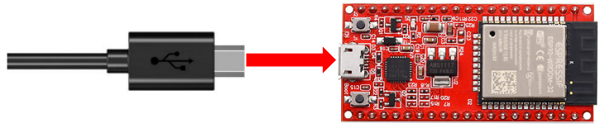
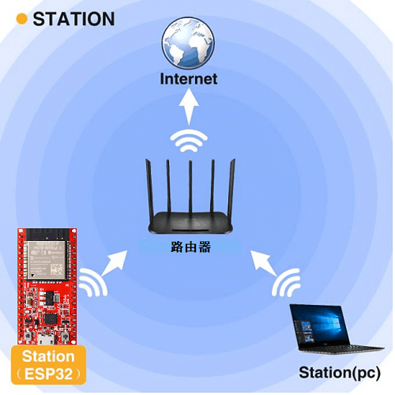
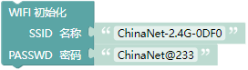
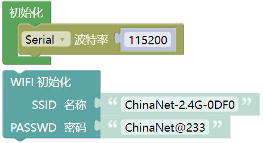
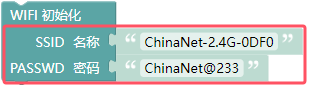
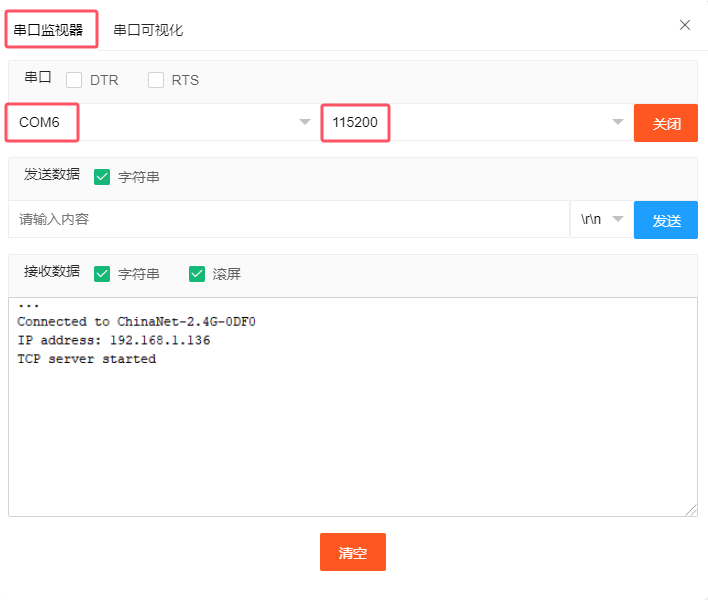

## 项目36 WiFi 工作模式

在如今科技高速发展的时代，人们的生活质量越来越好，生活节奏越来越快，开始有人觉得复杂多样的智能化设备控制起来十分麻烦，通过手机统一控制智能化设备这种方法逐渐得到了人们的青睐。这种方法是利用单片机通过wifi模块和Internet网络建立手机和智能化设备之间的连接以此来实现对智能化设备的远程控制。

在本章中，我们将重点关注ESP32的WiFi基础设施。ESP32有3种不同的WiFi工作模式：Station模式、AP模式和AP+Station模式。所有WiFi编程项目在使用WiFi前必须配置WiFi运行模式，否则无法使用WiFi。

**特别提醒：在本项目中，只讲解 ESP32 的 WiFi Station 模式**。

### 项目36.1: WiFi Station 模式

**1. 实验元件：**

|||
| :--: | :--: |
| USB 线 x1|ESP32x1|

**2. 实验接线：**

使用USB线将ESP32主板连接到电脑上的USB口。

**3. 元件知识：**

**Station 模式：** 当ESP32选择Station模式时，它作为一个WiFi客户端。它可以连接路由器网络，通过WiFi连接与路由器上的其他设备通信。如下图所示，PC和路由器已经连接，ESP32如果要与PC通信，需要将PC和路由器连接起来。

**4.项目代码：**

你可以打开我们提供的代码，也可以自己编写代码，其如下：

1. 从 “” 拖出 “”。

2. 从 “ ” 拖出 “  ” 放入 “  ” ，设置波特率为 115200 。

3. 从 “” 拖出 “” 。

完整代码：

特别提醒：由于各地的WiFi名称和密码是不同，所以在程序代码运行之前，用户需要在下图所示的框中输入你们自己的WiFi名称和密码。

**5. 项目现象：**

确认正确输入自己的WiFi名称和密码后，编译并上传代码到ESP32主板，上传成功后，单击图标  进入串行监视器，设置波特率为 115200。当ESP32成功连接到WiFi时，串行监视器将打印出WiFi分配给ESP32的IP地址。然后串口监视器窗口将显示如下：(如果打开串口监视器且设置波特率为115200之后，串口监视器窗口没有显示如下信息，可以按下ESP32的复位键 ）

