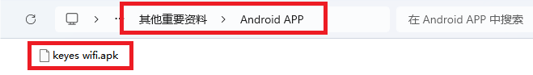
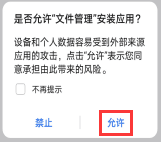
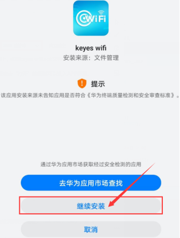
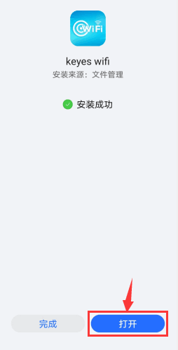
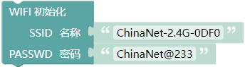
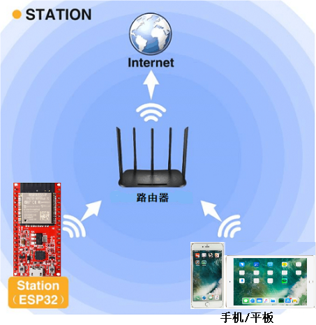
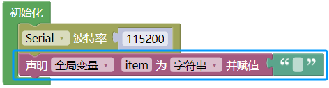
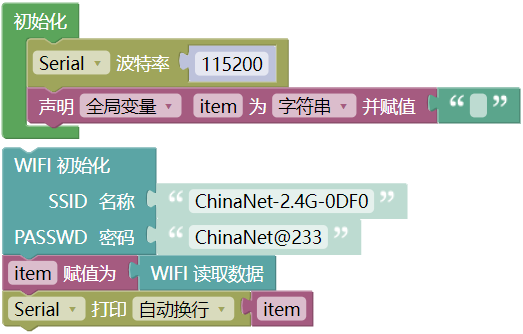
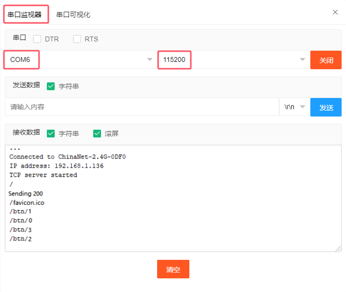

## 项目37 WiFi 测试

**1.实验简介：**

在本实验中，我们先使用ESP32的WiFi Station模式读取WiFi的IP地址，然后通过APP连接WiFi来读取APP上各功能按钮发送的字符。

**2.实验元件：**

||||
| :--: | :--: | :--: |
| ESP32*1 | USB 线*1 |智能手机/平板电脑(自备)*1|

**3.实验接线：**

使用USB线将ESP32主板连接到电脑上的USB口。

**4.安装APP:**

(1) 安卓系统设备（手机/平板）APP：

我们提供了Android APP 的安装包：

**安装步骤：**

A. 现将文件夹中的**keyes wifi.apk**文件转移到安卓系统手机或平板电脑上。

或者用安卓系统手机/平板电脑的浏览器中的扫码功能扫下面的二维码。

B. 点击keyes wifi.apk文件进入安装页面，点击“**允许**”按钮，然后点击“**安装**”按钮，过一会儿，安装完成后点击“**打开**”按钮就可以进入APP界面。

(2) IOS系统设备（手机/iPad）APP

a. 打开App Store。

b.在搜索框输入**keyes link**，点击搜索，出现下载界面，点击“”，就可以下载安装**keyes link**的APP。接下来的操作和安卓系统类似的，可以参考上面安卓系统的步骤进行操作。

**5.代码说明：**

输入WiFi名称和密码，连接WiFi热点，读取WiFi分配的IP地址。

APP按键发送数据，通过无线WiFi，ESP32接收相关数据，即：读取WiFi数据。

**6.项目代码：**

**特别注意：**确保计算机网络，手机/平板的网络，ESP32主板，路由器，代码中输入你自己的WiFi名称和密码都必须是在同一个局域网（WiFi）下。

你可以打开我们提供的代码，也可以自己编写代码，其如下：

1. 从 “” 拖出 “”。

2. 从 “” 拖出 “” 放入 “”，设置波特率为 115200 。

3. 先从 “ ” 拖出 “” 放入 “” 中，将 “ 整数 ” 改成 “字符串” ；再从 “” 拖出 “” 放入 “”中，删除 “hello”。

4. 从 “” 拖出 “” 。

5. 先从 “ ” 拖出 “” ，再从 “” 拖出 “” 。

6. 先从 “” 拖出 “” ，再从 “” 拖出 “” 。 

完整代码：

特别注意：需要先将项目代码  中的用户Wifi名称（SSID 名称）和用户Wifi密码（PASSWD 密码）改成你们自己的Wifi名称和Wifi密码。

**7.实验现象**

**特别注意：**确保计算机网络，手机/平板的网络，ESP32主板，路由器，代码中输入你自己的WiFi名称和密码都必须是在同一个局域网（WiFi）下。

确认程序代码中的Wifi名称和Wifi密码修改正确后，编译并上传代码到ESP32主板上。

打开串口监视器，设置波特率为115200，这样，串口监视器打印检测到的WiFi IP地址，然后打开WiFi APP。 在WIFI按钮前面的文本框中输入检测到的WIFI IP地址（例如，下上面串口监视器检测到的IP地址：192.168.1.136），再点击WIFI按钮，“403 Forbidden”或“网页无法打开”就会变成“192.168.1.136”。这样，就说明APP已经连接上了WIFI。

用手分别点击APP上的各个功能按钮，然后串口监视器会打印接收到的对应字符。

**注意：** 如果打开串口监视器且设置波特率为115200之后，串口监视器窗口没有显示如下信息，可以按下ESP32的复位键

