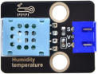
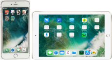
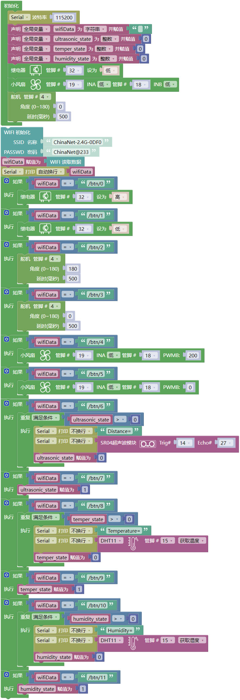
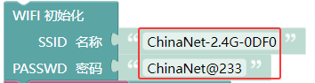
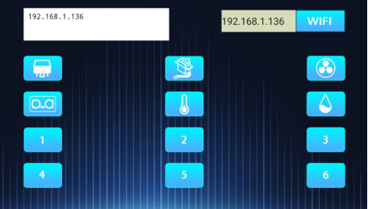
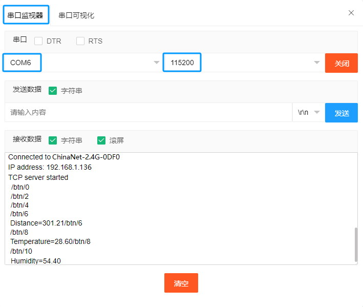

## 项目38 WiFi 智能家居

**1. 实验说明：**

在前面的实验中，我们已经了解了ESP32的WiFi Station模式。那么在本章实验中，我们将使用ESP32的WiFi Station模式通过APP连接WIFI来控制多个传感器/模块工作，实现WiFi智能家居的效果。

**2. 实验器材：**

|||||
| :--: | :--: | :--: | :--: |
|ESP32*1|面包板*1| 130直流电机模块*1|继电器模块*1|
|||||
| 舵机*1 |温湿度传感器*1| 超声波传感器*1|4P转杜邦线公单*2|
|||||
|智能手机/平板电脑(自备)*1|面包板专用电源模块*1|6节5号电池盒*1|风扇叶*1|
||| ||
|5号电池(自备)*6|MicroUSB线*1|3P转杜邦线公单*2|跳线若干|

**3. 实验接线图：**

| 继电器| ESP32主板 | 温湿度传感器 | ESP32主板 |
| :--: | :--: | :--: | :--: |
| G | G| G | G |
| V | 5V | V | 5V |
| S | IO32 | S | IO15 |

| 超声波传感器| ESP32主板 | 130 风扇模块 | ESP32主板 |
| :--: | :--: | :--: | :--: |
| Vcc | 5V| G | G |
| Trig | IO14 | V | 5V |
| Echo | IO27 | IN+ | IO19 |
|Gnd|G|IN-|IO18|

| 舵机| ESP32主板 |
| :--: | :--: | 
| 红色线 | 5V|
| 棕色线 | G |
| 橙色线 | IO4 |

(注: 先接好线，然后在直流电机上安装一个小风扇叶片。)

**4. 安装APP:**

安装APP的方法请参照 **项目37 WiFi测试** 。这里就不重复讲解。

**5. 项目代码：**

特别注意：需要先将项目代码  中的用户Wifi名称（SSID 名称）和用户Wifi密码（PASSWD 密码）改成你们自己的Wifi名称和Wifi密码。

**6. 实验现象：**

**特别注意：**确保计算机网络，手机/平板的网络，ESP32主板，路由器，代码中输入你自己的WiFi名称和密码都必须是在同一个局域网（WiFi）下。

确认程序代码中的Wifi名称和Wifi密码修改正确后，编译并上传代码到ESP32主板上。

打开串口监视器，设置波特率为 115200，这样，串口监视器打印检测到的WiFi IP地址。（**注意：** 如果打开串口监视器且设置波特率为115200之后，串口监视器窗口没有显示如下信息，可以按下ESP32的复位键 ）

然后打开WiFi APP，在WIFI按钮前面的文本框中输入检测到的WIFI IP地址（例如，上面串口监视器检测到的IP地址：192.168.1.136），接着点击WIFI按钮来连接WiFi。（WiFi的IP地址有时候会改变，如果原来的IP地址不行，需要重新检测WiFi的IP地址）

**APP已经连接上了WiFi后，开始进行如下操作：**

（1）点击  按钮，继电器打开，模块上的指示灯点亮；再次点击  按钮，继电器关闭，模块上的指示灯不亮。

（2）点击  按钮，舵机转动到180°处；再次点击  按钮，舵机转动到0°处。

（3）点击  按钮，电机（带小风扇叶）转动；再次点击  按钮，关闭电机。

（4）在超声波传感器前放一个物体，点击  按钮，超声波传感器测距，串口监视器窗口显示距离值，说明此时物体离超声波传感器的距离为301.2cm；再次点击  按钮，关闭超声波。

（5）点击  按钮，温湿度传感器测量环境中的温度，串口监视器窗口显示温度值，说明此时环境中的温度为28.6℃；再次点击 按钮，关闭温湿度传感器。

（6）点击  按钮，温湿度传感器测量环境中的湿度，串口监视器窗口显示湿度值，说明此时环境中的湿度为54.4%；再次点击  按钮，关闭温湿度传感器。

