## 10. 网页远程控制LED

网页远程控制LED实验是智慧校园物联网应用的微型实践，通过ESP32搭建Web服务器，实现浏览器对LED的远程操控，直接映射校园中智能照明、设备管理等真实场景。

本课将带领你探索物联网的奇妙世界！通过ESP32开发板，编写代码，就能用手机网页远程控制LED灯的开关。一起来完成你的第一个"智慧校园"物联网项目吧！

#### 原理

**注意：此课程涉及HTML、CSS、JS等课外知识， 只做简单介绍。**

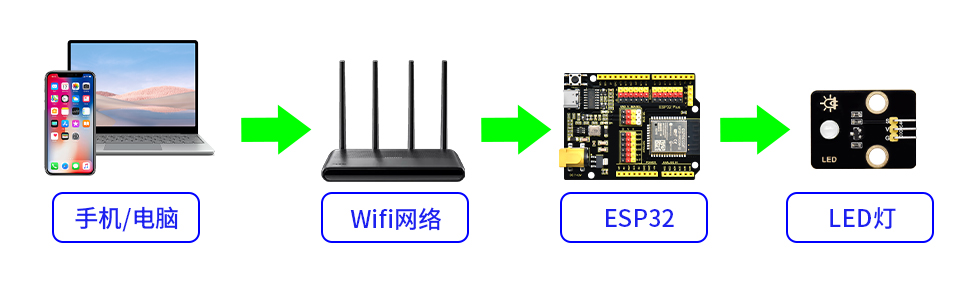

**关键步骤：**

**（1）ESP32 变身微型服务器**

- ESP32 连接 WiFi 后，会变成一个**微型Web服务器**（就像一台超迷你的电脑）。
- 它会有一个局域网 IP 地址（比如 `172.23.131.16`），其他连接 **同一WiFi** 的设备都能访问它。

**（2）网页交互设计**

- ESP32 托管一个简单的网页，网页上有两个按钮：

   - "ON" 按钮   → 点击后发送 `/ON` 请求

   - "OFF" 按钮 → 点击后发送 `/OFF` 请求

**（3）请求处理流程**

1. 点击网页按钮 → 浏览器向 ESP32 发送请求
2. ESP32 接收请求
2. ESP32 收到请求后，通过 GPIO 引脚控制 LED：
   - 开灯：引脚输出高电平 → LED 通电发光
   - 关灯：引脚输出低电平 → LED 断电熄灭

**（4）实时反馈**

网页通过 JavaScript 动态更新状态，无需刷新页面（类似你刷手机时的即时响应）。

#### 流程图

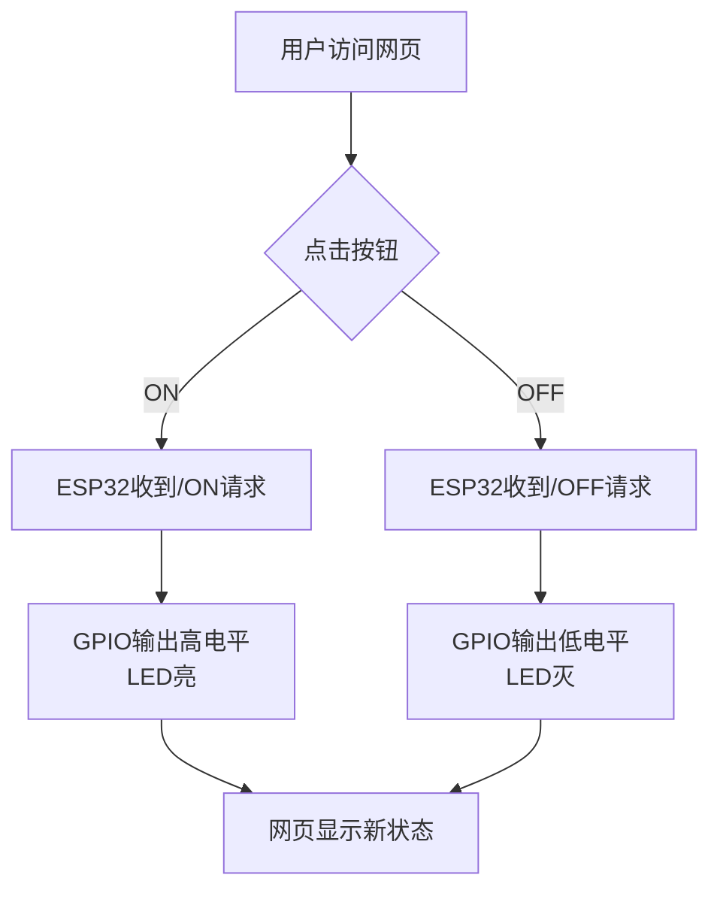

#### 实验代码

请将代码里的 WiFi 名称和密码替换为你的。

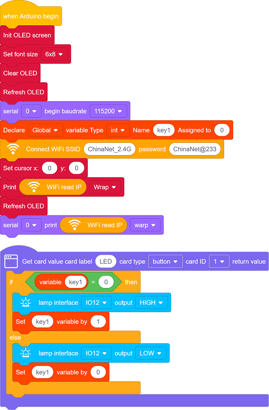

#### 代码说明

**注意：此课程涉及HTML、CSS、JS等课外知识， 只做简单介绍。**

需要添加 Web 库才能使用。

单击页面左下角的

在搜索框输入 `Web Page Editing PRO`，单击添加，单击 Back 返回编程页面。

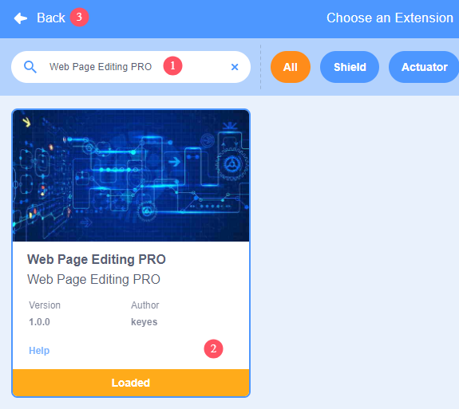

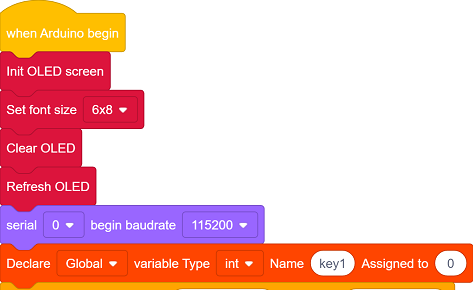

- OLED屏、串口初始化

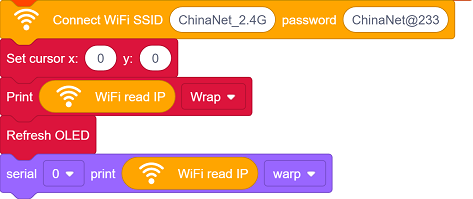

- 设置WiFi账号密码，连接WiFi，等待连接成功将IP地址打印在OLED屏和串口监视器。

  注意：请将代码里的 WiFi 名称和密码替换为你的。

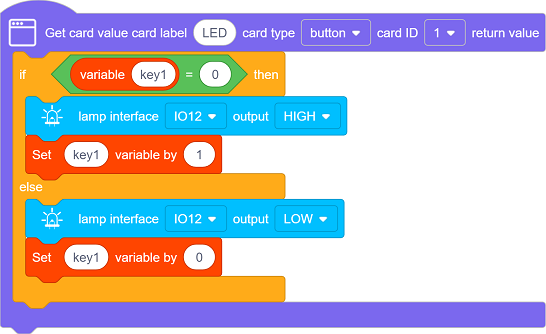

- 页面有一个按钮组件：**LED**
- 点击按钮控制LED亮灭。

#### 实验结果

1. 上传代码前打开串口监视器，设置波特率为115200。代码上传成功后可以看到打印的IP信息：

   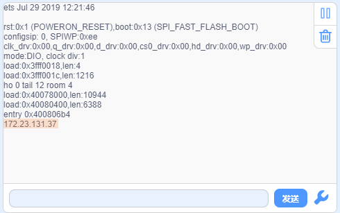

   OLED屏上同步打印IP信息：

   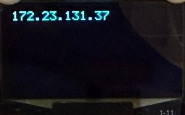

2. 将IP地址输入到手机/电脑浏览器并打开，你将看到一个简单的控制页面。

   注意：确保手机/电脑与ESP32连接到同一个 WiFi 。

   手机：

   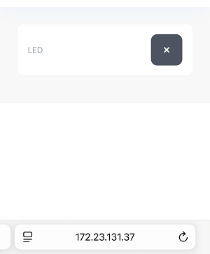

   电脑：

   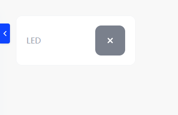

   

3. 点击控制点亮LED灯。

   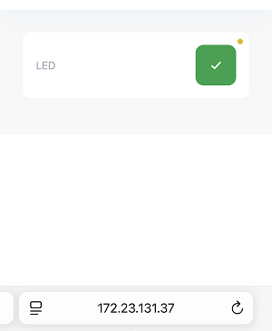

#### 常见问题解决

1. 若串口监视器无任何信息打印，请按下主板的复位键：

   

2. 若ESP32 一直没有获取到 IP 地址，通常是因为 WiFi 连接失败，解决办法：
   - 确保代码里的 WiFi 名称和密码已经替换为你的。
   - 确保你的 WiFi 网络是 2.4GHz 的，ESP32不支持 5GHz WiFi。
3. 若输入IP地址无页面，解决办法：
   - 确保IP地址输入正确。
   - 检查手机/电脑是否与ESP32在同一网络。

