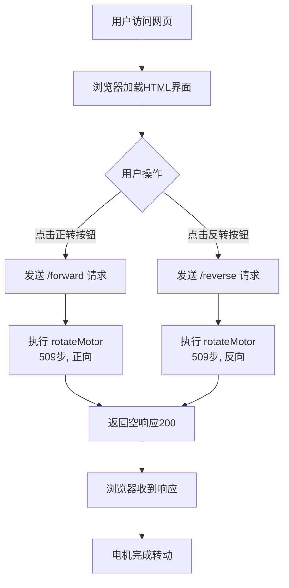
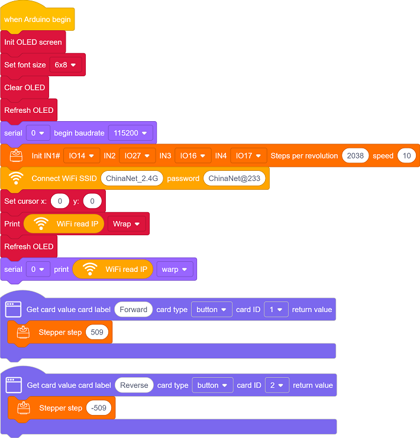
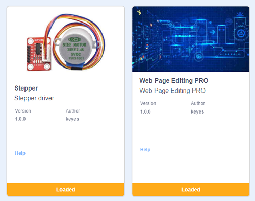
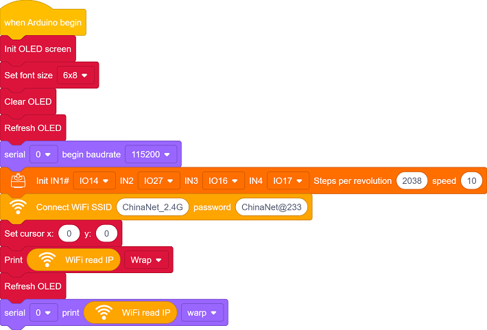
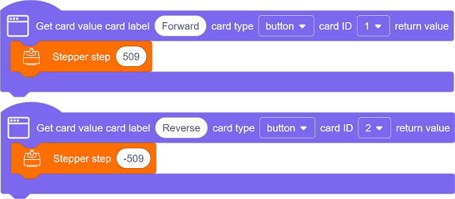
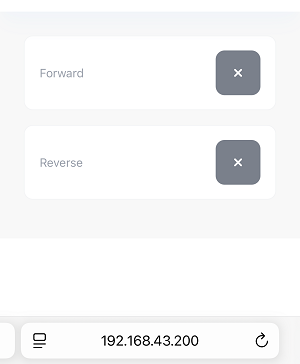

## 11. 网页远程控制智能窗帘

 在智慧校园的建设中，物联网技术正逐步改变传统的校园管理模式。本课程以“网页远程控制智能窗帘”为实践项目，探索物联网在校园生活中的实际应用。

通过本项目，你不仅能做出一个“会听话”的窗帘，更能掌握物联网系统的核心逻辑——“感知-决策-执行”，为智慧校园的创新打开一扇窗。

#### 原理

**手机浏览器 → WiFi → ESP32 → 控制电机转2圈 → 窗帘开/关**

1. **手机/电脑** 打开网页（输入ESP32的IP地址）
2. **点击按钮**（正转/反转）
3. **ESP32收到指令**（通过WiFi）
4. **电机转动**（转2圈，窗帘移动对应距离）
5. **窗帘移动**（电机通过齿轮带动窗帘）

#### 流程图

#### 实验代码

#### 代码说明

**注意：此课程涉及HTML、CSS、JS等课外知识， 只做简单介绍。**

单击页面左下角的

在搜索框输入名称，单击添加库：

单击 Back 返回编程页面。

- OLED屏、串口初始化、步进电机初始化

- 设置WiFi账号密码，连接WiFi，等待连接成功将IP地址打印在OLED屏和串口监视器。

  注意：请将代码里的 WiFi 名称和密码替换为你的。

- 页面有两个组件：**Forward** 和 **Reverse**
  - Forward 按钮每按一次控制电机正转509步
  - Reverse 按钮每按一次控制电机反转509步

#### 实验结果

1. 上传代码前打开串口监视器，设置波特率为115200。代码上传成功后可以看到打印的IP信息：

   

   OLED屏上同步打印IP信息：

   

2. 将IP地址输入到手机/电脑浏览器并打开，你将看到一个简单的控制页面。

   注意：确保手机/电脑与ESP32连接到同一个 WiFi 。

   

3. 每按下一次Forward的，电机正转509步。

   每按下一次Reverse的，电机反转509步。

#### 常见问题解决

1. 若串口监视器无任何信息打印，请按下主板的复位键：

   

2. 若ESP32 一直没有获取到 IP 地址，通常是因为 WiFi 连接失败，解决办法：

   - 确保代码里的 WiFi 名称和密码已经替换为你的。
   - 确保你的 WiFi 网络是 2.4GHz 的，ESP32不支持 5GHz WiFi。

3. 若输入IP地址无页面，解决办法：

   - 确保IP地址输入正确。
   - 检查手机/电脑是否与ESP32在同一网络。