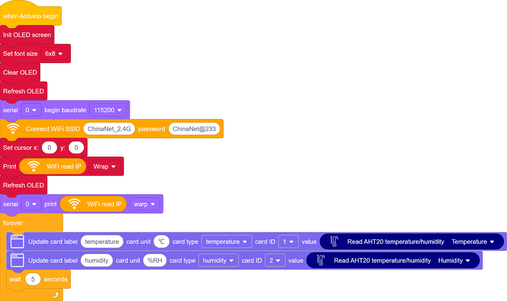
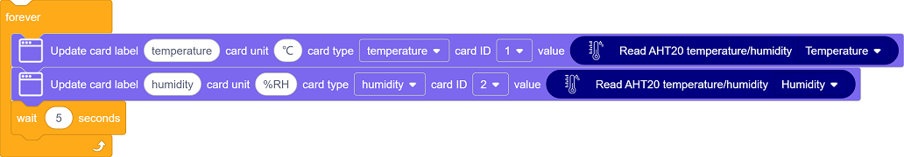
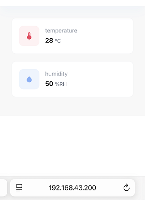

## 12. 网页远程监测温湿度

在智慧校园建设中，环境感知是打造绿色、舒适、智能化教学空间的重要基础。本课程将带领你开发一套轻量级环境监测系统，通过ESP32微控制器和AHT20传感器，实现教室环境质量远程监管。

现在开始，用技术让校园环境管理更智能！

#### 原理

1. 数据采集
   AHT20传感器 → ESP32（通过I2C）
2. 数据传输
   ESP32 → 路由器 → 手机/电脑
3. 数据显示
   浏览器请求 → 服务器响应 → 更新网页

#### 流程图

#### 实验代码

#### 代码说明

**注意：此课程涉及HTML、CSS、JS等课外知识， 只做简单介绍。**

单击页面左下角的

在搜索框输入名称，单击添加库：

单击 Back 返回编程页面。

- OLED屏、串口初始化

- 设置WiFi账号密码，连接WiFi，等待连接成功将IP地址打印在OLED屏和串口监视器。

  注意：请将代码里的 WiFi 名称和密码替换为你的。

- 页面有两个组件：**temperature** 和 **humidity**
  - temperature 组件实时显示当前温度值
  - humidity 组件实时显示当前湿度值
- 每5秒更新一次数据。

#### 实验结果

1. 上传代码前打开串口监视器，设置波特率为115200。代码上传成功后可以看到打印的IP信息：

   

   OLED屏上同步打印IP信息：

   

2. 将IP地址输入到手机/电脑浏览器并打开，即可访问温湿度监测页面。

   页面打开时立即获取数据，且每5秒更新一次数据。
   
   注意：确保手机/电脑与ESP32连接到同一个 WiFi 。

#### 常见问题解决

1. 若串口监视器无任何信息打印，请按下主板的复位键：

   

2. 若ESP32 一直没有获取到 IP 地址，通常是因为 WiFi 连接失败，解决办法：

   - 确保代码里的 WiFi 名称和密码已经替换为你的。
   - 确保你的 WiFi 网络是 2.4GHz 的，ESP32不支持 5GHz WiFi。

3. 若输入IP地址无页面，解决办法：

   - 确保IP地址输入正确。
   - 检查手机/电脑是否与ESP32在同一网络。
