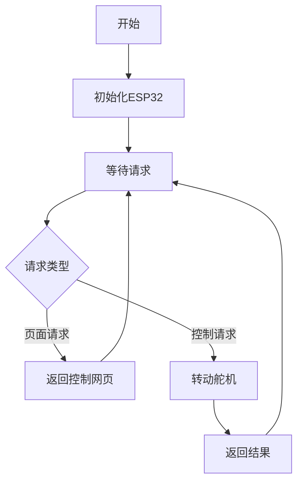
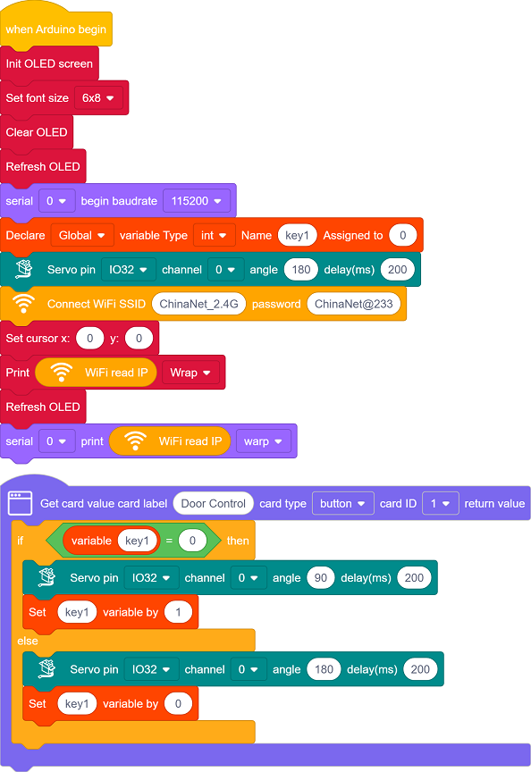
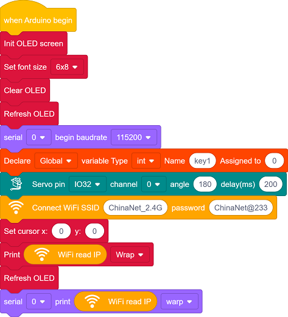
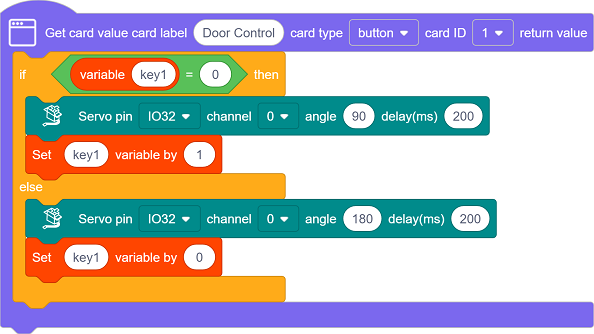
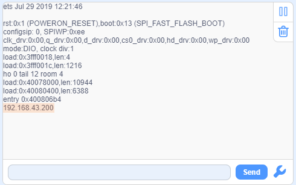
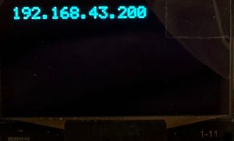
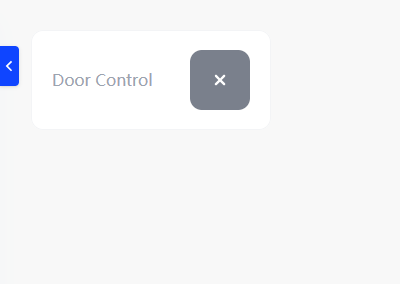
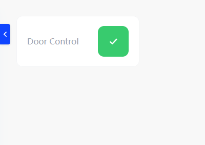
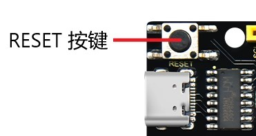

## 13. 网页远程控制校门

在智慧校园的建设浪潮中，智能管控与远程互联正成为校园现代化的重要标志。本项目以"网页远程控制大门开关"为主题，带领您深入探索物联网技术在校园安全管理中的创新应用。

现在开始，用技术守护校园安全，用创新构建智慧管理环境，共同探索物联网技术在教育领域的无限可能！

#### 原理

**手机浏览器 → WiFi → ESP32 → 控制舵机转动 → 大门开/关**

1. **手机/电脑** 打开网页（输入ESP32的IP地址）
2. **点击按钮**（开门/关门）
3. **ESP32收到指令**（通过WiFi）
4. **舵机转动**（180°或90°，对应大门关和开）

#### 流程图

#### 实验代码

#### 代码说明

**注意：此课程涉及HTML、CSS、JS等课外知识， 只做简单介绍。**

单击页面左下角的

在搜索框输入名称，单击添加库：

单击 Back 返回编程页面。

- OLED屏、串口初始化、舵机初始化至180°，关门状态

- 设置WiFi账号密码，连接WiFi，等待连接成功将IP地址打印在OLED屏和串口监视器。

  注意：请将代码里的 WiFi 名称和密码替换为你的。

- 页面有一个按钮组件：**Door Control**
- 点击按钮控制大门的开启与关闭。

#### 实验结果

1. 上传代码前打开串口监视器，设置波特率为115200。代码上传成功后可以看到打印的IP信息：

   

   OLED屏上同步打印IP信息：

   

2. 将IP地址输入到手机/电脑浏览器并打开，即可访问大门控制页面。

   注意：确保手机/电脑与ESP32连接到同一个 WiFi 。

   

   3. 点击控制大门开启和关闭。
   
   

#### 常见问题解决

1. 若串口监视器无任何信息打印，请按下主板的复位键：

   

2. Fi 连接失败，解决办法：

   - 确保代码里的 WiFi 名称和密码已经替换为你的。
   - 确保你的 WiFi 网络是 2.4GHz 的，ESP32不支持 5GHz WiFi。

3. 若输入IP地址无页面，解决办法：

   - 确保IP地址输入正确。
   - 检查手机/电脑是否与ESP32在同一网络。