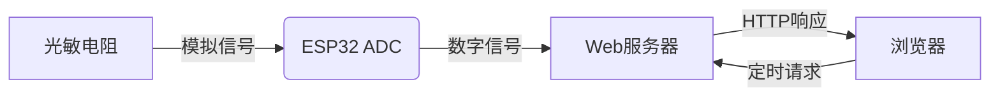
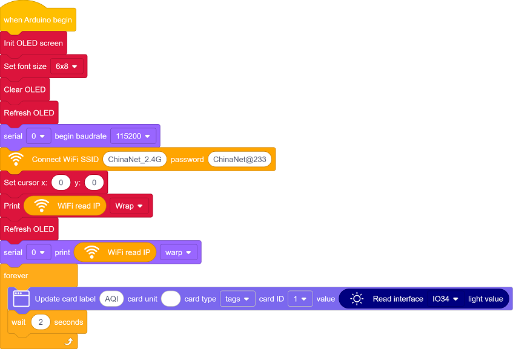
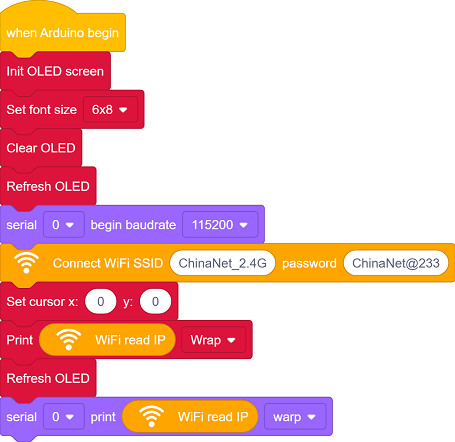
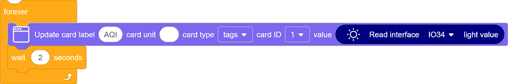
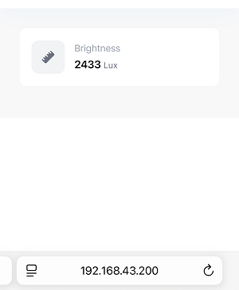

## 14. 网页远程监测光照值

在智慧校园的建设中，环境监测是提升教学环境舒适度、优化能源管理的重要环节。光照强度直接影响学生的学习效率和视觉健康，合理调控教室照明不仅能节能减排，还能创造更适宜的学习环境。

这一课，我们将掌握物联网环境监测的核心技术，实现教室光照强度的实时可视化，为智能照明、节能管理等应用提供基础方案，助力绿色智慧校园建设。

#### 原理

1. 数据采集

   光敏电阻分压 → ESP32的ADC引脚（模拟转数字）

2. 数据处理

   ESP32 → 路由器 → 手机/电脑

3. 网页交互

   浏览器请求 → 服务器响应 → 返回光照数值并刷新显示

#### 流程图

#### 实验代码

#### 代码说明

**注意：此课程涉及HTML、CSS、JS等课外知识， 只做简单介绍。**

单击页面左下角的

在搜索框输入名称，单击添加库：

单击 Back 返回编程页面。

- OLED屏、串口初始化

- 设置WiFi账号密码，连接WiFi，等待连接成功将IP地址打印在OLED屏和串口监视器。

  注意：请将代码里的 WiFi 名称和密码替换为你的。

- 页面有一个组件：**Brightness** 
  - Brightness 组件实时显示室内光照值
- 每2秒更新一次数据。

#### 实验结果

1. 上传代码前打开串口监视器，设置波特率为115200。代码上传成功后可以看到打印的IP信息：

   

   OLED屏上同步打印IP信息：

   

2. 将IP地址输入到手机/电脑浏览器并打开，即可访问室内光照值监测页面。

   页面打开时立即获取数据，且每2秒更新一次数据。

   注意：确保手机/电脑与ESP32连接到同一个 WiFi 。

#### 常见问题解决

1. 若串口监视器无任何信息打印，请按下主板的复位键：

   

2. 若ESP32 一直没有获取到 IP 地址，通常是因为 WiFi 连接失败，解决办法：

   - 确保代码里的 WiFi 名称和密码已经替换为你的。
   - 确保你的 WiFi 网络是 2.4GHz 的，ESP32不支持 5GHz WiFi。

3. 若输入IP地址无页面，解决办法：

   - 确保IP地址输入正确。
   - 检查手机/电脑是否与ESP32在同一网络。

